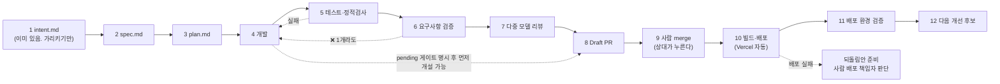

# CLAUDE.md — 결 GYEOL 작업 규약

이 문서는 **사람과 AI 에이전트가 같이 읽는 작업 규약**이다. 이 레포에서 코드를 만지기 전에 읽는다.

> **2026-09-17 사용자 확정 변경:** 프론트엔드는 Next.js App Router·React·TypeScript·Zustand·Tailwind CSS·shadcn/ui·tailwind-variants(`tv`)로 구현한다. 입력은 한 화면이며 아이덴티티 없이 사진만으로 시작할 수 있다. 기존 바닐라·2단계 입력 방침은 대체됐다. AI Session을 시작·인계할 때 [실행 그래프 운영](docs/ai-session-workflow.md)과 해당 이슈를 읽는다. 기술 결정은 [ADR-0002](docs/adr/0002-react-stack-and-ai-session-graph.md), 제품 동작은 [ADR-0001](docs/adr/0001-single-screen-photo-only-entry.md)이 우선한다. 신규 연결 계약 #24와 생성 서버 #26을 포함하며, 과거 L 개수 상한을 지키려고 경계 변경을 M으로 낮추지 않는다. 계약 합의와 merge는 사람의 명시적 증거로 판정한다.

> **전제 하나: 시간이 3.5일이다.**
> 오늘은 2026-09-17, 제출 마감은 **2026-09-21 00:00 KST**. 실질 개발 가능 시간은 **9/20 자정까지 약 3.5일**이고 사람은 2명이다.
> 아래 파이프라인은 12단계지만 **모든 이슈에 12단계를 다 돌리면 아무것도 못 끝낸다.** 그래서 이 문서에서 가장 중요한 것은 파이프라인 설명이 아니라 **3절의 생략 표**다. 거기부터 읽어도 된다.

영어 약어 풀이(첫 등장): **PR**(Pull Request — 코드 변경 제안), **Draft PR**(초안 상태로 열어 두는 PR. 리뷰는 받되 아직 합치지 않는다), **CI**(Continuous Integration — 자동 실행 검사 파이프라인), **DoD**(Definition of Done — 완료 조건), **SSE**(Server-Sent Events — 서버가 결과를 조금씩 흘려보내는 방식), **fixture**(픽스처 — 진짜 대신 끼워 넣는 고정 샘플 데이터).

---

> **2026-09-17 브랜치 정책 변경:** 사용자 지시에 따라 `develop`에서 작업 브랜치를 만들고 기능 PR의 base는 `develop`으로 한다. `main`은 Production 릴리스 전용이다. 상세: [ADR-0004](docs/adr/0004-develop-and-production-branches.md). 이전 main 단일 브랜치 지침보다 이 결정이 우선한다.

> **2026-09-17 최신 사용자 위임:** diego.yoon은 기존 제품 범위 내 기술 계약 결정, diego 담당 기능·디자인 구현, 검증 증거에 따른 **develop 셀프 머지**를 명시적으로 승인했다. enzo 변경은 중복 구현하지 않고 검토·통합한다. **main 릴리스와 유료 모델 호출은 보류**한다. 본문에 남은 사람-only merge·합의 대기 지침보다 [ADR-0005](docs/adr/0005-delegated-development.md)가 우선한다. 실패한 검사·중요 결함·미실행 증거를 숨겨 머지하지 않는다.

## 0. 한 장 요약

| | 원재 (enzo, `@onejaejae`) | 디에고 (`@jangwonyoon`) |
|---|---|---|
| 레이어 | 입력 이해 (백엔드 + AI) | 출력 생성 (프론트엔드 + AI) |
| 소유 기능 | F1 두 축 프로필 · F2 순서 제안 | F3 타이틀 + 캡션 · 화면 전체 |
| 소유 디렉토리 | 입력용 `src/app/api/`·`lib/`, `prompts/input/` `fixtures/` `scripts/` `config/` | `src/`(입력 API 제외) `prompts/output/`, 출력용 `src/app/api/generate/route.ts`·`lib/output-generation.js` |
| 넘기는 것 | `OrderedFeed` JSON 하나 | 사용자가 확정한 결과물 |

**경계선은 딱 하나, `OrderedFeed` 다.** 원재는 이 JSON 을 만들고 화면을 몰라도 되고, 디에고는 이 JSON 을 받고 그게 어디서 왔는지 몰라도 된다.

### 실행 권한과 사람의 책임

사용자는 **AI가 로컬 구현·테스트·수정을 계속 진행하도록 승인했다.** 위 소유자는 모든 코드를 직접 쓰는 사람이 아니라 해당 영역의 **사람 리뷰 책임자**다. AI는 배정된 파일 범위에서 작업하며, 공유 파일의 로컬 초안 편집도 승인 범위에 포함된다. 동시 작업자는 같은 파일을 함께 수정하지 않도록 실행 담당을 정한다.

이 권한은 **양쪽 사람의 계약 합의나 merge를 대신하지 않는다.** `docs/intent.md`의 C1~C8 및 #1 스키마에 대한 사람 합의는 증거가 기록되기 전까지 **pending**이다. 초안 구현과 독립 작업은 계속하되, 합의 대기를 완료로 표시하지 않는다. **무응답·시간 초과·마감 임박을 자동 승인이나 자동 merge로 해석하지 않는다.**

실행 순서와 남은 게이트는 [docs/automation-plan.md](docs/automation-plan.md)를 따른다. 기존 세션·미커밋 변경·다른 작업자의 산출물을 보존한다.

---

## 1. 작업 파이프라인 12단계

```
intent.md → spec.md → plan.md → 개발 → 테스트·정적 검사 → 요구사항 검증
→ 다중 모델 리뷰 → Draft PR → 사람 merge → 빌드·배포 → 배포 환경 검증 → 다음 개선 후보
```

각 단계의 **산출물 / 게이트(다음 단계로 넘어가도 되는 관측 가능한 조건) / 담당**은 아래와 같다. Draft PR은 필수 리뷰·검증이 pending이어도 먼저 열 수 있으며, 미완료 게이트를 본문에 명시한다.
생략 가능 여부는 이슈 크기에 따라 달라지므로 **3절 표**에서 따로 정한다.

### 1-1. 단계별 정의

| # | 단계 | 무엇을 만드는가 (산출물 경로) | 게이트 — 무엇을 만족해야 다음으로 가는가 | 누가 |
|---|---|---|---|---|
| **1** | **intent.md** | `docs/intent.md` **1개만 존재한다.** 이슈마다 만들지 않는다 | 이 이슈가 `intent.md` 의 "9/20 자정까지 반드시 동작해야 하는 것" 목록 중 **어느 줄을 향하는지** 이슈 본문 첫 줄에 적혀 있다. 어느 줄도 못 가리키면 **그 이슈는 만들지 않는다** | 공동 (변경 시 양쪽 승인) |
| **2** | **spec.md** | `docs/specs/<이슈번호>-<슬러그>/spec.md` | 입력·출력·완료 조건이 **관측 가능한 문장**으로 있다. "잘 동작한다"는 게이트가 아니다. "사진 15장 → 15슬롯, `position` 이 1..15 를 한 번씩"이 게이트다 | 이슈 담당자 |
| **3** | **plan.md** | 같은 폴더의 `plan.md` | 건드릴 파일 목록과 AI 실행 담당·사람 리뷰 책임자가 있다. 공유·교차 영역은 0·4절의 승인된 로컬 초안 범위로 표시하고, 사람 합의 게이트는 별도로 남긴다 | 이슈 담당자 |
| **4** | **개발** | 코드 | 로컬에서 **한 번은 실제로 돌아간 것을 본인 눈으로 봤다** (스크린샷 또는 터미널 출력) | 이슈 담당자 |
| **5** | **테스트·정적 검사** | `test/*.test.js` (Node 내장 `node --test`) | `npm test` 통과 + `npm run eval` 통과(불변식은 6절, **초기 #1·#6·#7은 3-2절 예외**). **테스트가 없는 코드가 아니라, 깨지면 아무도 모르는 코드가 금지다** | 이슈 담당자 |
| **6** | **요구사항 검증** | 이슈 코멘트 1개 | spec.md 의 완료 조건을 **한 줄씩 복사해 와서** 각각 ✅/❌ 를 붙였다. ❌ 가 하나라도 있으면 4단계로 돌아간다 | 이슈 담당자 |
| **7** | **다중 모델 리뷰** | PR 코멘트 | 서로 다른 모델 2개 이상에게 **같은 diff** 를 보여 주고 지적을 받았다. 지적마다 **반영 / 반영 안 함(+이유)** 이 적혀 있다. **지적 0건도 유효하다.** 모델 식별자·실행 시각·동일 diff 식별자·실제 응답을 남긴다. 실패·미실행을 0건으로 기록하지 않는다 | 이슈 담당자 |
| **8** | **Draft PR** | GitHub Draft PR | 제목이 `[<이슈번호>] <한 줄>`, 본문에 `Refs #N` + 현재 증거 + pending 게이트. **Draft는 먼저 열 수 있고, Ready는 크기별 필수 사전 게이트 통과 후**다. 전체 인수조건 충족 시에만 `Closes #N`을 쓴다 | 이슈 담당자 |
| **9** | **사람 merge** | main 커밋 | **사람 상대 리뷰어가 승인하고 merge한다. AI는 merge하지 않는다.** 무응답이면 pending으로 남기고 독립 작업을 계속한다. 시간 초과 예외는 없다 | 상대방 |
| **10** | **빌드·배포** | 배포 URL | develop 기능 PR은 Preview에서 검증하고, 사람이 릴리스 PR(develop → main)을 merge하면 Vercel Production이 배포된다. 배포 실패 시 원인·실패 커밋을 기록하고 되돌림안을 준비한다. 운영 되돌림 실행은 사람 배포 책임자가 판단한다 | 자동 (실패 시 merge 누른 사람) |
| **11** | **배포 환경 검증** | 이슈/PR 코멘트 1줄 | **배포된 URL 을 직접 열어서** 해당 기능을 한 번 돌렸다. 로컬에서 됐다는 것은 이 게이트를 통과시키지 않는다 | 이슈 담당자 |
| **12** | **다음 개선 후보** | 이슈 1개 또는 "없음" 코멘트 | 하고 싶었는데 안 한 것을 **이슈로 적고 닫지 않는다.** 단, 새 이슈를 여는 것과 **지금 하는 것은 다르다** — 여는 것은 자유, 하는 것은 8절 규칙을 따른다 | 이슈 담당자 |

### 1-2. 이 파이프라인이 실제로 도는 모습 (L 크기 이슈 기준)



---

## 2. 이슈 크기 판정 — 표를 읽기 전에 먼저 정한다

크기는 **걸리는 시간이 아니라 "경계를 건드리는가"** 가 1차 기준이다. 시간은 2차다.

| 크기 | 판정 기준 (위가 우선) | 예 |
|---|---|---|
| **L** | **경계 계약을 건드린다** — `schemas/`, `prompts/shared/`, `OrderedFeed` 의 형태, `api/` 의 응답 모양 중 하나라도. 또는 하루 이상 | 스키마 v1 확정 · 두 축 합성 · `OrderedFeed` 필드 추가 |
| **M** | 경계를 안 건드리고 **한 사람 영역 안**에서 끝난다. 파일 3~6개, 반나절 | `PhotoAnalysis` 추출 · 결과 화면 순서 리스트 · 캡션 프롬프트 |
| **S** | 파일 1~2개, 1시간 이하, **되돌리기가 쉽다** | 카피 문구 수정 · 버튼 하나 추가 · fixture 값 보정 · 오타 |

**애매하면 한 단계 위로 올린다.** L 을 M 으로 잘못 보면 이틀 뒤 양쪽 코드를 다 뜯는다. M 을 L 로 잘못 보면 30분 더 쓸 뿐이다.

---

## 3. ★ 생략 표 — 크기별로 어느 단계가 필수인가

**이 표가 이 문서의 본체다.** 3.5일 안에 끝내려면 무엇을 안 하기로 했는지가 무엇을 하기로 했는지보다 중요하다.

기호: **필수** = 빼면 안 됨 / **권장** = 시간 있으면 / **생략** = 안 한다 (하면 오히려 손해)

| # | 단계 | **S** | **M** | **L** | 생략해도 되는 이유 / 생략하면 안 되는 이유 |
|---|---|:---:|:---:|:---:|---|
| 1 | intent.md 가리키기 | 필수 | 필수 | 필수 | 문서 쓰는 일이 아니라 **한 줄 인용**이다. 비용 10초, 이게 없으면 3.5일에 안 해도 되는 일을 한다 |
| 2 | spec.md | **생략** | 필수 | 필수 | S 는 이슈 본문 3줄이 곧 spec 이다. 별도 파일은 순수 오버헤드 |
| 3 | plan.md | **생략** | **생략** | 필수 | M 은 plan 을 쓰는 시간에 코드가 나온다. **L 만 필수 —** 경계를 건드리는 변경은 "어느 파일을 건드리는지"가 곧 상대에게 주는 예고이기 때문 |
| 4 | 개발 | 필수 | 필수 | 필수 | — |
| 5 | 테스트·정적 검사 | **생략** | 필수 | 필수 | S 에서 깨진 건 눈에 바로 보인다. **단, S 라도 `api/` 나 `lib/` 를 건드리면 그 순간 M 이다**(2절 크기 판정) |
| 6 | 요구사항 검증 | **생략** | 필수 | 필수 | spec.md 가 없으면 대조할 대상이 없다. S 는 2단계를 생략했으므로 자동 생략 |
| 7 | 다중 모델 리뷰 | **생략** | 권장 | 필수 | L은 최종 같은 diff를 서로 다른 모델 2개가 리뷰한다. M은 권장, S는 생략한다. 실행한 리뷰의 지적 0건도 유효하다 |
| 8 | Draft PR | 필수 | 필수 | 필수 | AI 변경은 크기와 무관하게 Draft PR로 전달한다. main 직푸시로 사람 merge 게이트를 우회하지 않는다 |
| 9 | 사람 merge | 필수 | 필수 | 필수 | 상대 사람 리뷰어가 merge한다. **무응답 예외 없음**(1-1절 9번) |
| 10 | 빌드·배포 | 자동 | 자동 | 자동 | main merge = 자동 배포. 사람이 할 일 없음 |
| 11 | 배포 환경 검증 | 필수 | 필수 | 필수 | **가장 자주 생략되고 가장 비싸게 돌아오는 단계다.** 로컬에서 되는데 배포에서 안 되는 이유 1순위는 환경변수다. 3.5일에 마지막 날 이걸 처음 하면 끝이다 |
| 12 | 다음 개선 후보 | **생략** | 권장 | 필수 | 이슈 여는 데 1분. L 은 필수 — 경계를 건드리면 반드시 잔여물이 남는데, 적어 두지 않으면 마감 전날 기억으로 찾게 된다 |

**한 줄 요약**
> **S = 개발 → 최소 확인 → Draft PR → 사람 merge → 배포 확인.** 문서만 바뀌어 제품 실행에 영향이 없으면 배포 기능 확인은 해당없음으로 기록한다.
> **M = spec → 개발 → 테스트 → 검증 → (권장: 두 모델 리뷰) → Draft PR → 사람 merge → 배포 확인.**
> **L = 12단계 전부.**

**L 은 몇 개여야 하는가** — 3.5일 안에 **L 은 3개를 넘기지 않는다.** 넘으면 그건 일정이 아니라 희망이다.
현재 L 후보: ① 스키마 v1 확정 ② `OrderedFeed` 를 만드는 파이프라인 1회 관통 ③ 두 축 합성.
③ 이 위험하면 ③ 을 먼저 버린다 — `docs/intent.md` 4절이 자른 순서를 따른다.

### 3-1. 마감 6시간 전

**9/20 18:00 이후**에는 카피·CSS·fixture 값의 작은 수정만 한다. 경계 계약(L)은 바꾸지 않는다. 변경에 맞는 최소 확인을 남기고 **크기별 리뷰 규칙 → Draft PR → 사람 merge → 배포 URL 확인**을 유지한다. 마감도 자동 merge 사유가 아니다.

### 3-2. 초기 인수 예외 — #8이 eval을 만들기 전

- **#1·#6·#7은 `npm run eval` 게이트를 면제**하고 해당 계약 확인·배포 smoke 증거로 인수한다. 없는 eval을 통과했다고 쓰지 않으며, 로컬 확인과 배포 확인은 구분한다.
- **#7은 응답 계약 + `curl` 출력으로 인수**한다. 15슬롯·근거·외부 호출 0회를 확인하고, 화면 스크린샷은 **#14 DoD**로 넘긴다. #14는 #7 응답 계약 인수 후 시작할 수 있다.
- **#8은 사진 1벌 × 수동 작성 TargetProfile 2벌**로 시작한다. #10 결과를 기다리지 않는다. #8 자체는 만든 eval의 정상 통과와 E1·E2·E3·E6·E8·E9·E10·E11 각각의 의도적 실패를 검증하고, #8 이후 이슈에 일반 eval 게이트를 적용한다.
- #10 완료 후 골든 프로필을 실제 추출 결과로 교체할 때 교체 전후 5개 불변식을 다시 확인한다. 초기 수동 fixture 통과는 실제 AI 품질 증거가 아니다.
- **foundation #1·#7·#8은 제품 AI/외부 호출 0회**로 구현·검증한다. #6의 실모델 A1 측정은 모델 접근 확인 후 별도로 수행하며, 이 측정이나 공개 배포가 미확인인 동안 #2 전체 완료를 주장하지 않는다.

---

## 4. R&R 경계 — 실행 담당과 사람 리뷰 책임

근거: `pivot/docs/30-rnr.md` 0·1·3-1절.

### 4-1. 소유 디렉토리

```
src/app/api/         입력 함수 enzo / generate 출력 함수 diego (#26)
api/                 PR #21 기반. #23에서 HTTP 어댑터 인계 후 중복 경로 제거
lib/                 원재 소유    입력 이해 로직. lib/output-generation.js는 디에고 (#26)
prompts/input/       원재 소유    photo_analysis.md · target_extract.md · current_extract.md · order.md
fixtures/            원재 소유    mock 데이터. 스키마가 바뀌면 여기를 먼저 고친다
scripts/             원재 소유    CLI 파이프라인 실행기
config/models.json   원재 리뷰    사용 가능한 모델 확인·선택. AI 로컬 초안 편집 가능

src/                 디에고 소유  React 화면·편집 상태·FE API client·문구 (입력 API 제외)
public/              디에고 소유  정적 자산
prompts/output/      디에고 소유  title.md · caption.md · omit_reason.md
src/copy/            디에고 소유  한국어 문구. note_key → 문장 렌더링

schemas/             ★ 공동       로컬 초안 편집 가능, 계약 확정은 양쪽 사람 승인 (4-2)
prompts/shared/      ★ 공동       style_guard.md. 추가는 누구나, 삭제·완화는 양쪽 승인
package.json         ★ 공동       의존성 추가는 상대에게 알린다
vercel.json          ★ 공동       배포 설정
docs/intent.md       ★ 공동       무엇을 만드는지의 원천. 뒤집으려면 양쪽 승인
```

**규칙 3개**
1. AI는 승인된 로컬 작업을 실행하되 파일별 실행 담당을 지킨다. 교차 영역과 공유 파일은 plan에 표시하고 해당 사람 소유자의 리뷰를 남긴다. **로컬 편집 승인은 계약 합의 완료가 아니다.**
2. 한 PR 에 `prompts/input/` 과 `prompts/output/` 이 **같이 들어가면 양쪽 사람 리뷰가 필요하다.** 다른 PR도 해당 리뷰·테스트·합의 게이트를 충족한 뒤 상대 사람이 merge한다.
3. 프롬프트는 **파일**이지 코드 안의 문자열이 아니다. 서버가 실행 시점에 읽는다. 디에고는 #16 프롬프트와 #26의 출력 생성 서버를 함께 책임지고, 입력 서버는 원재가 리뷰한다.

### 4-2. 공유 계약 스키마 — 어디 있고 어떻게 바꾸는가

**어디 있나:** `schemas/` 4개 파일. 원본 설계는 `pivot/docs/30-rnr.md` 2절에 있고, **이 레포의 `schemas/` 가 유일한 실효 버전이다.** 둘이 어긋나면 `schemas/` 가 이긴다.

| 파일 | 무엇 | 누가 만드나 | 누가 읽나 |
|---|---|---|---|
| `schemas/target_profile.md` | 지향(주축). 되고 싶은 결 | 원재 | 원재 |
| `schemas/current_profile.md` | 현재(보정축). 원래 내 방식. **`present:false` 가 정상 상태다** | 원재 | 원재 |
| `schemas/photo_analysis.md` | 사진 1장의 사실. 핵심은 `describable_facts` (캡션이 말해도 되는 사실의 허용 목록) | 원재 | 원재 |
| `schemas/ordered_feed.md` | **경계 계약.** 순서 + 자리별 근거 + 합성된 프로필 | 원재 | **디에고** |

**바꾸는 절차 (L 크기다. 예외 없음):**
1. 이슈를 연다. 제목에 `[schema]` 를 붙인다.
2. **`fixtures/` 를 먼저 고친다.** 스키마 문서보다 먼저. 반대로 하면 "스키마는 바꿨는데 목업은 옛날 것"이 되어 디에고 화면이 조용히 깨진다.
3. 양쪽 사람이 이슈에 "합의함"을 남긴다. **미응답은 pending이다.** 승인된 로컬 초안과 독립 구현은 계속할 수 있지만 계약 확정·merge 게이트를 통과한 것으로 보지 않는다.
4. `schema_version` 을 올린다. 올리지 않으면 어느 fixture 가 옛날 것인지 구별이 안 된다.
5. 필드를 **줄이는 방향의 변경은 환영이고, 늘리는 방향은 4-2절의 기능 추가 거부권과 8절 규칙을 적용한다.**

**결정권이 갈리는 지점** (`30-rnr.md` 4절 C1~C7 을 그대로 따른다):

| 무엇 | 결정권 | 진 쪽의 권리 |
|---|---|---|
| `schemas/` 변경 | 양쪽 사람 승인 | 미응답이면 합의 pending, 로컬 초안·독립 작업 계속 |
| 캡션을 비울 것인가 채울 것인가 | **디에고** | 원재가 낸 숫자를 **UI 에 그대로 표시해야 한다.** 무시할 순 있어도 숨길 순 없다 |
| `describable_facts` 를 얼마나 넓게 담을까 | **원재** | 디에고는 부족한 케이스를 `eval/golden/` 에 올린다 |
| 두 축 합성 규칙 | **원재** | 디에고는 합성했다는 사실을 **정직하게 노출한다.** 감추지 않는다 |
| "기능 하나만 더" | **둘 다 거부권.** 한 명이라도 반대하면 안 한다 | — |

---

## 5. 브랜치 · 커밋 · PR

### 5-1. 브랜치
```
main                         Production 릴리스 전용
develop                      개발 통합·기본 브랜치. 모든 작업 브랜치의 출발점
feat/<이슈번호>-<슬러그>       기능        예: feat/12-photo-analysis
fix/<이슈번호>-<슬러그>        버그
docs/<슬러그>                 문서만
```
- 최신 `origin/develop`에서 작업 브랜치를 만들고 기능·수정·문서 PR은 `develop`을 대상으로 한다.
- `develop → main` PR은 배포할 때만 만든다. `main`과 `develop`은 삭제하거나 force-push하지 않는다.
- 작업 브랜치는 **하루를 넘기지 않는다.** 하루 넘게 살아 있으면 이슈가 너무 큰 것이다 — 쪼갠다.
- **AI 변경은 크기와 무관하게 작업 브랜치와 Draft PR을 쓴다.** main 직푸시·자동 merge는 하지 않는다.

### 5-2. 커밋

커밋할 권한이 있는 작업에서만 커밋한다. **Lore 형식**으로 첫 줄에 변경 이유를 한국어로 쓰고, 필요한 결정 맥락만 trailer로 남긴다.

```text
근거 없는 승인으로 배포가 진행되지 않도록 실행 권한을 구분한다

Constraint: 사람의 계약 합의와 merge 권한 유지
Rejected: 무응답 자동 승인 | 사람의 결정을 증명하지 못함
Confidence: high
Scope-risk: narrow
Directive: 로컬 구현 완료와 사람 합의 완료를 구분할 것
Tested: 실제 수행한 검사와 결과
Not-tested: 실제로 확인하지 못한 항목
```

- Git author는 **실제 커밋 작성자의 설정**을 사용한다. 고정된 Claude 이름·모델·이메일로 덮어쓰지 않는다.
- 공동 저자 trailer는 실제 참여자의 확인된 신원만 사용한다. 참여하지 않은 모델의 `Co-Authored-By`를 붙이지 않는다.
- 한 커밋은 한 가지 결정만 담고, 검사 결과·확신 수준은 실제 증거에 맞춘다.

### 5-3. PR
- **필수 리뷰·검증이 pending이어도 Draft로 열 수 있다.** 현재 증거와 남은 게이트를 본문에 표시한다. Ready for review는 해당 크기의 필수 사전 게이트(필요한 테스트·요구사항 검증·L의 두 모델 리뷰·계약 합의)가 통과한 뒤다. 사람 PR 승인·merge 및 배포 확인은 후속 단계다.
- 제목: `[<이슈번호>] <한 줄>`
- 본문: `Refs #N` / 현재 스크린샷 또는 터미널 출력 / 완료 조건별 통과·pending·해당없음. **부분 구현이나 인수 대기에는 `Refs #N`을 유지**하고, 전체 인수조건이 충족된 이슈에만 `Closes #N`을 사용한다.
- **merge는 상대 사람 리뷰어가 누른다**(1-1절 9번). 시간 초과 자동 승인·셀프 merge 예외는 없다.
- 작업 브랜치 → `develop`은 **Squash and merge**. 장기 브랜치 `develop → main` 릴리스는 **merge commit**으로 공통 이력을 보존한다. AI는 두 경우 모두 merge하지 않는다.
- **CI 를 만들지 않는다.** 3.5일에 CI 설정 비용이 이득보다 크다. 필수인 `npm test`는 Ready 전 로컬에서 돌리고, Draft에서 미실행이면 pending으로 표시한다.

---

## 6. AI 출력 품질 기준

근거: `pivot/docs/20-product-definition.md` 3-3절 P1~P3, `pivot/docs/30-rnr.md` 3-3절.

### 6-1. 지켜야 하는 것

**P2 — 모든 판단에 근거를 댄다. 못 대면 말하지 않는다.**
근거는 문서의 다짐이 아니라 **타입**이다.
```jsonc
Claim<T> = { "value": T, "confidence": 0.0~1.0, "evidence": [Evidence, ...] }  // evidence 길이 0 금지
Evidence = { "kind": "ig_post"|"uploaded_photo"|"user_text"|"aggregate"|"rule",
             "ref": "출처 식별자", "note": "한 줄 한국어. UI 의 [근거 보기] 에 그대로 뜬다" }
```
- `evidence` 가 빈 `Claim` 은 **직렬화 단계에서 거부한다.** 근거가 없으면 그 필드를 **아예 빼고** `completeness` 를 낮춘다.
- **모르는 걸 비워 두는 것은 정상이고, 모르면서 값을 채우는 것이 실패다.**
- `kind:"rule"` 은 우리 설계 규칙에서 온 판단이다. 허용하되 **`rule` 만으로 이루어진 프로필 항목은 개인화가 아니므로** 프로필에 넣지 않는다. `OrderedFeed.slots[].rationale` 에서만 허용한다.

**P3 — 다 채우지 않는다. 비움을 결과로 내놓는다.**
- 캡션 슬롯을 전부 채우려 들지 않는다. **"설명 없음"도 유효한 큐레이션 결과다.**
- **진행률 UI("3/3 완성")를 화면 어디에도 두지 않는다.** 그 자체가 전부 채우라는 압력이다.
  ※ "분석 중" 로딩 표시는 진행률 UI 가 아니다. 금지 대상이 아니다.

### 6-2. 자동으로 판정한다 — 불변식 (축소판)

원본 `30-rnr.md` 3-3절은 불변식 8개를 정의했다. **3.5일 기준으로 5개로 줄인다.** 줄인 것과 그 이유:

| # | 불변식 | 누구의 실패 | 상태 |
|---|---|---|---|
| **E1** | 모든 `Claim` 의 `evidence` 길이 ≥ 1 | 낸 쪽 | **유지** — P2 의 실체. 이게 없으면 근거 추적이 말뿐이 된다 |
| **E2** | `input_count == output_count`, `photo_id` 중복·누락 0 | 원재 | **유지** — 깨지면 사진이 사라진다. 데모 즉사 |
| **E3** | `position` 이 1..N 을 빠짐없이 한 번씩 | 원재 | **유지** — E2 와 한 쌍 |
| **E6** | 타이틀은 정확히 1개 | 디에고 | **유지** — 비용 0 |
| **E8** | `current_profile_id == null` 인데 `disclosure != "target_only"` 면 실패 | 원재 | **유지** — 보정 없이 보정한 척하는 것은 정직성 위반이다 |
| **E9** | `applied_profile.target_profile_id == 실제 TargetProfile 입력의 profile_id` | 낸 쪽 | **추가(3차 리뷰 H1)** — 지향축이 주축이다. 이게 없으면 적용 프로필을 통째로 지어내도 통과한다. **ID 동일성만 본다**; 두 축을 섞는 규칙(tilt)이 아직 없으므로 값 수준 합성은 검증 범위 밖이다 |
| **E10** | `kind=="uploaded_photo"` 인 모든 `evidence.ref` 가 실제 입력 사진 ID에 해소된다 (feed·export 양쪽) | 낸 쪽 | **추가(3차 리뷰 H2)** — 근거가 "있기만" 하고 아무 데도 닿지 않으면 P2 가 빈다. 다른 `kind` 는 참조 도메인이 이 계약 밖이라 건드리지 않는다 |
| **E11** | `slots[].caption_inputs.describable_facts` 가 **그 사진의** `PhotoAnalysis.describable_facts` 부분집합 | 낸 쪽 | **추가(2차 M1·3차 M)** — 다른 사진의 실제 사실을 복사해 붙이는 인덱스 밀림을 잡는다. 의미 분석이 아니라 부분집합 대조다 |
| ~~E4~~ | 캡션의 고유명사가 `describable_facts` 안에 있다 | 디에고 | **자동 판정 생략 → 수동 스팟체크로.** 한국어 고유명사 추출을 3.5일에 제대로 만들 수 없다. 대신 **데모에 쓸 사진 세트 1벌은 사람이 전수 대조한다** |
| ~~E5~~ | `banned_words` 출현 0회 | 디에고 | **프롬프트 단계로 이동.** `prompts/shared/style_guard.md` 에 금지어를 넣고, 판정은 사람 눈으로 |
| ~~E7~~ | `caption_state=="omitted"` 슬롯 최소 1개 | 디에고 | **자동 판정 생략.** 비움이 1개도 없는 결과는 사람이 보면 바로 안다. 자동화 이득이 적다 |

> E9·E10·E11 은 3.5일 축소판의 5개를 되돌리는 것이 아니다. **기존 5개가 검사하지 않는 "입력과의 대조"** 를 같은 비용(존재 검사 → 해소 검사)으로 메운다. 의미 분석·AI 호출은 여전히 하지 않는다.

**골든 세트도 줄인다.** 원본은 사진 3벌 × 프로필 2벌 = 6케이스. **1케이스(사진 1벌 × 프로필 2벌)로 시작한다.** 프로필 2벌은 유지 — 그게 "같은 사진, 다른 사람, 다른 결과"라는 핵심 주장의 증거이기 때문이다.

필수인 `npm run eval`은 **Ready 전 로컬에서** 돌린다. 초기 #1·#6·#7은 3-2절 예외를 따르며, 미실행 상태로 Draft를 열 때는 pending으로 표시한다.

### 6-3. ★ 하지 말아야 할 것

**(a) MVP 에서 뺀 것 — 이슈로도 만들지 않는다** (`pivot/BRIEF.md` 4항)
계정/로그인 · 결제 · 팀 협업 · 예약 발행 · **실제 인스타 자동 게시** · 사진 보정/필터/생성 · 해시태그 대량 추천 · 인게이지먼트 예측 점수 · 게이미피케이션(출석/점수/랭킹).
> 이슈로 만들면 그 자체가 나중에 "해야 할 일"로 읽힌다. 만들지 않는다.

**(b) 출처 없는 수치를 사실처럼 쓰지 않는다**
- 시장 규모·사용자 수·"N분 절약" 같은 수치는 **출처 URL 을 달거나 "미검증 가정"으로 표기한다.**
- 해커톤 기간의 사용자 수는 통계가 아니라 관찰 기록이다. **비율("60%")이 아니라 "5명 중 3명"으로 말한다.** 비율로 부풀리는 순간 `BRIEF.md` 6항 실패 조건이다.
- `pivot/docs/20-product-definition.md` 1-4절의 미검증 가정(U1~U18)을 **사실처럼 인용하지 않는다.**

**(c) 없는 사실을 단정하지 않는다 — AI 출력의 1순위 금지**
- 캡션은 그 슬롯의 `describable_facts` 안에서만 말한다. **거기 없는 장소·인물·시간·감정을 문장에 넣으면 그 캡션은 틀린 것이다.**
- 순서 근거(`rationale`)는 `PhotoAnalysis` 필드나 프로필 항목으로 **역추적되어야 한다.** 근거가 전부 `kind:"rule"` 인 결과는 개인화가 아니므로 실패로 본다.
- 사진에 대한 감정·의도 추정("행복해 보이는 순간")을 사실처럼 쓰지 않는다.

**(d) 과장하지 않는다**
- `prompts/shared/style_guard.md` 의 금지어를 쓴다: `이처럼` `또한` `이를 통해` `이러한` `마침내` — 한국어 AI 문체의 신호다.
- 최상급·단정형("최고의", "완벽한", "반드시")을 쓰지 않는다.
- UI 는 "생성했습니다"가 아니라 **"이렇게 해봤습니다, 고치세요"** 로 말한다. 결과물은 언제나 초안이고 최종 저자는 사용자다(P1).

---

## 7. 기술 스택 — 3.5일 안에 2인이 배포까지 가는 최소 구성

프론트엔드는 사용자 확정 스택을 따른다. #23에서 필요한 빌드·검증만 구성하고 기존 서버 기반을 재사용한다.

| 층 | 선택 | 왜 (한 줄) |
|---|---|---|
| **프론트엔드** | **Next.js App Router + React + TypeScript strict** (`src/`) | 사용자 확정 스택. 기존 HTML의 시각·흐름을 재사용한다 (#23) |
| **상태·스타일** | **Zustand · Tailwind CSS · shadcn/ui · tailwind-variants(tv)** | 공유 편집 상태와 UI 변형을 관리한다. 구현 시 최신 stable·peer 호환을 확인한다 |
| **서버** | **Next.js Route Handlers** (`src/app/api/**/route.ts`, Node runtime) | 기존 lib/·계약·검증을 재사용하고 API 키를 서버에 둔다. HTTP 경로는 유지한다 |
| **배포** | **Vercel. `main` = Production, 나머지 = Preview** | 개발 통합은 develop에서 검증하고, 명시적인 릴리스 PR으로 공개 배포 시점을 분리한다 |
| **AI** | **Anthropic API, 계정에서 사용 가능함을 확인한 모델** (`config/models.json`) | 실호출 전에 공식 제공 정보·계정 접근을 확인하고 모델 ID·확인 시각·응답 증거를 기록한다. 미확인 모델 ID를 하드코딩하지 않는다. foundation은 호출 0회다 |
| **데이터 저장** | **없음.** 세션 메모리 + `fixtures/` 정적 JSON | 로그인이 없으므로(6-3 a) 저장된 데이터의 주인을 식별할 수 없다. DB 를 붙이면 붙이는 시간만 든다 |
| **정적 검사** | **Biome lint·format·import + TypeScript strict** | 신규 src·FE 설정에 적용하며 기존 서버 검증을 유지한다 |
| **테스트** | **기존 Node test/eval + FE Vitest + 핵심 경로 Playwright** | 기존 서버 검증을 보존하고 React 상태·브라우저 검증은 #23·#27에서 연결한다 |
| **패키지** | **npm.** #23의 FE 스택과 서버 SDK | lockfile·Node·peer 호환을 함께 확인하고 공유 파일은 인계한다 |
| **인스타 수집** | **Apify `apify/instagram-scraper`. 단 크리티컬 패스 밖** | 실측 근거가 있다 — 공개 계정 1건, 게시물 100개, 약 75초, 실비 $0.27 `[12b 1절]`. **75초와 실비 때문에 무대에서는 사전 수집 스냅샷을 재생한다**(자세한 근거는 `docs/intent.md` 4절) |

**의도적으로 안 쓰는 것**

| 안 쓰는 것 | 이유 |
|---|---|
| Vue / Svelte 및 추가 UI 프레임워크 | React로 확정했다 |
| 별도 백엔드 프레임워크(Express/Nest) | 서버리스 함수 3~4개면 끝난다. 라우터를 만들 이유가 없다 |
| DB (Postgres/Supabase/Redis) | 저장할 주인이 없다 |
| CI (GitHub Actions) | 설정 비용 > 이득 (5-3절) |
| Docker | Vercel 이 런타임을 준다 |
| 인증/세션 | MVP 에서 뺀 항목이다 (6-3 a) |

**환경변수** — `.env.example` 만 커밋한다. 실제 키는 절대 커밋하지 않는다.
```
ANTHROPIC_API_KEY=      # 원재가 발급. 디에고는 별도 키를 따로 받는다 (누가 얼마 썼는지 보여야 한다)
APIFY_TOKEN=            # 선택. 없으면 fixtures/ 스냅샷으로 동작한다
```
Vercel 프로젝트 설정에도 **같은 이름으로** 넣는다. **로컬에서 되는데 배포에서 안 되는 이유 1순위가 이것이다**(11단계).

---

## 8. 막혔을 때

| 상황 | 할 것 |
|---|---|
| 상대 영역 파일을 고쳐야 한다 | 승인된 로컬 범위와 실행 담당을 확인하고 plan에 사람 리뷰 책임자를 표시한다(4-1) |
| 사람 합의·리뷰 응답이 없다 | pending을 유지한다. 독립 로컬 작업을 계속하며 자동 merge하지 않는다 |
| 상대 코드가 아직 없다 | `?mock=1` 로 `fixtures/` 를 받아서 진행한다. **기다리지 않는다** |
| 배포가 깨졌다 | 실패 증거와 되돌림안을 사람 배포 책임자에게 전달한다. 운영 변경 승인을 추정하지 않는다 |
| "기능 하나만 더" 하고 싶다 | 상대에게 묻는다. **한 명이라도 반대하면 안 한다**(4-2) |
| 일정이 부족하다 | `docs/intent.md` 4절의 **자를 순서**를 위에서부터 따른다. 새로 정하지 않는다 |
| 마감 6시간 전이다 | 3-1절로 간다. 경계 계약을 건드리지 않는다 |

같은 실패에 대한 자동 수정은 **최대 3회**다. 각 시도에 원인 가설·변경·재검사 결과를 남긴다. 3회 뒤에도 실패하면 해당 작업을 **blocked**로 표시하고 필요한 결정·증거를 전달한 뒤 **독립 작업은 계속한다**. 모델·키·배포 권한 등 외부 조건이 없을 때는 의미 없는 재시도 대신 해당 의존 경로만 막고 mock/fixture 작업을 진행한다. 새 증거나 결정 없이 시도 횟수를 초기화하지 않는다.

---

## 브랜치 통합 — develop을 원천으로 사용

기존 dev의 #9/#12 구현을 develop에 이력 보존 병합했다. 새 작업과 PR은 **origin/develop / base develop**을 사용한다. 기존 dev 기반 PR은 선행 변경이 develop에 들어간 뒤 base를 develop으로 옮긴다. dev 브랜치를 삭제하거나 force-push하지 않는다. Vercel Production은 main이며 GitHub 기본 브랜치는 develop이다. [ADR-0004](docs/adr/0004-develop-and-production-branches.md).

## 자동 작업 루프

사람은 **정말로 사람만 할 수 있는 일**에만 개입한다. 나머지는 멈추지 않고 자동으로 돈다.

### 루프 한 바퀴

```
① 다음 이슈 고르기 (의존성이 풀린 것 중 순번이 빠른 것)
     ↓
② intent → spec → plan → 개발 → 테스트·검증
     ↓
③ develop으로 Draft PR 열기
     ↓
④ 교차 리뷰 — 만든 모델과 다른 모델이 본다
     ↓
⑤ 지적이 있으면 고친다 (한 PR 당 최대 3회)
     ↓
⑥ 판정
     ├ BLOCKER·HIGH 0건 + 테스트 통과 → **develop으로** merge. 전체 DoD 통과 시에만 이슈 닫기
     ├ 3회 안에 못 고침 → 이슈에 이유 남기고 Draft 로 두고 다음으로
     └ 사람 판단 필요 → 에스컬레이션 (아래)
     ↓
⑦ ①로 돌아간다
```

**한 바퀴가 끝나기를 기다리지 않는다.** 서로 의존하지 않는 이슈는 워크트리를 나누어 동시에 돈다.

### 교차 리뷰 규칙
- **PR 을 만든 모델과 리뷰하는 모델이 달라야 한다.** 같은 모델은 같은 사각지대를 공유한다.
- 리뷰어는 주장을 **실제로 재현**한다. 테스트를 돌리고 HTTP 로 호출한다. 읽기만 한 리뷰는 리뷰가 아니다.
- 리뷰어는 코드를 고치지 않는다. 고치는 것은 별도 세션이 한다.
- 수정한 뒤에는 **결함을 재현하는 검사가 고치기 전엔 실패하고 고친 뒤엔 통과하는지**를 보인다. 통과만 확인하는 것은 증거가 아니다.

### merge 판단 기준 (자동)
아래를 **전부** 만족하면 사용자 위임 범위에서 사람을 기다리지 않고 develop으로 merge 한다.
- [ ] `npm test` 와 `npm run eval` 이 실제로 통과한다 (출력을 남긴다)
- [ ] 교차 리뷰의 BLOCKER·HIGH 가 0건이거나, 고쳐졌거나, **수용 이유가 PR 에 적혀 있다**
- [ ] 이슈의 DoD 가 실제 실행으로 확인됐다
- [ ] 되돌리기 어려운 변경이 아니다

### 사람이 개입하는 경우 — 이때만 멈춘다
1. **외부 계정 인증** — 브라우저 로그인, 토큰 발급, 권한 승인
2. **제품 방향이 갈리는 결정** — 무엇을 버릴지, 타깃을 바꿀지처럼 근거만으로 못 정하는 것
3. **되돌리기 어려운 일** — 배포 환경 변경, 데이터 삭제, 외부로 나가는 발행
4. **두 사람 사이의 합의가 필요한 것** — 스키마 변경처럼 상대의 작업을 바꾸는 것
5. **비용이 크게 드는 일** — 외부 API 대량 호출

그 밖에는 멈추지 않는다. 애매하면 **가장 되돌리기 쉬운 쪽을 고르고 기록을 남긴 뒤 계속 간다.**

---

## 칸반 보드로 작업 상태를 관리한다

보드: https://github.com/orgs/Daterl/projects/2/views/1

**보드가 작업 현황과 로드맵의 단일 출처다.** 이슈 댓글은 보조 기록이다.

| 루프 지점 | 보드 Status | 같이 남기는 것 |
|---|---|---|
| 아직 선행이 안 풀림 | `대기` | — |
| 선행이 풀려 지금 시작 가능 | `착수 가능` | — |
| ① 이슈를 고른 직후 | `진행 중` | 이슈 댓글에 "작업 시작" 과 워크트리·브랜치 이름 |
| ③ Draft PR 을 연 직후 | `검토·인수 대기` | 이슈 댓글에 PR 링크 |
| ⑤ 지적을 고치는 동안 | `검토·인수 대기` 유지 | 몇 번째 수정인지 |
| ⑥ merge 함 | 전체 DoD 통과 시 `완료`, 외부 게이트가 남으면 `검토·인수 대기` | 검증 범위와 남은 조건 기록. 전체 완료 시만 닫음 |
| ⑥ 3회 안에 못 고침 | `막힘` | **무엇이 왜 막혔는지.** 이슈를 닫지 않는다 |
| 시간이 없어 버림 | `막힘` | 버린 이유. 이슈를 닫지 않는다 |

**보드 조작 (실측된 ID)**
```
프로젝트: gh project item-list 2 --owner Daterl
project-id : PVT_kwDOEEH4tM4BjxHB
Status field-id : PVTSSF_lADOEEH4tM4BjxHBzhikOOg
옵션 id : 대기 f75ad846 / 착수 가능 5c826cb6 / 진행 중 47fc9ee4
          검토·인수 대기 ce80ec84 / 막힘 d4be9059 / 완료 98236657

# 보드에 없는 이슈는 먼저 추가한다
gh project item-add 2 --owner Daterl --url <이슈 URL>

# 상태 바꾸기
gh project item-edit --id <item-id> --project-id <project-id> \
  --field-id <field-id> --single-select-option-id <option-id>
```

**보드에 없는 칸 이름을 만들지 않는다.** 위 이름과 실제 보드의 칸 이름이 다르면 **실제 보드를 따른다.**
칸 구성이나 자동화 규칙을 새로 만들지 않는다.

**권한:** 보드 조작에는 `read:project`·`project` 스코프가 필요하다.
```
gh auth refresh -s read:project,project
```
이 스코프가 없으면 **보드 갱신을 건너뛰고 이슈 댓글로만 기록한 뒤 계속 진행한다.**
보드 때문에 작업을 멈추지 않는다. 권한이 생기면 그때 밀린 상태를 한 번에 맞춘다.

### 기록
- 이슈 댓글에 시작·막힘·완료를 남긴다.
- 막힌 것은 **막혔다고 적는다.** 우회해서 겉만 통과시키지 않는다.

---

## 막힌 일을 누구에게 보낼 것인가 (2026-09-18 확정)

작업 중 **내가 할 수 없는 일**을 만나면 멈추지 말고 **주인에게 보낸다.**

| 누구 일인가 | 무엇을 하나 |
|---|---|
| **원재 (`onejaejae`, 백엔드·AI)** 가 직접 해야 할 일 | 보고에 **"원재님이 하실 것"** 으로 한 줄 적는다. 이슈를 만들지 않는다 |
| **디에고 (`jangwonyoon`, 프론트·배포)** 일 | **GitHub 이슈를 만들고 `--assignee jangwonyoon` 으로 배정한다.** 말로만 전하지 않는다 |
| 둘 다 아니고 코드로 고칠 수 있는 일 | 고친다 |

### 원재가 직접 해야 할 일의 예
외부 계정 인증(API 키 발급, 로그인), 비용이 드는 결정, 제품 방향 판단, 두 사람 합의가 필요한 스키마 변경.

### 디에고에게 이슈로 보낼 일의 예
배포·Vercel 설정, Next.js 빌드, React 화면 코드, 프론트 상태 관리, 디자인 에셋.

### 이슈로 보낼 때 반드시 담을 것
- **무엇이 안 되는지** — 재현 명령과 실제 출력. 추측 금지
- **왜 급한지** — `docs/intent.md` 의 D1~D6 중 어느 것이 걸리는지
- **내가 왜 못 고치는지** — 범위 밖인 이유. "귀찮아서" 는 이유가 아니다
- **완료 조건** — 관측 가능하게. 무엇을 실행하면 무엇이 나와야 하는가
- 라벨(`fe`/`be`), 크기(`size/*`), 마일스톤, 칸반 등록

### 그리고 멈추지 않는다
이슈를 보낸 뒤 **그것을 기다리며 멈추지 않는다.** 그 일에 막히지 않는 다음 작업으로 넘어간다.
막힌 이슈는 칸반에서 `막힘` 으로 두고, 이유를 댓글로 남긴다.

---

## 제품 방향성 검토 — 루프마다 돈다 (2026-09-18 확정)

### 왜 필요한가 — 실제로 놓쳤다

교차 리뷰는 **코드 결함**을 잘 잡았다. 그러나 **요구사항이 제품에 없다는 사실**은 못 잡았다.

| 놓친 것 | 왜 안 잡혔나 |
|---|---|
| `orderFeed` 가 실경로에 안 붙어 있었다 (`#69`) | 리뷰가 **PR 단위**였다. `lib/order.js` 는 완벽했고 테스트도 통과했다. 아무도 "그래서 이게 제품에서 실제로 불리는가" 를 묻지 않았다 |
| Apify 수집이 제품에 없었다 (`#68`) | `currentProfile` 은 스냅샷을 잘 먹었다. **그 스냅샷을 누가 만드는가**를 아무 PR 도 담당하지 않았다 |
| Production 이 50 커밋 뒤처져 있었다 (`#72`) | 모든 검증이 **로컬**에서 통과했다. 배포된 것을 찌른 사람이 없었다 |

**공통점: 각 조각은 옳았는데 이어지지 않았다.** PR 리뷰는 조각을 본다. 제품을 보는 눈이 따로 필요하다.

### 언제 도는가

**PR 을 머지한 직후마다.** 그리고 하루에 최소 한 번.

### 무엇을 묻는가 — 다섯 질문

1. **이 기능이 실제 제품 경로에서 불리는가?**
   `lib/` 에 함수가 있는 것과 `api/`·화면이 그것을 부르는 것은 다르다. **호출 사슬을 끝까지 따라가라.**
2. **배포된 것에서 되는가?**
   로컬 통과는 증거가 아니다. **공개 URL 을 직접 찔러라.** `curl` 로 실제 응답을 본다.
3. **요구사항 중 아무도 안 맡은 것이 있는가?**
   `docs/intent.md` 4-3 절 D1~D6 과 7-3 절 S1~S4 를 **한 줄씩 짚으며** 담당 이슈를 대응시킨다. 대응이 없으면 그게 구멍이다.
4. **되는 척하는 것이 있는가?**
   테스트가 통과하는데 입력이 현실에 없는 경우(픽스처가 분석기 출력과 다름), 값이 상수인데 측정한 것처럼 보이는 경우.
5. **제품이 다른 물건이 되지 않았는가?**
   `S3`(프로필이 결과를 바꾼다)이 살아 있는가. 죽으면 우리는 **스타일 프리셋 적용기**다.

### 결과를 어떻게 다루나

- 구멍을 찾으면 **이슈로 만든다.** 어느 판정 기준(D/S)이 걸리는지 반드시 적는다
- 라우팅 규칙대로 주인에게 보낸다 (원재 → 보고, 디에고 → 이슈 배정)
- **찾은 구멍이 0개면 그것도 기록한다.** 안 돌린 것과 돌려서 없는 것은 다르다

### 피드백 루프 자체도 점검한다

루프가 무언가를 **실제로 잡고 있는지** 주기적으로 확인한다.
- 최근 교차 리뷰들이 **BLOCKER·HIGH 를 몇 건 찾았는가.** 계속 0건이면 리뷰가 형식이 됐다는 신호다
- 리뷰가 **만든 모델과 다른 모델**로 돌았는가. 같은 모델이면 게이트가 닫히지 않았다
- 수정이 **"고치기 전 실패 → 고친 뒤 통과"** 를 보였는가. 통과만 확인한 수정은 증거가 없다
- **머지가 리뷰보다 먼저 일어나지 않았는가.** 사후 리뷰는 지적을 후속 이슈로만 처리할 수 있다
