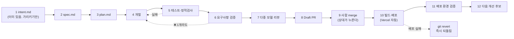

# CLAUDE.md — 결 GYEOL 작업 규약

이 문서는 **사람과 AI 에이전트가 같이 읽는 작업 규약**이다. 이 레포에서 코드를 만지기 전에 읽는다.

> **전제 하나: 시간이 3.5일이다.**
> 오늘은 2026-09-17, 제출 마감은 **2026-09-21 00:00 KST**. 실질 개발 가능 시간은 **9/20 자정까지 약 3.5일**이고 사람은 2명이다.
> 아래 파이프라인은 12단계지만 **모든 이슈에 12단계를 다 돌리면 아무것도 못 끝낸다.** 그래서 이 문서에서 가장 중요한 것은 파이프라인 설명이 아니라 **3절의 생략 표**다. 거기부터 읽어도 된다.

영어 약어 풀이(첫 등장): **PR**(Pull Request — 코드 변경 제안), **Draft PR**(초안 상태로 열어 두는 PR. 리뷰는 받되 아직 합치지 않는다), **CI**(Continuous Integration — 자동 실행 검사 파이프라인), **DoD**(Definition of Done — 완료 조건), **SSE**(Server-Sent Events — 서버가 결과를 조금씩 흘려보내는 방식), **fixture**(픽스처 — 진짜 대신 끼워 넣는 고정 샘플 데이터).

---

## 0. 한 장 요약

| | 원재 (enzo, `@onejaejae`) | 디에고 (`@jangwonyoon`) |
|---|---|---|
| 레이어 | 입력 이해 (백엔드 + AI) | 출력 생성 (프론트엔드 + AI) |
| 소유 기능 | F1 두 축 프로필 · F2 순서 제안 | F3 타이틀 + 캡션 · 화면 전체 |
| 소유 디렉토리 | `api/` `lib/` `prompts/input/` `fixtures/` `scripts/` `config/` | `public/` `prompts/output/` `copy/` |
| 넘기는 것 | `OrderedFeed` JSON 하나 | 사용자가 확정한 결과물 |

**경계선은 딱 하나, `OrderedFeed` 다.** 원재는 이 JSON 을 만들고 화면을 몰라도 되고, 디에고는 이 JSON 을 받고 그게 어디서 왔는지 몰라도 된다.

---

## 1. 작업 파이프라인 12단계

```
intent.md → spec.md → plan.md → 개발 → 테스트·정적 검사 → 요구사항 검증
→ 다중 모델 리뷰 → Draft PR → 사람 merge → 빌드·배포 → 배포 환경 검증 → 다음 개선 후보
```

각 단계의 **산출물 / 게이트(다음 단계로 넘어가도 되는 관측 가능한 조건) / 담당**은 아래와 같다.
생략 가능 여부는 이슈 크기에 따라 달라지므로 **3절 표**에서 따로 정한다.

### 1-1. 단계별 정의

| # | 단계 | 무엇을 만드는가 (산출물 경로) | 게이트 — 무엇을 만족해야 다음으로 가는가 | 누가 |
|---|---|---|---|---|
| **1** | **intent.md** | `docs/intent.md` **1개만 존재한다.** 이슈마다 만들지 않는다 | 이 이슈가 `intent.md` 의 "9/20 자정까지 반드시 동작해야 하는 것" 목록 중 **어느 줄을 향하는지** 이슈 본문 첫 줄에 적혀 있다. 어느 줄도 못 가리키면 **그 이슈는 만들지 않는다** | 공동 (변경 시 양쪽 승인) |
| **2** | **spec.md** | `docs/specs/<이슈번호>-<슬러그>/spec.md` | 입력·출력·완료 조건이 **관측 가능한 문장**으로 있다. "잘 동작한다"는 게이트가 아니다. "사진 15장 → 15슬롯, `position` 이 1..15 를 한 번씩"이 게이트다 | 이슈 담당자 |
| **3** | **plan.md** | 같은 폴더의 `plan.md` | 건드릴 파일 목록이 있고, 그중 **남의 소유 디렉토리(4절)가 하나도 없다**. 있으면 이슈를 쪼개거나 상대 승인을 먼저 받는다 | 이슈 담당자 |
| **4** | **개발** | 코드 | 로컬에서 **한 번은 실제로 돌아간 것을 본인 눈으로 봤다** (스크린샷 또는 터미널 출력) | 이슈 담당자 |
| **5** | **테스트·정적 검사** | `test/*.test.js` (Node 내장 `node --test`) | `npm test` 통과 + `npm run eval` 통과(불변식은 6절). **테스트가 없는 코드가 아니라, 깨지면 아무도 모르는 코드가 금지다** | 이슈 담당자 |
| **6** | **요구사항 검증** | 이슈 코멘트 1개 | spec.md 의 완료 조건을 **한 줄씩 복사해 와서** 각각 ✅/❌ 를 붙였다. ❌ 가 하나라도 있으면 4단계로 돌아간다 | 이슈 담당자 |
| **7** | **다중 모델 리뷰** | PR 코멘트 | 서로 다른 모델 2개 이상에게 **같은 diff** 를 보여 주고 지적을 받았다. 지적마다 **반영 / 반영 안 함(+이유)** 이 적혀 있다. 지적 0건은 리뷰를 안 돌린 것으로 본다 | 이슈 담당자 |
| **8** | **Draft PR** | GitHub Draft PR | 제목이 `[<이슈번호>] <한 줄>`, 본문에 `Closes #N` + 스크린샷 또는 출력 1장. **Draft 로 연다 — Ready for review 로 올리는 것은 5·6단계가 끝난 뒤다** | 이슈 담당자 |
| **9** | **사람 merge** | main 커밋 | **본인이 자기 PR 을 merge 하지 않는다.** 상대가 누른다. 4시간 안에 상대가 응답 없으면 PR 에 "4시간 경과, 셀프 머지함"을 남기고 본인이 누른다 — 해커톤에서는 대기가 더 비싸다 | 상대방 |
| **10** | **빌드·배포** | 배포 URL | main 에 merge 되면 Vercel 이 자동 배포한다. **배포 실패 알림이 오면 그 자리에서 되돌린다**(`git revert`). 고치려고 붙잡지 않는다 | 자동 (실패 시 merge 누른 사람) |
| **11** | **배포 환경 검증** | 이슈/PR 코멘트 1줄 | **배포된 URL 을 직접 열어서** 해당 기능을 한 번 돌렸다. 로컬에서 됐다는 것은 이 게이트를 통과시키지 않는다 | 이슈 담당자 |
| **12** | **다음 개선 후보** | 이슈 1개 또는 "없음" 코멘트 | 하고 싶었는데 안 한 것을 **이슈로 적고 닫지 않는다.** 단, 새 이슈를 여는 것과 **지금 하는 것은 다르다** — 여는 것은 자유, 하는 것은 7절 규칙을 따른다 | 이슈 담당자 |

### 1-2. 이 파이프라인이 실제로 도는 모습 (M 크기 이슈 기준)



---

## 2. 이슈 크기 판정 — 표를 읽기 전에 먼저 정한다

크기는 **걸리는 시간이 아니라 "경계를 건드리는가"** 가 1차 기준이다. 시간은 2차다.

| 크기 | 판정 기준 (위가 우선) | 예 |
|---|---|---|
| **L** | **경계 계약을 건드린다** — `schemas/`, `prompts/shared/`, `OrderedFeed` 의 형태, `api/` 의 응답 모양 중 하나라도. 또는 하루 이상 | 스키마 v1 확정 · 두 축 합성 · `OrderedFeed` 필드 추가 |
| **M** | 경계를 안 건드리고 **한 사람 영역 안**에서 끝난다. 파일 3~6개, 반나절 | `PhotoAnalysis` 추출 · 결과 화면 순서 리스트 · 캡션 프롬프트 |
| **S** | 파일 1~2개, 1시간 이하, **되돌리기가 쉽다** | 카피 문구 수정 · 버튼 하나 추가 · fixture 값 보정 · 오타 |

**애매하면 한 단계 위로 올린다.** L 을 M 으로 잘못 보면 이틀 뒤 양쪽 코드를 다 뜯는다. M 을 L 로 잘못 보면 30분 더 쓸 뿐이다.

---

## 3. ★ 생략 표 — 크기별로 어느 단계가 필수인가

**이 표가 이 문서의 본체다.** 3.5일 안에 끝내려면 무엇을 안 하기로 했는지가 무엇을 하기로 했는지보다 중요하다.

기호: **필수** = 빼면 안 됨 / **권장** = 시간 있으면 / **생략** = 안 한다 (하면 오히려 손해)

| # | 단계 | **S** | **M** | **L** | 생략해도 되는 이유 / 생략하면 안 되는 이유 |
|---|---|:---:|:---:|:---:|---|
| 1 | intent.md 가리키기 | 필수 | 필수 | 필수 | 문서 쓰는 일이 아니라 **한 줄 인용**이다. 비용 10초, 이게 없으면 3.5일에 안 해도 되는 일을 한다 |
| 2 | spec.md | **생략** | 필수 | 필수 | S 는 이슈 본문 3줄이 곧 spec 이다. 별도 파일은 순수 오버헤드 |
| 3 | plan.md | **생략** | **생략** | 필수 | M 은 plan 을 쓰는 시간에 코드가 나온다. **L 만 필수 —** 경계를 건드리는 변경은 "어느 파일을 건드리는지"가 곧 상대에게 주는 예고이기 때문 |
| 4 | 개발 | 필수 | 필수 | 필수 | — |
| 5 | 테스트·정적 검사 | **생략** | 필수 | 필수 | S 에서 깨진 건 눈에 바로 보인다. **단, S 라도 `api/` 나 `lib/` 를 건드리면 그 순간 M 이다**(2절 크기 판정) |
| 6 | 요구사항 검증 | **생략** | 필수 | 필수 | spec.md 가 없으면 대조할 대상이 없다. S 는 2단계를 생략했으므로 자동 생략 |
| 7 | 다중 모델 리뷰 | **생략** | 권장 | 필수 | **L 만 필수.** 경계 계약의 설계 실수는 리뷰로만 잡힌다 — 테스트는 "내가 의도한 대로 도는가"만 보고 "의도가 틀렸는가"는 못 본다. M 은 시간 나면 |
| 8 | Draft PR | 권장 | 필수 | 필수 | S 는 main 직푸시 허용(5절). **단 `public/`·`api/` 를 건드리는 S 는 PR 필수** — 배포가 바로 따라가기 때문 |
| 9 | 사람 merge | 해당없음 | 필수 | 필수 | **셀프 머지 금지가 2인 팀의 유일한 안전장치다.** 4시간 무응답 시 예외(1-1절 9번) |
| 10 | 빌드·배포 | 자동 | 자동 | 자동 | main merge = 자동 배포. 사람이 할 일 없음 |
| 11 | 배포 환경 검증 | 권장 | 필수 | 필수 | **가장 자주 생략되고 가장 비싸게 돌아오는 단계다.** 로컬에서 되는데 배포에서 안 되는 이유 1순위는 환경변수다. 3.5일에 마지막 날 이걸 처음 하면 끝이다 |
| 12 | 다음 개선 후보 | **생략** | 권장 | 필수 | 이슈 여는 데 1분. L 은 필수 — 경계를 건드리면 반드시 잔여물이 남는데, 적어 두지 않으면 마감 전날 기억으로 찾게 된다 |

**한 줄 요약**
> **S = 개발 → (배포 확인).** 3단계.
> **M = spec → 개발 → 테스트 → 검증 → PR → merge → 배포 확인.** 7단계.
> **L = 12단계 전부.**

**L 은 몇 개여야 하는가** — 3.5일 안에 **L 은 3개를 넘기지 않는다.** 넘으면 그건 일정이 아니라 희망이다.
현재 L 후보: ① 스키마 v1 확정 ② `OrderedFeed` 를 만드는 파이프라인 1회 관통 ③ 두 축 합성.
③ 이 위험하면 ③ 을 먼저 버린다 — `docs/intent.md` 4절이 자른 순서를 따른다.

### 3-1. 전부 생략해도 되는 유일한 경우

**마감 6시간 전(9/20 18:00 이후)** 부터는 아래만 남긴다.
```
개발 → 배포 → 배포 URL 에서 눈으로 확인
```
이때는 PR 도 테스트도 리뷰도 안 돌린다. 대신 **그 시간대에 경계 계약(L)을 건드리는 것을 금지한다.** 고칠 수 있는 것은 카피·CSS·fixture 값뿐이다.

---

## 4. R&R 경계 — 절대 서로 건드리지 않는 것

근거: `pivot/docs/30-rnr.md` 0·1·3-1절.

### 4-1. 소유 디렉토리

```
api/                 원재 소유    서버리스 함수. 디에고는 읽기만
lib/                 원재 소유    입력 이해 로직 (PhotoAnalysis / Profile / 합성 / 순서)
prompts/input/       원재 소유    photo_analysis.md · target_extract.md · current_extract.md · order.md
fixtures/            원재 소유    mock 데이터. 스키마가 바뀌면 여기를 먼저 고친다
scripts/             원재 소유    CLI 파이프라인 실행기
config/models.json   원재 소유    모델 선택. 변경 권한도 원재 (비용·지연이 서버에서 관측된다)

public/              디에고 소유  index.html · app.js · style. 화면 전체
prompts/output/      디에고 소유  title.md · caption.md · omit_reason.md
copy/                디에고 소유  한국어 문구. note_key → 문장 렌더링

schemas/             ★ 공동       변경하려면 양쪽 승인 (아래 4-2)
prompts/shared/      ★ 공동       style_guard.md. 추가는 누구나, 삭제·완화는 양쪽 승인
package.json         ★ 공동       의존성 추가는 상대에게 알린다
vercel.json          ★ 공동       배포 설정
docs/intent.md       ★ 공동       무엇을 만드는지의 원천. 뒤집으려면 양쪽 승인
```

**규칙 3개**
1. 남의 디렉토리 파일을 직접 고치지 않는다. 고쳐야 하면 **이슈로 요청한다.**
2. 한 PR 에 `prompts/input/` 과 `prompts/output/` 이 **같이 들어가면 양쪽 리뷰가 필요하다.** 이 조건만 지키면 나머지 PR 은 상대가 바로 눌러도 된다.
3. 프롬프트는 **파일**이지 코드 안의 문자열이 아니다. 서버가 실행 시점에 읽는다. 그래야 디에고가 `api/` 를 안 건드리고 자기 프롬프트를 고친다.

### 4-2. 공유 계약 스키마 — 어디 있고 어떻게 바꾸는가

**어디 있나:** `schemas/` 4개 파일. 원본 설계는 `pivot/docs/30-rnr.md` 2절에 있고, **이 레포의 `schemas/` 가 유일한 실효 버전이다.** 둘이 어긋나면 `schemas/` 가 이긴다.

| 파일 | 무엇 | 누가 만드나 | 누가 읽나 |
|---|---|---|---|
| `schemas/target_profile.md` | 지향(주축). 되고 싶은 결 | 원재 | 원재 |
| `schemas/current_profile.md` | 현재(보정축). 원래 내 방식. **`present:false` 가 정상 상태다** | 원재 | 원재 |
| `schemas/photo_analysis.md` | 사진 1장의 사실. 핵심은 `describable_facts` (캡션이 말해도 되는 사실의 허용 목록) | 원재 | 원재 |
| `schemas/ordered_feed.md` | **경계 계약.** 순서 + 자리별 근거 + 합성된 프로필 | 원재 | **디에고** |

**바꾸는 절차 (L 크기다. 예외 없음):**
1. 이슈를 연다. 제목에 `[schema]` 를 붙인다.
2. **`fixtures/` 를 먼저 고친다.** 스키마 문서보다 먼저. 반대로 하면 "스키마는 바꿨는데 목업은 옛날 것"이 되어 디에고 화면이 조용히 깨진다.
3. 양쪽이 이슈에 "합의함"을 남긴다. **4시간 안에 응답이 없으면 제안자가 진행하고 상대에게 알린다.**
4. `schema_version` 을 올린다. 올리지 않으면 어느 fixture 가 옛날 것인지 구별이 안 된다.
5. 필드를 **줄이는 방향의 변경은 환영이고, 늘리는 방향은 7절(기능 추가) 규칙을 적용한다.**

**결정권이 갈리는 지점** (`30-rnr.md` 4절 C1~C7 을 그대로 따른다):

| 무엇 | 결정권 | 진 쪽의 권리 |
|---|---|---|
| `schemas/` 변경 | 양쪽 승인 | 4시간 무응답 시 제안자 진행 |
| 캡션을 비울 것인가 채울 것인가 | **디에고** | 원재가 낸 숫자를 **UI 에 그대로 표시해야 한다.** 무시할 순 있어도 숨길 순 없다 |
| `describable_facts` 를 얼마나 넓게 담을까 | **원재** | 디에고는 부족한 케이스를 `eval/golden/` 에 올린다 |
| 두 축 합성 규칙 | **원재** | 디에고는 합성했다는 사실을 **정직하게 노출한다.** 감추지 않는다 |
| "기능 하나만 더" | **둘 다 거부권.** 한 명이라도 반대하면 안 한다 | — |

---

## 5. 브랜치 · 커밋 · PR

### 5-1. 브랜치
```
main                         유일한 장기 브랜치. 여기가 곧 배포다
feat/<이슈번호>-<슬러그>       기능        예: feat/12-photo-analysis
fix/<이슈번호>-<슬러그>        버그
docs/<슬러그>                 문서만
```
- `develop` 을 만들지 않는다. 3.5일에 장기 브랜치가 둘이면 머지 비용만 는다.
- 브랜치는 **하루를 넘기지 않는다.** 하루 넘게 살아 있으면 이슈가 너무 큰 것이다 — 쪼갠다.
- **S 크기 + 문서/카피/fixture 만 건드리는 경우에 한해 main 직푸시를 허용한다.** 그 외는 전부 브랜치.

### 5-2. 커밋
```
<type>: <한 줄 한국어 요약>

<필요하면 본문>

Co-Authored-By: Claude Opus 5 (1M context) <noreply@anthropic.com>
```
`type` 은 6개만 쓴다: `feat` `fix` `docs` `refactor` `test` `chore`.
- **한국어로 쓴다.** 두 사람 다 한국어가 모국어다.
- AI 가 만든 커밋에는 위 `Co-Authored-By` 를 붙인다. 사람이 직접 쓴 커밋에는 붙이지 않는다.
- 한 커밋은 한 가지만. "이것저것 수정"은 나중에 되돌릴 수 없다.

### 5-3. PR
- **Draft 로 연다.** 5·6단계(테스트·요구사항 검증)가 끝나면 Ready for review 로 올린다.
- 제목: `[<이슈번호>] <한 줄>`
- 본문 필수 3줄: `Closes #N` / 스크린샷 또는 터미널 출력 1장 / spec 완료 조건 체크 결과
- **merge 는 상대가 누른다**(1-1절 9번). 4시간 무응답이면 예외.
- merge 방식은 **Squash and merge** 하나만 쓴다. 되돌릴 때 커밋 하나만 revert 하면 되기 때문이다.
- **CI 를 만들지 않는다.** 3.5일에 CI 설정 비용이 이득보다 크다. `npm test` 는 각자 PR 올리기 전에 로컬에서 돌린다.

---

## 6. AI 출력 품질 기준

근거: `pivot/docs/20-product-definition.md` 3-3절 P1~P3, `pivot/docs/30-rnr.md` 3-3절.

### 6-1. 지켜야 하는 것

**P2 — 모든 판단에 근거를 댄다. 못 대면 말하지 않는다.**
근거는 문서의 다짐이 아니라 **타입**이다.
```jsonc
Claim<T> = { "value": T, "confidence": 0.0~1.0, "evidence": [Evidence, ...] }  // evidence 길이 0 금지
Evidence = { "kind": "ig_post"|"uploaded_photo"|"user_text"|"aggregate"|"rule",
             "ref": "출처 식별자", "note": "한 줄 한국어. UI 의 [근거 보기] 에 그대로 뜬다" }
```
- `evidence` 가 빈 `Claim` 은 **직렬화 단계에서 거부한다.** 근거가 없으면 그 필드를 **아예 빼고** `completeness` 를 낮춘다.
- **모르는 걸 비워 두는 것은 정상이고, 모르면서 값을 채우는 것이 실패다.**
- `kind:"rule"` 은 우리 설계 규칙에서 온 판단이다. 허용하되 **`rule` 만으로 이루어진 프로필 항목은 개인화가 아니므로** 프로필에 넣지 않는다. `OrderedFeed.slots[].rationale` 에서만 허용한다.

**P3 — 다 채우지 않는다. 비움을 결과로 내놓는다.**
- 캡션 슬롯을 전부 채우려 들지 않는다. **"설명 없음"도 유효한 큐레이션 결과다.**
- **진행률 UI("3/3 완성")를 화면 어디에도 두지 않는다.** 그 자체가 전부 채우라는 압력이다.
  ※ "분석 중" 로딩 표시는 진행률 UI 가 아니다. 금지 대상이 아니다.

### 6-2. 자동으로 판정한다 — 불변식 (축소판)

원본 `30-rnr.md` 3-3절은 불변식 8개를 정의했다. **3.5일 기준으로 5개로 줄인다.** 줄인 것과 그 이유:

| # | 불변식 | 누구의 실패 | 상태 |
|---|---|---|---|
| **E1** | 모든 `Claim` 의 `evidence` 길이 ≥ 1 | 낸 쪽 | **유지** — P2 의 실체. 이게 없으면 근거 추적이 말뿐이 된다 |
| **E2** | `input_count == output_count`, `photo_id` 중복·누락 0 | 원재 | **유지** — 깨지면 사진이 사라진다. 데모 즉사 |
| **E3** | `position` 이 1..N 을 빠짐없이 한 번씩 | 원재 | **유지** — E2 와 한 쌍 |
| **E6** | 타이틀은 정확히 1개 | 디에고 | **유지** — 비용 0 |
| **E8** | `current_profile_id == null` 인데 `disclosure != "target_only"` 면 실패 | 원재 | **유지** — 보정 없이 보정한 척하는 것은 정직성 위반이다 |
| ~~E4~~ | 캡션의 고유명사가 `describable_facts` 안에 있다 | 디에고 | **자동 판정 생략 → 수동 스팟체크로.** 한국어 고유명사 추출을 3.5일에 제대로 만들 수 없다. 대신 **데모에 쓸 사진 세트 1벌은 사람이 전수 대조한다** |
| ~~E5~~ | `banned_words` 출현 0회 | 디에고 | **프롬프트 단계로 이동.** `prompts/shared/style_guard.md` 에 금지어를 넣고, 판정은 사람 눈으로 |
| ~~E7~~ | `caption_state=="omitted"` 슬롯 최소 1개 | 디에고 | **자동 판정 생략.** 비움이 1개도 없는 결과는 사람이 보면 바로 안다. 자동화 이득이 적다 |

**골든 세트도 줄인다.** 원본은 사진 3벌 × 프로필 2벌 = 6케이스. **1케이스(사진 1벌 × 프로필 2벌)로 시작한다.** 프로필 2벌은 유지 — 그게 "같은 사진, 다른 사람, 다른 결과"라는 핵심 주장의 증거이기 때문이다.

`npm run eval` 을 **PR 올리기 전 각자 로컬에서** 돌린다.

### 6-3. ★ 하지 말아야 할 것

**(a) MVP 에서 뺀 것 — 이슈로도 만들지 않는다** (`pivot/BRIEF.md` 4항)
계정/로그인 · 결제 · 팀 협업 · 예약 발행 · **실제 인스타 자동 게시** · 사진 보정/필터/생성 · 해시태그 대량 추천 · 인게이지먼트 예측 점수 · 게이미피케이션(출석/점수/랭킹).
> 이슈로 만들면 그 자체가 나중에 "해야 할 일"로 읽힌다. 만들지 않는다.

**(b) 출처 없는 수치를 사실처럼 쓰지 않는다**
- 시장 규모·사용자 수·"N분 절약" 같은 수치는 **출처 URL 을 달거나 "미검증 가정"으로 표기한다.**
- 해커톤 기간의 사용자 수는 통계가 아니라 관찰 기록이다. **비율("60%")이 아니라 "5명 중 3명"으로 말한다.** 비율로 부풀리는 순간 `BRIEF.md` 6항 실패 조건이다.
- `pivot/docs/20-product-definition.md` 1-4절의 미검증 가정(U1~U18)을 **사실처럼 인용하지 않는다.**

**(c) 없는 사실을 단정하지 않는다 — AI 출력의 1순위 금지**
- 캡션은 그 슬롯의 `describable_facts` 안에서만 말한다. **거기 없는 장소·인물·시간·감정을 문장에 넣으면 그 캡션은 틀린 것이다.**
- 순서 근거(`rationale`)는 `PhotoAnalysis` 필드나 프로필 항목으로 **역추적되어야 한다.** 근거가 전부 `kind:"rule"` 인 결과는 개인화가 아니므로 실패로 본다.
- 사진에 대한 감정·의도 추정("행복해 보이는 순간")을 사실처럼 쓰지 않는다.

**(d) 과장하지 않는다**
- `prompts/shared/style_guard.md` 의 금지어를 쓴다: `이처럼` `또한` `이를 통해` `이러한` `마침내` — 한국어 AI 문체의 신호다.
- 최상급·단정형("최고의", "완벽한", "반드시")을 쓰지 않는다.
- UI 는 "생성했습니다"가 아니라 **"이렇게 해봤습니다, 고치세요"** 로 말한다. 결과물은 언제나 초안이고 최종 저자는 사용자다(P1).

---

## 7. 기술 스택 — 3.5일 안에 2인이 배포까지 가는 최소 구성

**선정 기준 하나: 빌드 설정에 쓰는 1시간은 기능에 쓰는 1시간을 뺏는다.** 그래서 전부 "설정 0" 쪽으로 골랐다.

| 층 | 선택 | 왜 (한 줄) |
|---|---|---|
| **프론트엔드** | **빌드 없는 단일 HTML + 바닐라 JS** (`public/index.html`, `public/app.js`) | `pivot/deliverables/prototype.html` 이 이미 그 형태로 동작한다 — 프레임워크 도입은 순수 마이그레이션 비용이고 3.5일에 되갚을 시간이 없다 |
| **서버** | **Vercel Serverless Functions** (`api/*.js`, Node 22) | 정적 HTML 을 그대로 서빙하면서 **같은 레포에서** API 키를 서버에 숨길 수 있는 최소 구성. 별도 서버 프로세스·포트·Dockerfile 이 없다 |
| **배포** | **Vercel. `main` push = 자동 배포** | 배포 파이프라인을 따로 만들 시간이 없다. merge 가 곧 배포여야 11단계(배포 환경 검증)가 실제로 돈다 |
| **AI** | **Anthropic API, `claude-opus-5` 하나** (`config/models.json`) | 모델을 여러 개 섞으면 품질 차이의 원인을 못 찾는다. 하나로 시작하고 필요할 때만 쪼갠다 |
| **데이터 저장** | **없음.** 세션 메모리 + `fixtures/` 정적 JSON | 로그인이 없으므로(6-3 a) 저장된 데이터의 주인을 식별할 수 없다. DB 를 붙이면 붙이는 시간만 든다 |
| **테스트** | **Node 내장 `node --test`** | 설치 0. Jest/Vitest 는 설정 파일부터 만들어야 한다 |
| **패키지** | **npm.** 런타임 의존성은 `@anthropic-ai/sdk` 하나로 시작 | 의존성을 늘릴 때마다 상대에게 알려야 하는 비용(4-1절)이 붙는다 |
| **인스타 수집** | **Apify `apify/instagram-scraper`. 단 크리티컬 패스 밖** | 실측 근거가 있다 — 공개 계정 1건, 게시물 100개, 약 75초, 실비 $0.27 `[12b 1절]`. **75초와 실비 때문에 무대에서는 사전 수집 스냅샷을 재생한다**(자세한 근거는 `docs/intent.md` 4절) |

**의도적으로 안 쓰는 것**

| 안 쓰는 것 | 이유 |
|---|---|
| React / Vue / Svelte | 프로토타입이 바닐라다. 옮기는 시간에 결과 화면을 다듬는 게 표를 번다 |
| TypeScript | 타입 이득이 3.5일 안에 빌드 설정·타입 에러 대응 비용을 못 넘는다. 계약은 `schemas/` 문서와 불변식(6-2)으로 지킨다 |
| 별도 백엔드 프레임워크(Express/Nest) | 서버리스 함수 3~4개면 끝난다. 라우터를 만들 이유가 없다 |
| DB (Postgres/Supabase/Redis) | 저장할 주인이 없다 |
| CI (GitHub Actions) | 설정 비용 > 이득 (5-3절) |
| Docker | Vercel 이 런타임을 준다 |
| 인증/세션 | MVP 에서 뺀 항목이다 (6-3 a) |

**환경변수** — `.env.example` 만 커밋한다. 실제 키는 절대 커밋하지 않는다.
```
ANTHROPIC_API_KEY=      # 원재가 발급. 디에고는 별도 키를 따로 받는다 (누가 얼마 썼는지 보여야 한다)
APIFY_TOKEN=            # 선택. 없으면 fixtures/ 스냅샷으로 동작한다
```
Vercel 프로젝트 설정에도 **같은 이름으로** 넣는다. **로컬에서 되는데 배포에서 안 되는 이유 1순위가 이것이다**(11단계).

---

## 8. 막혔을 때

| 상황 | 할 것 |
|---|---|
| 상대 영역 파일을 고쳐야 한다 | 이슈로 요청한다. 직접 고치지 않는다(4-1) |
| 상대가 4시간 응답이 없다 | 진행하고 PR/이슈에 "4시간 경과, 진행함"을 남긴다 |
| 상대 코드가 아직 없다 | `?mock=1` 로 `fixtures/` 를 받아서 진행한다. **기다리지 않는다** |
| 배포가 깨졌다 | 고치려 붙잡지 말고 **즉시 `git revert`.** main 은 항상 돌아야 한다 |
| "기능 하나만 더" 하고 싶다 | 상대에게 묻는다. **한 명이라도 반대하면 안 한다**(4-2) |
| 일정이 부족하다 | `docs/intent.md` 4절의 **자를 순서**를 위에서부터 따른다. 새로 정하지 않는다 |
| 마감 6시간 전이다 | 3-1절로 간다. 경계 계약을 건드리지 않는다 |
