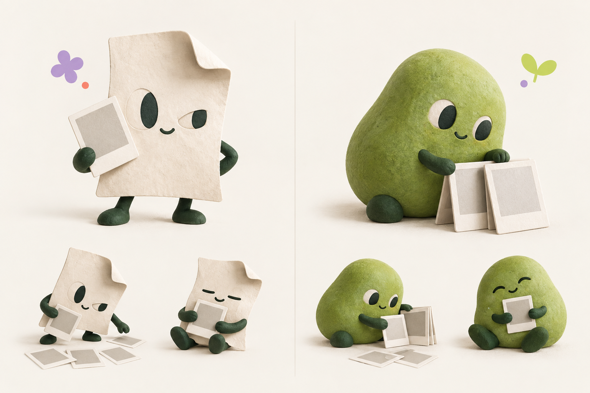

# ADR-0003: 이미지 캐릭터·기믹과 후속 Motion

- 날짜: 2026-09-17
- 결정자: **diego.yoon** (`@jangwonyoon`)
- 협업자: **enzo.cho** (`@onejaejae`)
- 상태: 이미지 전용 제작·펑키하고 귀여운 방향·후속 Motion은 사용자 지시로 확정. 최종 외형·이름·화면 배치는 미정.
- 범위: intent D2 첫 체험, D3 사진 순서/근거, D5 비움 이해를 돕는 시각 개선. API·제품 계약 변경은 없다.

## 결정

캐릭터와 장식 기믹은 **PNG·WebP·AVIF 이미지 에셋만** 사용한다. CSS/SVG/Canvas 캐릭터나 3D 런타임은 추가하지 않는다. 3D 질감으로 제작한 정적 래스터 이미지는 가능하다. 버튼·안내 텍스트·접근성 구조는 기존 HTML/shadcn을 유지하며 필수 글자를 이미지에 굽지 않는다.

PLAY CLUB은 분위기 레퍼런스다. 사용자 추가 지시에 따라 기존 이미지·얼굴을 따르지 않아도 되며, GYEOL 결과 화면에 어울리는 **새롭고 펑키하고 귀여운 이미지**를 만든다. 사진이 주인공이라는 위계와 기존 종이색·초록색은 제안의 기준으로 삼는다. 사용자 사진 보정/합성이나 새로운 게임 기능은 포함하지 않는다.

Framer Motion은 정적 이미지 버전 인수 후 후속으로 진행한다. 현재 공식 계열인 `motion`/`motion/react`를 구현 시 확인하고 고정하며, 이번 문서 작업에서는 설치하지 않는다. 이미지 등장·이동·표정 이미지 전환에 적용한다. `prefers-reduced-motion`에서 정적 상태를 유지하고, 결과 표시나 CTA를 연출 때문에 늦추지 않는다.

## 현재 화면 검토

기준은 PR #32가 병합된 main `9a69a16`, [Production 화면](https://project-7klb1.vercel.app/)이다. 실제 첫 화면과 [PLAY CLUB 원본 이미지](../reference/play-club/README.md)를 비교했다.

- 현재 종이색·초록색, 차분한 서체, 샘플 CTA와 고정 샘플 안내는 일관된다.
- 첫 화면에 사진 예시나 캐릭터가 없어 ‘사진 순서를 다루는 제품’의 시각적 인상이 약하다. 동일한 텍스트 샘플 카드만으로 사진의 관계를 체험하기 어렵다.
- 현재는 foundation이다. 입력/편집/완성된 결과 화면의 부재를 완성 UI의 버그로 평가하지 않는다. #14/#15/#17과 연결해 설계한다.
- 권고: 사진을 고르는 작은 동반자 1종과 스티커/인화지 이미지 기믹 최대 2개. 캐릭터가 사진·근거·복구 CTA를 가리지 않도록 배치한다.

UI UX Pro Max 로컬 2.0.1 설치본을 확인하고 디자인 시스템/UX 검색을 실행했다. 뉴스레터·구독 폼·파랑/주황 등 자동 추천은 제품 맥락과 달라 채택하지 않았다. content-first·대비·터치·포커스·reduced-motion 기준만 검토에 활용했다. 설치본의 React Native 전용 문구는 GYEOL의 확정 Next.js 스택에 적용하지 않는다.

## 새 이미지 시안

내장 imagegen으로 생성한 비교용 보드다. 왼쪽은 인화지를 정리하는 접힌 종이 친구, 오른쪽은 초록색 조약돌 동반자다. **추천은 왼쪽**: 사진·종이·큐레이션이라는 제품 의미가 실루엣에 직접 드러난다. 오른쪽은 더 둥글고 친근한 대안이다.

이는 화면용 투명 에셋이나 승인된 최종 캐릭터가 아니다. 배경이 있는 콘셉트 보드이며 실제 표시 크기·최종 포즈·투명 가장자리·최적화 검증은 #35에서 진행한다. 생성 방식과 최종 프롬프트는 [제작 기록](../design/concepts/README.md)에 남겼다.

## 실행 그래프와 병렬 작업

| 노드 | 범위 | 실행 |
|---|---|---|
| [#33](https://github.com/Daterl/gyeol/issues/33) | 디자인 엄브렐라 (#4 하위) | 범위/증거 모음 |
| [#34](https://github.com/Daterl/gyeol/issues/34) | 화면 검토·정적 시안·이미지 배치 | 착수 가능 |
| [#35](https://github.com/Daterl/gyeol/issues/35) | 캐릭터/스티커 이미지 후보와 최종 에셋 | #34와 후보 제작 병렬 가능; 첫 비교 보드 생성 |
| [#36](https://github.com/Daterl/gyeol/issues/36) | 정적 이미지 화면 적용 | #34/#35 및 #14/#15/#17 인계 후 |
| [#37](https://github.com/Daterl/gyeol/issues/37) | 이미지 Motion | #36 이후 후속 대기, 제출 마일스톤 미지정 |

GitHub native parent/sub-issue와 blocked-by에 반영하고 Project #2에서 상태를 관리한다. #34는 docs/design/ui-review.md, #35는 캐릭터 에셋/제작 문서를 소유해 병렬 수정 충돌을 피한다. 앱 적용은 담당 하나가 공유 파일을 수정한다. 새로운 디자인 가지를 기존 D1~D6의 필수 선행으로 만들지 않는다.

## 근거

- [PLAY CLUB v0.2](https://app.notion.com/p/PLAY-CLUB-v0-2-3dcde71aaa9f81d8a838d97dfde29bf2?source=copy_link): 선택이 결과를 바꾸는 작은 놀이, 조건 유지, 공유 강요 없음.
- [UI UX Pro Max](https://github.com/nextlevelbuilder/ui-ux-pro-max-skill)
- [Motion 설치](https://motion.dev/docs/react-installation), [MotionConfig](https://motion.dev/docs/react-motion-config), [useReducedMotion](https://motion.dev/docs/react-use-reduced-motion)
