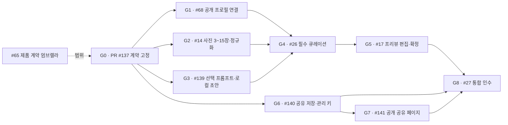

# AI Session 실행 그래프

[제품 계약 엄브렐라 #65](https://github.com/Daterl/gyeol/issues/65) · [작업 칸반](https://github.com/orgs/Daterl/projects/2/views/1) · [제출 마일스톤](https://github.com/Daterl/gyeol/milestone/1) · [Production 릴리스 #77](https://github.com/Daterl/gyeol/issues/77)

## 노드와 관계

엄브렐라는 범위를 모으고 G 노드는 제품 전달 게이트를 나타낸다. 하위 이슈가 없는 실제 실행 leaf 하나가 AI Session/PR 하나의 계약이다. GitHub native parent/sub-issue가 범위 관계, blocked-by가 실행 선행 관계다. 실제 관계와 상태는 GitHub가 원천이고 이 문서는 운영 방법과 현재 실행 그래프를 기록한다.

- 과거 #22 → #2~#5 실행 그래프는 #65의 G0~G8로 대체되어 종료됐다. 기존 구현과 검증 증거는 해당 G 노드의 하위 이슈에서 재사용한다.
- #65 아래 G1~G8을 native sub-issue로 등록했고, 실선 선행 관계를 GitHub blocked-by로 등록했다.
- 담당은 diego.yoon (`@jangwonyoon`), 공개 프로필 수집·입력 이해 협업은 enzo.cho (`@onejaejae`)다. 공유 계약은 두 사람이 함께 리뷰한다.
- G1·G2·G3·G6은 `착수 가능`, G4·G5·G7·G8은 native blocked-by가 해제될 때까지 `대기`다.

## 공개 프로필 큐레이션 계약 그래프 — 2026-09-18

[ADR-0008](adr/0008-public-profile-curation-and-sharing.md)이 확정한 사용자 경로는 **공개 프로필 연결 → 사진 3~15장 → 선택 프롬프트 → 필수 큐레이션 프리뷰·편집·확정 → 공유 링크**다. 프로필 연결은 Apify로 공개 자료를 확인하는 것이며 본인 소유권 인증이 아니다. `인증 완료` 대신 `공개 프로필 연결 완료`라고 쓴다.



실선은 실행 선행 관계다. 점선은 범위 관계라서 엄브렐라 완료를 기다리라는 뜻이 아니다. G1·G2·G3·G6은 G0 인수 후 병렬로 진행할 수 있다. G6은 저장 계약과 관리 권한을 먼저 구현하고, G5의 확정 결과를 실제 저장에 연결하는 검증은 G8에서 수행한다.

| 노드 | 작업 내용·소유 | 완료 조건 | 필수 증거 | blocked edge와 해제 조건 |
| --- | --- | --- | --- | --- |
| G0 · PR #137 계약 고정 | diego.yoon, enzo.cho 공동 리뷰. ADR-0008·#65·이 그래프의 용어와 범위를 일치시킨다. | 공개 연결이 소유권 인증이 아님, 3~15장, 선택 프롬프트, 필수 큐레이션, 프리뷰 편집 후 확정, 공유 링크가 세 문서에 같은 의미로 기록된다. | 문서 링크, diff 리뷰, 두 담당의 인수 기록. | 완료. merge `76e95d8`. |
| G1 · #68 공개 프로필 연결 | enzo.cho 주도, diego.yoon UI. Instagram 공개 프로필 URL을 Apify `apify/instagram-scraper`로 조회한다. 정규화한 사용자명 해시 경로의 Private Blob 스냅샷·만료 시각과 조건부 reservation으로 브라우저·URL 표기·서버리스 instance와 무관하게 24시간 제공자 재호출을 막는다. | 공개·비공개·없음·제공자 실패를 구분하고 비공개 계정은 우회 없이 종료한다. 화면에 소유권 인증 표현이 없다. 24시간 이후 사용자 새로고침만 새 호출을 만들며 만료된 PII·실패·reservation을 일일 정리한다. | URL 정규화·경계 테스트, 공개/비공개/없음 fixture, 동시 요청 단일 호출, 다른 브라우저 캐시 재사용, 24시간 TTL 삭제, 실패 매핑, 공개 프로필 live 1회 결과와 비용·시각. | `착수 가능`. Apify 접근은 live 인수만 막는다. |
| G2 · #14 사진 3~15장·정규화 | diego.yoon. 모바일 사진 선택과 공유용 이미지 정규화를 맡는다. | 3장과 15장은 통과하고 2장과 16장은 막힌다. 긴 변 1440px WebP 공유본만 남고 EXIF·GPS와 원본은 보관하지 않는다. 선택 순서를 보존한다. | 수량 경계 테스트, 방향이 다른 실제 모바일 사진 fixture, 출력 크기·형식·메타데이터 검사, 실제 모바일 picker 확인. | `착수 가능`. 특정 외부 서비스에 의존하지 않는다. |
| G3 · #139 선택 프롬프트·로컬 초안 | diego.yoon. 프롬프트는 비워도 된다. 가벼운 프로필 참조·사진 ID·프롬프트·편집 메타데이터는 localStorage, 정규화 WebP bytes는 브라우저 native IndexedDB에 저장한다. | 빈 프롬프트와 작성 프롬프트가 모두 동작하고, 새로고침·뒤로 가기 뒤 같은 초안과 사진을 복구한다. localStorage에 사진 data URL/blob을 넣지 않고 확정 공유본을 브라우저 저장소만으로 제공하지 않는다. | 빈 값/문자열 계약 테스트, 15장 저장·reload 복구 UI 테스트, localStorage 용량 검사, 두 저장소 중 하나가 손상됐을 때 안전 초기화 증거. | `착수 가능`. G2와 병렬로 구현한다. |
| G4 · #26 필수 큐레이션 | enzo.cho 입력·근거, diego.yoon 결과 계약. 프로필 스냅샷·3~15장·선택 프롬프트로 순서, 제외 후보, 캡션 초안을 항상 만든다. | 입력 완료 뒤 큐레이션을 건너뛰는 경로가 없고 사진 ID·근거·원본 선택 순서를 잃지 않는다. 프롬프트가 없으면 연결한 공개 프로필의 관측 가능한 스타일만 사용한다. | 고정 fixture 계약 테스트, 빈/작성 프롬프트 비교, 3장·15장 결과, 근거 추적, 실제 모델 품질 표본. | #68·#14·#139에 blocked-by. 품질 하위 이슈 #41·#43·#69·#88·#97·#101·#109·#123·#124·#128·#129를 재사용한다. |
| G5 · #17 프리뷰 편집·확정 | diego.yoon. Instagram식 프로필 헤더·3열 그리드·사진 상세 패턴을 모바일 우선으로 적용한다. | 확정 전 프리뷰에서 순서 변경, 사진 제외·복원, 캡션 편집·비움과 그리드 썸네일 중심 조정을 자유롭게 적용한다. 프로필 사진·표시 이름·사용자명의 공유 포함은 기본 꺼짐이며, 이 선택이 프로필 주체의 동의나 소유권 증명이 아님을 알린다. 확정은 현재 프리뷰의 불변 스냅샷을 만든다. 편집 화면은 최대 480px이고 드래그 외 키보드·버튼 대안이 있다. Instagram 로고·고유 아이콘·그라데이션을 복제하지 않고 GYEOL 캐릭터·포인트 색을 쓴다. | 360·390·430px 시각 증거, 터치·키보드 편집 UI 테스트, 프로필 표시 선택 on/off, 편집 전후 스냅샷 비교, 새로고침 복구. | #26에 blocked-by. 디자인 하위 #33을 재사용한다. |
| G6 · #140 공유 저장·관리 키 | diego.yoon, enzo.cho 보안 리뷰. 확정 JSON과 정규화 이미지를 Private Vercel Blob의 불변 version 경로에 저장하고 manifest가 최신 version을 가리킨다. | 큐레이션 영수증은 share/version·정렬된 photo ID/hash·10분 이내 만료를 서명한다. 영수증 해시 marker를 조건부 생성해 같은 영수증에는 같은 제한 세션만 반환한다. 객체 수·WebP·파일별/총량·prefix·hash를 검증한 뒤 게시한다. manifest는 상태·current version·photo별 pathname/hash/type/size·관리 키 hash·프로필 표시 선택/출처/시각을 가진다. cache bypass와 ETag `ifMatch`로 변경을 직렬화한다. 이미지 route는 shareId+photoId를 active manifest에서 해석해 foreign share·old version·tombstone을 거부한다. share ID는 CSPRNG 128bit+, 관리 키는 256bit+이며 SHA-256·timing-safe 비교·관리 route 요청 제한·회전 후 구키 무효화를 적용한다. 비활성화는 PII 없는 tombstone을 먼저 쓰고 연결 객체를 삭제하며 이전 version과 24시간 지난 중단 업로드도 정리한다. | 영수증 replay/idempotency, 발급·관리 route 요청 제한, 2/16개·타입·크기·prefix 거부, foreign/old/tombstone 객체 거부, 키 entropy·timing-safe 비교·구키 거부, 해시 원문 비저장, 조건부 쓰기 충돌, cache bypass/no-store, 선택 off PII 비저장, version 전환, revoke/부분 업로드 정리, Blob mock 통합. | `착수 가능`. Blob 접근은 Preview live 인수만 막는다. |
| G7 · #141 공개 공유 페이지 | diego.yoon. 로그인 없이 보는 읽기 전용 웹 페이지다. | 프로필 표시 동의가 있으면 사진·표시 이름·사용자명을, 없으면 GYEOL 일반 헤더를 표시한다. 3열 1:1 그리드, 원본 비율 상세, 사진별 캡션만 제공한다. 좋아요·댓글·팔로워 수·Instagram 연결 버튼은 없다. 데스크톱 최대 935px, 모바일 3열을 유지하고 검색엔진 색인을 막는다. | 새 브라우저 직접 URL 접근, 동의 on/off, 390px·935px 시각 증거, 상세 열기, `noindex`, 비활성 링크 확인. | #140에 blocked-by. mock manifest가 인수되면 착수한다. |
| G8 · #27 통합 인수 | diego.yoon 실행, enzo.cho 수집·근거 공동 인수. | 공개 프로필 연결부터 사진 3~15장, 선택 프롬프트, 필수 큐레이션, 프리뷰 편집·확정, 다른 브라우저의 공유 조회와 관리 키 수정·비활성화까지 한 경로로 통과한다. 재확정하면 같은 링크가 최신 확정본을 보여주고, 비활성화 직후 공유·이미지 응답이 중단된다. | Preview URL, 실제 모바일 경로 녹화/스크린샷, 프로필 표시 동의 on/off, 동시 재확정 충돌, 15장 분할 업로드, revoke 직후 조회 차단·미디어 삭제, 네트워크·저장 로그에서 원본/키 비노출 확인, 접근성·회귀 명령과 결과 SHA. | #17·#140·#141에 blocked-by. 통과 뒤 #77 Production 릴리스를 연다. |

비공개 계정 차단, 사용자의 관리 키 분실, localStorage 삭제는 제품이 약속한 경계이며 작업 상태 `막힘`으로 바꾸지 않는다. 외부 접근이 없을 때도 fixture·mock으로 독립 노드를 계속 진행하고, live 증거가 필요한 노드만 `PENDING` 또는 `BLOCKED`로 기록한다. 별도 그래프 DB나 스케줄러는 만들지 않는다.

## 세션 시작

1. 해당 이슈의 목표·원천·완료 조건, 선행 노드의 실제 산출물과 인수 증거를 읽는다. 부모 umbrella 종료를 기다리지 않는다.
2. 최신 `origin/develop`에서 작업 브랜치를 만들고 PR base를 `develop`으로 정한다. 기준 SHA, branch/worktree, 실행 담당, Owned·Shared·Forbidden 파일을 기록한다. 공유 파일은 담당자 한 명이 수정하고 인계한다.
3. 선행 계약이 부분 인수됐다면 인수된 산출물만 사용하는 초안을 진행할 수 있다. 계약 확정·merge·완료와 구분한다.
4. Project를 진행 중으로 옮긴다. M은 spec, L은 spec+plan을 작성하고 해당 노드의 최소 구현·검증을 수행한다.

## 세션 종료와 인계

이슈/PR에 다음 기록을 남긴다. 실행하지 않은 항목은 PENDING이다.

```text
Verdict: PASS | FAIL | BLOCKED | PENDING
기준/결과 SHA와 PR:
변경 파일:
검증 명령 → 결과 → 증거:
실제 모델/배포 확인:
남은 게이트·막힘 해제 조건:
다음 행동·담당:
```

PASS는 기록한 검증 범위에만 적용한다. 로컬 테스트 성공이나 PR 생성만으로 완료 처리하지 않는다. 해당 이슈의 사람 합의·리뷰·merge·필요한 배포 검증을 확인한 뒤 완료로 옮긴다. 작업 시작·PR 작성·막힘·인수마다 Project를 갱신한다.

## 개발 통합과 Production 릴리스

[ADR-0004](adr/0004-develop-and-production-branches.md)를 따른다. 작업 PR은 `develop`에서 사람 리뷰·squash merge하고 Preview로 검증한다. 공개 배포는 별도 `develop → main` 릴리스 PR을 사람이 merge commit으로 병합할 때 수행한다. Preview 통과를 Production 확인으로 기록하지 않는다. Production 인수가 필요한 leaf는 배포 확인 전까지 완료로 옮기지 않는다.

## 의존성과 검증의 구분

- #68·#14·#139·#140은 병렬로 착수한다. 공유 파일이 겹치면 먼저 시작한 노드가 소유하고 댓글로 인계한다.
- native blocked-by는 선행 이슈가 닫혀야 해제된다. 댓글의 부분 인수만으로 Project 상태를 `착수 가능`으로 바꾸지 않는다.
- #26은 #68·#14·#139의 결정적 fixture를 모두 받아 로컬 통합·근거 추적이 PASS하면 닫는다. 실제 모델 품질은 #43과 #27에서 계속 인수한다.
- #140은 Blob mock의 replay·경계·CAS·객체 격리·키 회전·revoke·cleanup이 PASS하면 닫는다. Preview Blob live 인수는 #27에서 수행한다.
- #17은 닫힌 #26의 fixture 결과로 진행하고, #141은 닫힌 #140의 mock manifest로 진행한다. 각 UI 노드의 fixture/mock 인수 뒤 닫아 #27을 해제하며 live 외부 서비스는 #27에서 확인한다.
- #27만 live Apify·Preview Blob·실제 모바일의 전체 경로를 인수한다. #77은 #27 뒤의 별도 Production 릴리스다.
- #6은 Preview 외부 환경의 횡단 작업이다. `package.json`, lockfile, `vercel.json`은 한 노드가 소유하고 순차 인계한다.
- 키·모델·배포 접근 등 외부 게이트는 각 노드에서 명시한다. 초안 진행과 외부 게이트 통과를 혼동하지 않는다.

## 구현 기준

[ADR-0008](adr/0008-public-profile-curation-and-sharing.md)이 [ADR-0001](adr/0001-single-screen-photo-only-entry.md)의 사진만 시작·선택 프로필·3~20장 결정을 대체한다. [ADR-0002](adr/0002-react-stack-and-ai-session-graph.md)의 Next.js App Router·React·TypeScript·Zustand·Tailwind CSS·shadcn/ui·tv·Biome, [ADR-0006](adr/0006-apify-public-instagram.md)의 공개 자료 제한, [ADR-0007](adr/0007-mobile-first-experience.md)의 모바일 접근성 기준은 유지한다. 기존 화면과 계약이 충돌하면 ADR-0008을 우선한다.

원본 HTML의 시각·흐름은 #23에서 팀이 접근할 수 있는 참조 자료로 보존하고 경로를 기록한다. 로컬 파일명만 있는 상태를 공유 완료로 간주하지 않는다. 사진 속성·계정 프로필을 해시로 고르는 프로토타입 계산은 실제 분석으로 이식하지 않는다.

재사용한 선례: [KHDS #372](https://github.com/khc-dp/khds/issues/372)와 KHDS AI Session Task 템플릿. 별도 그래프 DB·스케줄러·대시보드를 만들지 않고 GitHub 관계·Mermaid·Project를 사용한다.
