# #34 재설계 인계 — 사진 작업대

담당 diego.yoon / 협업 enzo.cho. 2026-09-17, 기준 develop10836f8. 사용자 추천 위임 ADR-0005에 따라 A 종이 작업대를 선택했다. 아래 새 규칙이 1차 시안보다 우선한다. 문서 인수와 실제 앱 반영(#36)은 별개다.

## 관찰 → 변경

실제 #19 화면은 샘플·결과·문장 설명이 사진 위에 누적된다. 사진을 보기 전까지 제목과 안내를 여러 번 읽어야 한다. UI UX Pro Max의 정보 위계·접근성 기준으로 다음을 정했다. 스킬 사용 자체를 완성 근거로 삼지 않는다.

| 관찰 | 적용 규칙 |
|---|---|
| 큰 랜딩 제목과 결과 제목이 연속 등장 | 첫 제목28~32px, 결과는 하나의 작업 제목. 반복 캐치프레이즈 삭제 |
| 결과 앞 긴 문장 생성 설명 | 제목 입력과 생성/내보내기를 하나의 도구 영역으로 모음. 출처 고지는 짧게 유지 |
| 첫 화면에 사진 없이 샘플 버튼만 있음 | 동일 샘플3장의 미리보기와 원클릭 진입을 먼저 보여 줌 |
| 카드 외곽/균일한 둥근 상자가 반복됨 | 사진3열을 얇은 구분선으로 정렬. 비움만 작은 보라색 선으로 구분하며 상태명·이유 유지 |
| 모바일 원본 비율 사진이 화면 대부분을 차지 | 390px는104px 미리보기+문장, 320px는88px. 원본 보기와 모든 편집 동작 유지 |
| 선택 입력4개가 처음부터 펼쳐져 있음 | 모두 선택인 영역은 native details로 접음. 오류가 있으면 자동으로 열고 해당 입력을 읽을 수 있어야 함 |

[실행 HTML](mockups/refined.html)에서 입력/결과/같은 콘텐츠 전후 비교를 볼 수 있다. `before=1`은 1차 시안의 큰 제목·카드·간격을 **새 동일 콘텐츠로 재구성한 비교군**이며 과거 서비스의 원본 캡처가 아니다. 원본 1차 시안은 아래 기록을 보존한다.

## 실제 캡처

| | 1440px | 390px |
|---|---|---|
| 같은 콘텐츠의 이전 구성 비교 | 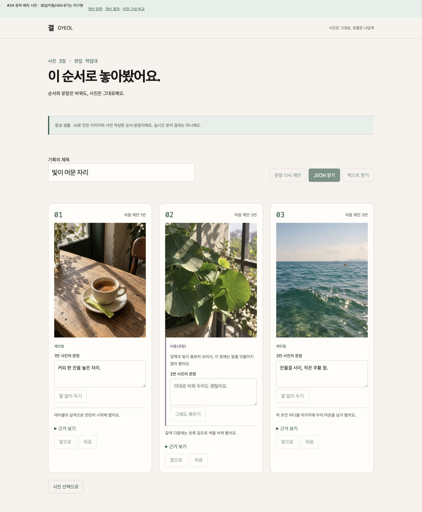 | 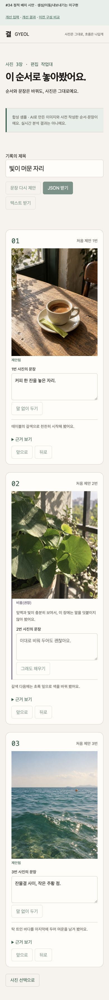 |
| 새 결과 | 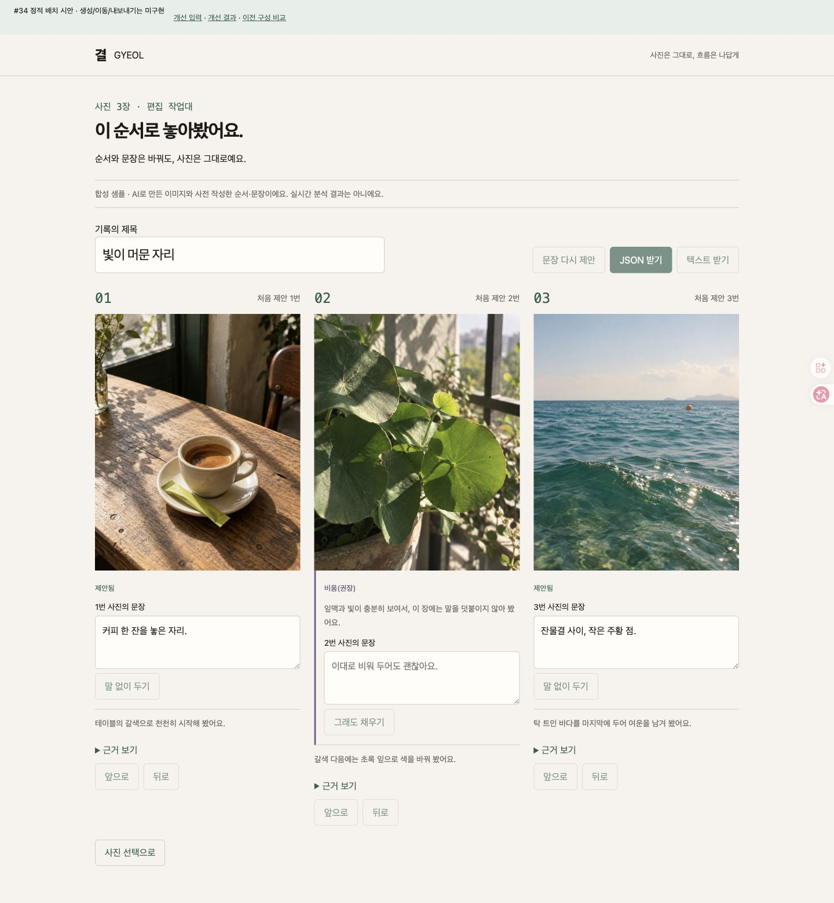 | 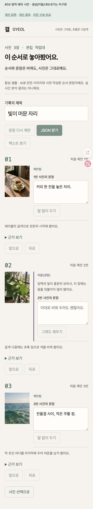 |
| 새 입력 | 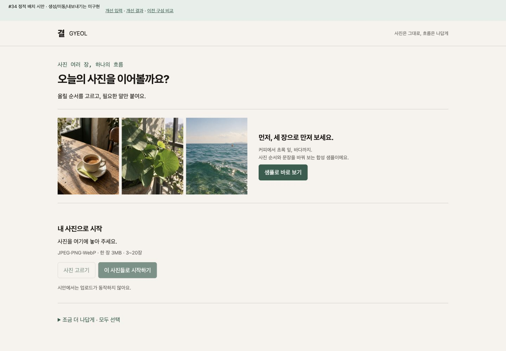 | 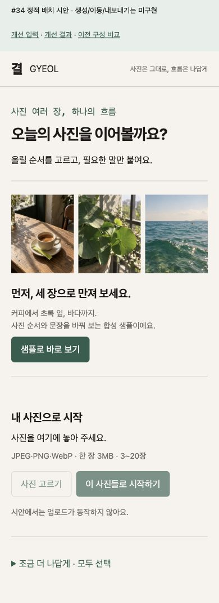 |

CUA에서 첫 사진 시작 위치 비교: 데스크톱758.77→541.77px(217px 감소), 모바일888.16→689.16px(199px 감소). 검토용 상단 바 포함, 서로 동일 콘텐츠/창 크기. [측정](mockups/refined-measurements.json). 320/390/1440 입력·결과 가로 넘침0, 이미지 전부 로드. 결과 버튼/summary/input 높이44px 이상. 320px 근거 Enter 펼침/포커스 유지/3px outline 확인. 입력 썸네일 원본 height 때문에 생긴 빈 여백은 캡처로 재현하고 height:auto 적용 후 재확인했다.

## #35 / #36 적용 계약

- 캐릭터는 추천 종이 동반자 **한 종류, 한 영역만**. desktop96px/mobile64px, 320px 숨김. 추가 스티커는 이번에 만들지 않는다. 최대2개 허용 범위에서1개만 채택한다.
- 첫 입력에 default, 실제 feed/generate 요청 대기에 working, 실제 원본 결과가 있으면 complete, 요청 오류면 recovery. 샘플은 사전 결과임을 표시하고 분석 완료라고 쓰지 않는다. 오류 복구 버튼이 이미지보다 먼저다.
- #35 독립 RGBA PNG/WebP를 쓰고 사진에 합성하지 않는다. 표정은 장식이고 필수 설명은 HTML. 캐릭터를 없애도 위계가 유지되는 것을 이번 무캐릭터 시안으로 확인했다.
- 입력/결과 구성과 이미지 연결은 #36에서 기존 #14/#15/#17/#19 컴포넌트에 적용. API/store/실제 파일/사용자 편집 계약 유지. 실패·재시도·키보드·텍스트 확대·15/20장 실기능은 #36/#27에서 확인한다.
- #37은 정적 화면 적용 후 이미지 요소만 Motion. CTA/결과를 애니메이션 종료까지 기다리게 하지 않는다.
- 사진 원본을 가리지 않는 contain을 사용한다. 이전 문서의 crop 추천보다 이 결정이 우선한다.

Verdict: 정적 재설계·비교/키보드/좁은 화면 QA PASS. 앱 반영/실모델 품질/다른 물리 기기 검증은 이 문서가 대체하지 않는다. 제품 코드를 바꾸지 않아 앱 테스트는 해당없음.

---

## 1차 시안 이력 (당시 판단, 위 재설계가 우선)

# #34 디자인 검토·화면 시안

담당 **diego.yoon** (`@jangwonyoon`) · 협업 **enzo.cho** (`@onejaejae`) · 2026-09-17.
기준 main `d815859634755b29af91d6fbbe8dcbd3f5cbf714` (PR #39 포함). 목표: intent D2·D3·D5.

**추천: A ‘종이 작업대’에 이미지 동반자 1종을 작게 배치한다.** 사진·근거·비움 이유가 먼저 읽히고, 캐릭터는 작업 상태를 보조한다. 최종 방향·캐릭터 외형은 사람 리뷰 전이다.

## 범위와 인수 기준 (이 leaf의 spec)

소유: 이 문서와 `mockups/*`. 앱·API·스키마·최종 캐릭터 에셋은 변경하지 않는다. 구현한 제품 화면과 앞으로 구현할 설계를 구분하고, 두 아트 방향·입력/결과 시안·상태별 배치·좁은 화면 규칙을 다음 leaf에 넘긴다.

- 현재 foundation에 대한 관찰과 #14/#15/#17 제안을 분리한다.
- 두 방향의 1440px·390px 입력/결과 PNG를 제공하고 320px 축소 규칙을 확인한다.
- 3/15/20장, 사진만 입력, sample/live, loading/error/empty의 위계를 정의한다.
- 필수 정보는 HTML 텍스트로 남긴다. 이미지 장식은 버튼·사진·포커스를 가리지 않는다.
- 주요 조작 높이 44px 이상, 본문 대비 4.5:1 이상, 키보드 근거 펼치기를 점검한다.
- 기믹은 최대 2개, 후속 구현·미검증·사람 판단을 명시한다.

## 현재 화면에서 관찰한 것

PR #32 이후 [공개 Production](https://project-7klb1.vercel.app/)을 실제로 확인한 기준이다. 이 브랜치에서 현재 `src/app/page.tsx`, `src/features/sample/sample-preview.tsx`, `src/app/globals.css`도 대조했다.

| 관찰 | 영향 | 제안·담당 |
|---|---|---|
| 종이색·초록색과 고정 샘플 안내가 일관됨 | 샘플을 실제 개인화로 오해할 가능성을 줄임 | 팔레트·출처 안내 유지, #14/#15 |
| 첫 화면에 사진이 없고 샘플 카드가 텍스트 중심 | 사진 순서 제품이라는 인상이 약함 | 썸네일 → 순서 → 근거/캡션 순으로 배치, #14/#15 |
| 샘플 CTA와 건너뛰기 링크가 존재 | 첫 체험과 키보드 진입의 기반이 있음 | 샘플 진입 유지, 실제 입력과 구분, #19 |
| 입력·편집·최종 F3 상태는 아직 foundation 범위 밖 | 부재를 완성 UI의 결함으로 판정할 수 없음 | 아래는 구현 제안이며 기능 검증 결과가 아님 |

원본 [GYEOL HTML](../reference/gyeol-prototype.html)의 사진 우선 흐름과 [PLAY CLUB 이미지](../reference/play-club/README.md)의 스티커/종이 감각을 참고했다. PLAY CLUB의 CSS 얼굴·게임 규칙은 가져오지 않는다. UI UX Pro Max의 정보 위계·대비·터치·포커스 기준을 사용했고, 이전 자동 추천의 뉴스레터 구성과 React Native 전용 지침은 적용하지 않았다.

## 두 방향 비교

| | A — 종이 작업대 (추천) | B — 작은 사진 클럽 |
|---|---|---|
| 기본 | 종이색 `#f6f3ed`, 초록 `#2e5e4e`, 얇은 경계 | 같은 기본색 + 라임·라벤더 영역 |
| 이미지 동반자 | 데스크톱 112px / 모바일 72px | 데스크톱 136px / 모바일 72px |
| 강조 | 사진과 실행 버튼, 비움 상태에만 연보라 | 제목 영역과 상태 배지에도 색면 |
| 장점 | 사진의 색을 방해하지 않고 긴 결과 편집에 적합 | 첫 체험에서 장난스러운 인상이 강함 |
| 비용 | 개성은 #35 이미지 완성도에 더 의존 | 큰 제목 색면이 사진보다 먼저 눈에 들어옴 |
| 결론 | A에 캐릭터의 표정·질감으로 펑키함을 담는다 | 비교안으로 유지; 대형 색면은 채택하지 않는 것을 권고 |

두 안의 내용과 조작 위치는 같아 색과 이미지 크기를 비교할 수 있다. 장식으로 사용자의 사진을 덮거나 변형하지 않는다. 비교 보드를 CSS로 잘라 보여주는 것은 **시안의 배치 참고만**이며 최종 앱에서는 #35의 독립 PNG/WebP로 교체한다.

### 데스크톱 1440px

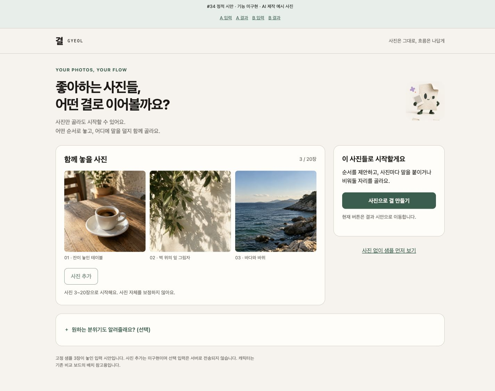
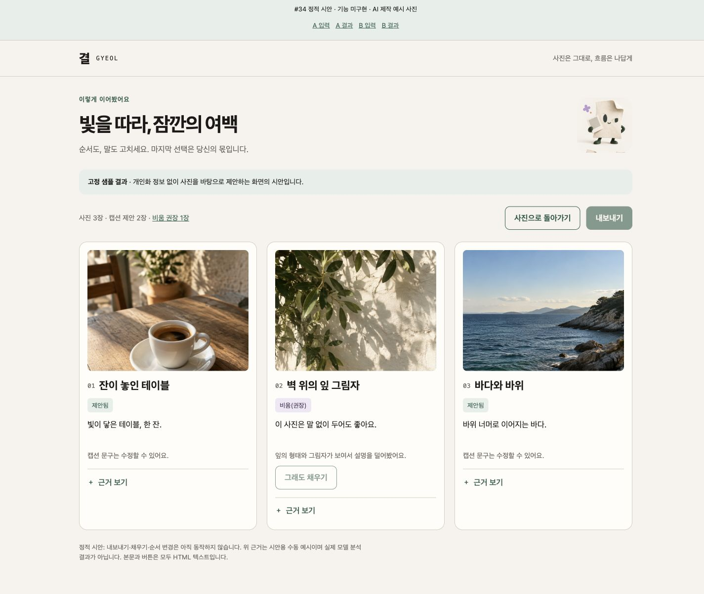
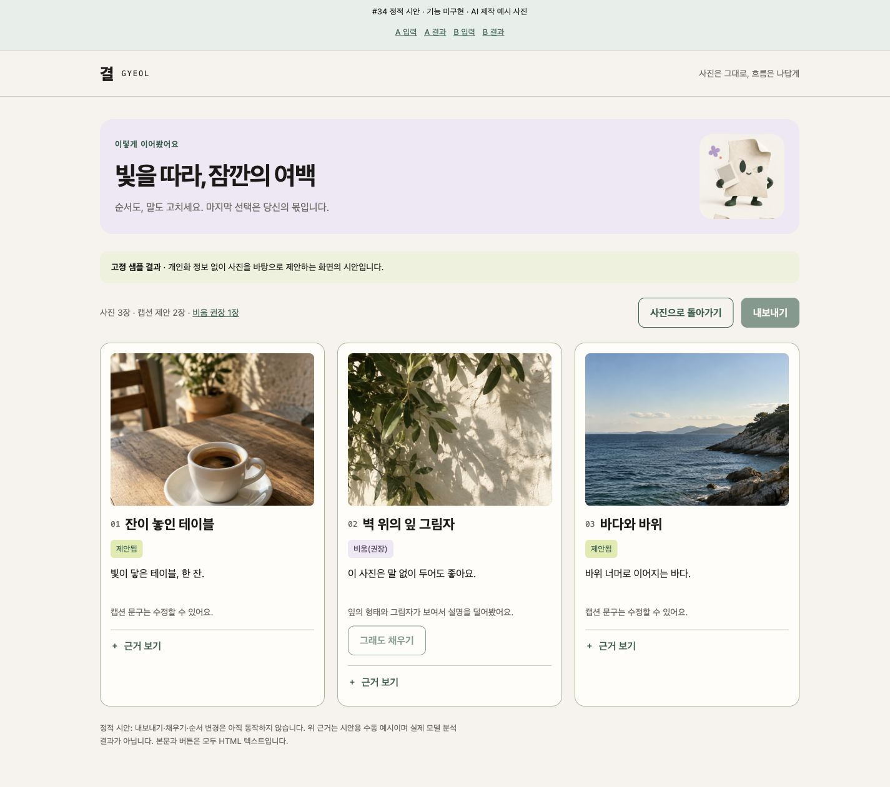

### 모바일 390px

| A 입력 | A 결과 |
|---|---|
| 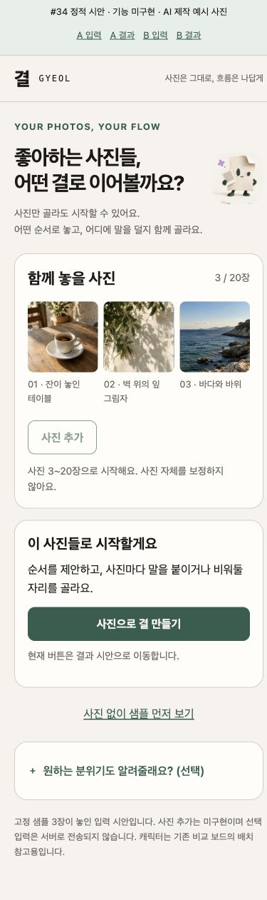 | 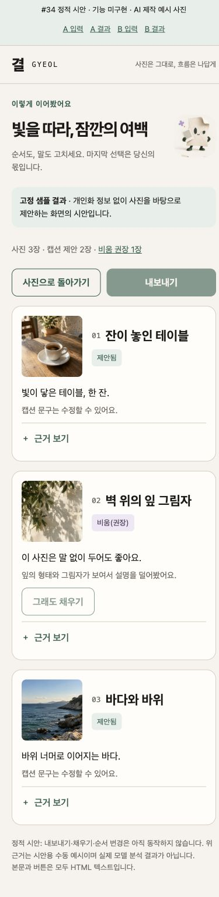 |

전체 8개 캡처와 재현 방법은 [시안 실행·제작 기록](mockups/README.md)에 있다. 상단 ‘#34 정적 시안’ 바는 검토용이며 제품에 적용하지 않는다. 비활성 버튼은 미구현 기능을 실행되는 것처럼 보이지 않도록 한 시안 표기다.

## 화면·데이터 상태별 규칙

| 상태 | 위계·조작 | 이미지·문구 규칙 |
|---|---|---|
| 초기 / 0장 | 사진 선택 → 3~20장 안내 → 샘플 진입 → 선택 입력 | 동반자 1개; 만들기 비활성 사유를 텍스트로 설명 |
| 1~2장 | 선택된 사진 유지, ‘사진을 N장 더 골라주세요’ | 오류 축하 연출 없음, 선택 버튼 유지 |
| 3장 | 세 썸네일·개수 → 만들기 → 접힌 선택 입력 | 이번 정적 시안의 입력 상태 |
| 15장 | 입력 썸네일은 3열(모바일)/5열(데스크톱), 접지 않고 전부 확인 가능 | 모바일 만들기 액션은 하단 고정 시 safe-area와 같은 높이의 본문 여백 필수. 포커스 가림 검증은 #14 |
| 20장 | 15장 규칙과 같고 추가 버튼 비활성; 삭제 후 다시 추가 가능 | 개수는 업로드 제한 안내이며 ‘캡션 완성률’이 아님 |
| 21장 / 파일 오류 | 잘못된 항목과 원인·제거 방법을 사진 영역에 표시 | 입력한 정상 사진 보존. 조용한 이미지 또는 이미지 생략 |
| 사진만 입력 | 개인화 선택 항목을 전부 비워도 시작 | ‘개인화 정보 없이 사진을 바탕으로 제안했습니다’ |
| 선택 입력 | 내 URL·기존 게시물 업로드·레퍼런스 URL·원하는 느낌, 모두 선택 | URL 미지원/스냅샷 사용을 필드 옆에 고지. 수집하지 않은 계정을 읽었다고 말하지 않음 |
| 분석/생성 중 | 실제 진행 상태의 텍스트, 중복 제출 방지, 취소/복귀 정책은 #25 | 정적 정리 중 이미지. 퍼센트·남은 시간·가짜 성공 없음 |
| 요청 실패 | 원인 요약 → 재시도 / 사진으로 돌아가기 | 입력 사진 보존, 캐릭터보다 오류·복구 조작이 우선 |
| 고정 샘플 | 결과 상단에 ‘고정 샘플 결과’ 항상 표시 | 실제 사용자 사진·실분석으로 표시하지 않음 |
| 실결과 | 결과 출처·타이틀 → 사진 순서 → 캡션/비움 → 근거 | sample 배지 제거. target_only/corrected/사진만 출처를 구분 |
| 결과 3/15/20장 | N개 전부 순서대로 표시, 데스크톱 3열 / 모바일 1열. 이동 버튼은 드래그와 동등 제공 | 원래 근거 보존, 현재 순서로 새로 분석한 것처럼 쓰지 않음 |
| 캡션 제안됨 | 사진 아래 수정 가능한 문구와 ‘제안됨’ | 실제 근거 범위에서만 작성 |
| 비움(권장) | 상태명 → 왜 비웠는지 한 줄 → ‘그래도 채우기’ → 상세 근거 | 빈칸으로 대체하지 않음. 샘플 시안의 2번 카드 |
| 사용자 작성 | ‘사용자 작성’과 편집 내용 유지 | 다시 생성해도 덮어쓰지 않음; 저장 정책은 #25/#17 |
| 전체 비움 | 모든 사진·순서는 유지, 내보내기 가능 | 완성률·부족 점수·경고색 사용 안 함 |
| 결과 없음 / 이미지 실패 | 생성 실패와 의도적 비움을 별도 텍스트로 구별 | 장식 이미지 실패는 레이아웃 유지. 사진 실패는 파일명/재선택 표시 |

이번 HTML은 3장 입력/샘플 결과의 **배치 시안**이다. 15/20장과 비동기 상태는 위 인계 명세이며 동작 구현·검증을 했다는 뜻이 아니다. 사용자의 live 사진은 서버 분석을 위해 전송될 수 있으므로 ‘기기 밖으로 전송하지 않는다’는 기존 프로토타입 문구를 쓰지 않는다.

## 좁은 화면과 접근성

- 390px: 사진 선택 3열, 결과는 사진 104px + 순서/상태, 그 아래 캡션·비움 이유·근거. 선택 입력은 주요 CTA 뒤로 이동한다.
- 320px: 좌우 16px, 캐릭터와 헤더 보조 문구 숨김, 결과 사진 88px, 액션은 필요한 경우 세로 배치. 필수 정보는 숨기지 않는다. 사진 번호는 줄바꿈 금지.
- 입력 사진과 결과 사진은 원본 비율을 왜곡하지 않고 미리보기 영역에서 크롭한다. 실제 앱에서 원본 확인 방법은 #14/#15에 맡긴다.
- 필수 문구·상태·버튼은 HTML이다. 장식 캐릭터는 `alt=""`, `aria-hidden="true"`; 사진에는 구분 가능한 대체 텍스트를 둔다.
- Tab 순서는 DOM 순서와 같고 `summary`는 Enter로 펼친다. 3px 포커스 표시와 본문 건너뛰기 링크를 유지한다.
- 일반 본문 16px, 보조 설명 14px. 색만으로 비움/오류를 구분하지 않는다. 주요 조작 높이 ≥44px.
- 이번 시안에는 모션이 없다. 후속 #37에서도 reduced-motion일 때 같은 정적 정보가 즉시 보여야 한다.
- 보정 배너의 `resolved` 숫자를 꾸밈에 가리지 않고 실제 값 그대로 표시한다 (#15).

사용한 sRGB 색 조합의 계산 대비: 본문/종이 **15.70:1**, 보조문구/종이 **4.98:1**, 종이/초록 CTA **6.71:1**, 비움 글자/연보라 **7.49:1**, 초록/라임 **5.81:1**. 비활성 버튼은 시안에서 기능 미구현을 나타내며 활성 CTA 대비 판정에 포함하지 않는다.

## 이미지 기믹 두 개와 인계

1. **사진 정리 동반자**: 첫 입력·분석 중·완료·복구 상태의 이미지 교체. 입력/결과 제목 옆의 독립 영역 한 군데만 사용, 320px에서 숨겨도 정보 손실 없음. #35는 4상태 원본·투명 가장자리·64/128/256px 품질을 인계하고 #36은 기존 상태와 연결한다.
2. **비움 카드의 작은 인화지 스티커**: 첫 번째 비움 카드의 텍스트 밖 32~40px 예약 영역에 최대 한 개. ‘비움(권장)’ 글자와 이유는 HTML 유지. 시안의 보라색 배지는 의미 있는 UI이며 이미지 스티커의 대체물이 아니다. 최종 스티커는 #35에서 제작한 뒤 #36에서 배치 검토한다.

제외: 사진 위 캐릭터 합성, CSS/SVG 얼굴, 카드마다 반복 캐릭터, 큰 축하 연출, 점수·출석·수집, 자동 움직임, 가짜 진행률. Framer Motion 설치·적용은 #37 후속이다.

| 인계 | 담당 산출물 / 남은 게이트 |
|---|---|
| #14·#15·#17 | 이 문서의 입력·결과·비움 위계. 실제 업로드·편집·복구·내보내기 검증은 각각 수행 |
| #35 | 종이 동반자 추천 외형, 상태 4종·스티커 제작. 최종 선택/이름은 사람 리뷰 전 |
| #36 | 승인된 시안+최종 에셋+화면 기능 인계 후 적용. 이미지 실패/전송량/레이아웃 변화 검증 |
| #37 | 정적 버전 인수 이후. 현재 모션 의존성 추가 없음 |

## 검증과 판정

- CUA Chrome에서 A/B × 입력/결과 × 1440/390/320px **12조합**을 확인했다. 모든 이미지 로드, 가로 넘침 없음, 주요 조작 높이 ≥44px. [원시 측정](mockups/viewport-check.json).
- 390px 결과의 두 번째 근거를 Enter로 열고 닫았다. 열린 근거 문구·포커스 대상 유지·3px outline을 확인했다.
- 시각 점검 중 캐릭터 이미지 비율, 사진 미리보기 비율, 모바일 선택 입력/CTA 순서, 320px 사진 번호 줄바꿈을 수정했다.
- 1440/390px PNG 8개는 이 HTML의 실제 브라우저 캡처다. Chrome의 세로 스크롤바 15px 때문에 캡처 내용 폭은 각각 1425/375px이며 `innerWidth`는 목표값과 일치한다.
- 이 변경은 문서·시안만 포함한다. 앱 빌드/모델/Production 기능 테스트는 해당없음. 실제 모바일 기기, 스크린리더, 200% 확대, 15/20장 동작·live 응답, 팀 밖 2명 비움 반응은 미실행이며 #14/#17/#27의 인수 항목이다.

**Verdict: 로컬 시안·검토 PASS / 사람 방향 선택·리뷰·merge PENDING.** 사람의 승인이나 실제 제품 완성을 대신하지 않는다. 추천 A를 기준으로 다음 구현을 검토할 수 있으며 기존 기능 작업의 새 선행 조건으로 만들지 않는다.
