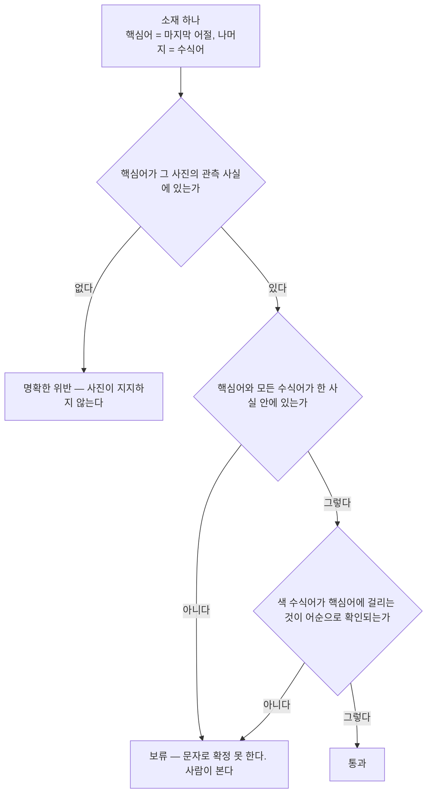

# 사실 정합성 기준 재채점 — 기존 36회 데이터

기존 실모델 36회의 출력을 그대로 두고 채점 기준만 바꿔 다시 셌다. **새 모델 호출 0회.** 입력은 `run-1.json`·`run-2.json`·`run-3.json`과 `inputs.json`뿐이다. 재현: `python3 rescore.py` (판정 규칙 검사는 `python3 rescore.py --selftest`).

## 왜 기준을 바꿨나

기존 기준은 소재 문구가 `describable_facts` 문자열을 **그대로 포함하는가**를 봤다. 그래서 `흰 털의 개`처럼 사진에 실제로 보이는 소재도 글자가 다르면 불일치로 셌고, **진짜 남은 문제가 몇 건인지 알 수 없었다.** 바꾼 기준은 소재가 그 사진의 관측 사실로 **지지되는가**를 묻는다. 느슨하게 만든 것이 아니다 — 지지되지 않으면 여전히 실패이고, 문자로 확정할 수 없으면 통과가 아니라 **보류**로 남겨 사람이 본다.

## 세 숫자 — 기존 기준과 나란히

|회차 세트|소재 수|**명확한 위반**|**보류**|**통과**|(참고) 기존 기준 불일치|
|---|---|---|---|---|---|
|run-1|362|5|44|313|197|
|run-2|336|3|30|303|131|
|run-3|276|2|10|264|44|
|**합계**|**974**|**10**|**84**|**880**|**372**|

기존 기준은 974개 소재 중 **372개**를 불일치로 셌다. 새 기준으로는 **명확한 위반 10건 · 보류 84건 · 통과 880건**이다. 최종 회차(run-3)만 보면 위반 2건 · 보류 10건이다.

## 판정 규칙

소재의 마지막 어절을 **핵심어**, 나머지를 **수식어**로 본다.

|판정|조건|
|---|---|
|명확한 위반|핵심어가 그 사진의 관측 사실 어디에도 없다. 사진이 지지하지 않는다.|
|통과|핵심어와 모든 수식어가 **한 사실 안에** 있고, 색 수식어가 핵심어에 걸린다는 것이 그 문장의 어순으로 확인된다.|
|보류|그 밖의 전부. 문자로 지지 여부를 확정할 수 없으므로 사람이 본다.|

표층 변이(`흰`/`흰색`, `체크`/`체크무늬`, 조사, 띄어쓰기)만 같은 것으로 흡수한다. 동의어 사전은 두지 않았다 — 그래서 `숄더백`을 `가방`으로 바꾼 것도 위반으로 떨어진다.

## 사진 직접 대조와의 교차 확인 (run-3, 276개 소재)

이 재채점은 사진을 보지 않고 관측 사실 텍스트만 쓴다. 사진을 직접 열고 만든 [s4-audit.json](s4-audit.json)과 맞춰 보면:

|사진 직접 대조|재채점|건수|
|---|---|---|
|관측 확인|통과|264|
|관측 확인|보류|9|
|보류|명확한 위반|2|
|위반|보류|1|

**사진 대조가 위반·보류로 본 것을 재채점이 통과로 올린 경우는 0건이다.** 기준을 느슨하게 만들지 않았다는 근거로 이 줄을 남긴다. 엇갈린 12건은 전부 재채점이 더 보수적이거나(9건 보류), 사진 없이도 관계 표현임이 분명해 더 엄격하거나(`반려견` 2건), 사진을 봐야만 알 수 있어 보류로 남긴 경우(`검은 스티커` 1건)다.

## 명확한 위반 전수 — 사람 판정 칸은 비어 있다

|회차 세트|회차|사진|소재|에이전트 의견 (사람 판정 아님)|사람 O/X|
|---|---|---|---|---|---|
|run-1|3|cq_03|검은 우븐 가방|관측은 '검은색 우븐 패턴의 숄더백'이다. 상위어로 바꿨을 뿐 사실은 맞다.|☐ O ☐ X|
|run-1|3|cq_15|녹색 잎 배경|관측은 '뒤로 짙은 초록색 잎이 보인다'다. '배경'은 관측에 없는 낱말이나 사실과 어긋나지 않는다.|☐ O ☐ X|
|run-1|5|cq_08|파란 체크셔츠|관측은 '파란색 체크무늬 셔츠'다. 붙여쓰기와 '무늬' 생략 차이다.|☐ O ☐ X|
|run-1|8|cq_15|초록 잎 배경|위와 같다.|☐ O ☐ X|
|run-1|12|cq_04|음식 여러 종류|관측은 '여러 가지 음식'이다. 사실은 맞으나 소재로서 너무 막연하다.|☐ O ☐ X|
|run-2|8|cq_09|흰 털 강아지|관측은 '흰 털의 개'다. 사실은 같고 단어만 바꿨다.|☐ O ☐ X|
|run-2|9|cq_11|검은색과 흰색 겹옷|관측은 '겉옷'이다. '겹옷'은 관측에 없는 낱말이며 오기로 보인다.|☐ O ☐ X|
|run-2|10|cq_08|파란 체크셔츠|관측은 '파란색 체크무늬 셔츠'다. 붙여쓰기와 '무늬' 생략 차이다.|☐ O ☐ X|
|run-3|7|cq_09|반려견|사진은 개를 보여주지만 기르는 관계는 사진으로 확인할 수 없다. 실질 위반으로 본다.|☐ O ☐ X|
|run-3|7|cq_12|반려견|위와 같다. 관측에 없는 관계를 단정했다.|☐ O ☐ X|

## 보류 — 사람이 봐야 하는 것

같은 소재가 여러 회차에 반복되면 한 줄로 모으고 횟수를 적었다.

|건수|사진|소재|보류 사유|사람 O/X|
|---|---|---|---|---|
|14|cq_14|크림색 노트|색 수식어 "크림색"가 핵심어에 붙어 있는지 문장에서 확인되지 않는다|☐ O ☐ X|
|7|cq_14|분홍색 라벨|색 수식어 "분홍색"가 핵심어에 붙어 있는지 문장에서 확인되지 않는다|☐ O ☐ X|
|6|cq_09|남색 라벨 병|색 수식어 "남색"가 핵심어에 붙어 있는지 문장에서 확인되지 않는다|☐ O ☐ X|
|5|cq_02|흰색 꽃 자수|색 수식어 "흰색"가 핵심어에 붙어 있는지 문장에서 확인되지 않는다|☐ O ☐ X|
|4|cq_07|은색 버클 벨트|색 수식어 "은색"가 핵심어에 붙어 있는지 문장에서 확인되지 않는다|☐ O ☐ X|
|4|cq_14|크림색 표지|색 수식어 "크림색"가 핵심어에 붙어 있는지 문장에서 확인되지 않는다|☐ O ☐ X|
|3|cq_02|흰 꽃 자수|색 수식어 "흰"가 핵심어에 붙어 있는지 문장에서 확인되지 않는다|☐ O ☐ X|
|2|cq_02|흰 자수|색 수식어 "흰"가 핵심어에 붙어 있는지 문장에서 확인되지 않는다|☐ O ☐ X|
|2|cq_05|녹색 천 포장|색 수식어 "녹색"가 핵심어에 붙어 있는지 문장에서 확인되지 않는다|☐ O ☐ X|
|2|cq_09|흰 개|색 수식어 "흰"가 핵심어에 붙어 있는지 문장에서 확인되지 않는다|☐ O ☐ X|
|2|cq_04|초록 접시 음식|색 수식어 "초록"가 핵심어에 붙어 있는지 문장에서 확인되지 않는다|☐ O ☐ X|
|2|cq_02|흰색 자수|색 수식어 "흰색"가 핵심어에 붙어 있는지 문장에서 확인되지 않는다|☐ O ☐ X|
|1|cq_08|걷어 올린 소매|수식어 "올린"가 핵심어와 같은 사실 안에 없다|☐ O ☐ X|
|1|cq_02|단추 달린 아이보리 카디건|수식어 "달린"가 핵심어와 같은 사실 안에 없다|☐ O ☐ X|
|1|cq_05|초록 잎 화분|색 수식어 "초록"가 핵심어에 붙어 있는지 문장에서 확인되지 않는다|☐ O ☐ X|
|1|cq_05|녹색 리본 포장물|색 수식어 "녹색"가 핵심어에 붙어 있는지 문장에서 확인되지 않는다|☐ O ☐ X|
|1|cq_08|걷어올린 소매|수식어 "걷어올린"가 핵심어와 같은 사실 안에 없다|☐ O ☐ X|
|1|cq_09|분홍 니트 옷 입은 흰 개|수식어 "분홍"가 핵심어와 같은 사실 안에 없다|☐ O ☐ X|
|1|cq_12|이어폰 낀 개|수식어 "이어폰"가 핵심어와 같은 사실 안에 없다|☐ O ☐ X|
|1|cq_07|은색 벨트|색 수식어 "은색"가 핵심어에 붙어 있는지 문장에서 확인되지 않는다|☐ O ☐ X|
|1|cq_05|초록 화분|색 수식어 "초록"가 핵심어에 붙어 있는지 문장에서 확인되지 않는다|☐ O ☐ X|
|1|cq_11|파란 하트 바지|색 수식어 "파란"가 핵심어에 붙어 있는지 문장에서 확인되지 않는다|☐ O ☐ X|
|1|cq_03|검은색 우븐 숄더백|색 수식어 "검은색"가 핵심어에 붙어 있는지 문장에서 확인되지 않는다|☐ O ☐ X|
|1|cq_04|초록색 접시 음식|색 수식어 "초록색"가 핵심어에 붙어 있는지 문장에서 확인되지 않는다|☐ O ☐ X|
|1|cq_04|치즈가 늘어나는 돌솥|수식어 "늘어나는"가 핵심어와 같은 사실 안에 없다|☐ O ☐ X|
|1|cq_05|녹색 천 포장물|색 수식어 "녹색"가 핵심어에 붙어 있는지 문장에서 확인되지 않는다|☐ O ☐ X|
|1|cq_10|검은색 가방|색 수식어 "검은색"가 핵심어에 붙어 있는지 문장에서 확인되지 않는다|☐ O ☐ X|
|1|cq_11|검은색 털 겉옷|색 수식어 "검은색"가 핵심어에 붙어 있는지 문장에서 확인되지 않는다|☐ O ☐ X|
|1|cq_15|흰 반팔 티셔츠와 연한 녹색 상의|색 수식어 "흰"가 핵심어에 붙어 있는지 문장에서 확인되지 않는다|☐ O ☐ X|
|1|cq_15|진한 초록색 잎|수식어 "진한"가 핵심어와 같은 사실 안에 없다|☐ O ☐ X|
|1|cq_13|강한 그림자|수식어 "강한"가 핵심어와 같은 사실 안에 없다|☐ O ☐ X|
|1|cq_15|흙빛 니트|수식어 "흙빛"가 핵심어와 같은 사실 안에 없다|☐ O ☐ X|
|1|cq_10|흑백 가방|수식어 "흑백"가 핵심어와 같은 사실 안에 없다|☐ O ☐ X|
|1|cq_11|검은색과 흰색 터 겉옷|수식어 "터"가 핵심어와 같은 사실 안에 없다|☐ O ☐ X|
|1|cq_13|어깨 위의 가방|수식어 "위의"가 핵심어와 같은 사실 안에 없다|☐ O ☐ X|
|1|cq_04|종이봉투의 글자|수식어 "종이봉투의"가 핵심어와 같은 사실 안에 없다|☐ O ☐ X|
|1|cq_14|흰색 크림색 노트|색 수식어 "흰색"가 핵심어에 붙어 있는지 문장에서 확인되지 않는다|☐ O ☐ X|
|1|cq_13|초록 잎 배경|수식어 "초록"가 핵심어와 같은 사실 안에 없다|☐ O ☐ X|
|1|cq_11|주황색 머리 봉제 인형|색 수식어 "주황색"가 핵심어에 붙어 있는지 문장에서 확인되지 않는다|☐ O ☐ X|
|1|cq_12|핑크 침구|수식어 "핑크"가 핵심어와 같은 사실 안에 없다|☐ O ☐ X|
|1|cq_13|햇빛 아래 그림자|수식어 "아래"가 핵심어와 같은 사실 안에 없다|☐ O ☐ X|
|1|cq_14|검은 스티커|수식어 "검은"가 핵심어와 같은 사실 안에 없다|☐ O ☐ X|
|1|cq_14|분홍색 배경 라벨|색 수식어 "분홍색"가 핵심어에 붙어 있는지 문장에서 확인되지 않는다|☐ O ☐ X|

보류 84건은 서로 다른 소재 43종이다.

## 판정 — 에이전트 의견 한 줄

> 최종 회차 소재 276개 중 사진이 지지하지 않는 주장은 `반려견` 2건뿐이고 나머지 위반 8건은 다른 회차의 어휘 치환이라, **품질 자체는 쓸 만한 수준으로 보인다.** 다만 보류 10건(주로 색 수식어 귀속)을 사람이 확인하기 전에는 받아들일지 결정할 수 없다.

이 줄은 의견이고 판정이 아니다. 위 두 표의 **사람 O/X 칸은 비워 두었다.** 1분 내 작성 가능 여부는 이 재채점의 범위 밖이며 [run-3-human-review.md](run-3-human-review.md)에서 여전히 pending이다.

## 이 기준이 못 보는 것

- 사진을 보지 않는다. 관측 사실 자체가 틀렸다면 이 재채점도 같이 틀린다.
- 동의어·상위어를 모른다. `숄더백`→`가방`, `개`→`강아지`가 위반으로 떨어진다.
- 핵심어를 '마지막 어절'로 단순히 잡는다. `음식 여러 종류`처럼 어순이 뒤집히면 헛짚는다.
- 색 수식어 귀속은 어순 사슬로만 본다. 문장 구조가 복잡하면 통과가 아니라 보류로 떨어진다.
