# 사람 판정표 — pending

1분 안에 자기 캡션을 쓸 수 있는지는 사람이 판단한다. 에이전트는 체크하지 않았다. 사진만 보고 쓰는 빈 칸 조건과 단서를 보는 조건을 서로 다른 참가자에게 배정하고, 사진 및 조건 순서는 바꾼다. 같은 사람이 같은 사진을 두 번 보고 답하면 학습 효과가 섞이므로 비교 증거로 쓰지 않는다.

각 슬롯의 O/X와 실제 작성 문장·소요 시간을 사람이 기록한다. 비움은 작성 요청이 아니므로 해당 슬롯의 1분 문항은 N/A이며 비움을 유지할지만 별도 판단한다.

## 1회차 — reference

타이틀(수정 대상 아님): 음식과 옷, 일상의 순간들

|사진|제시된 단서 / 비움 이유|1분 내 작성 가능|빈 칸 조건의 결과|실제 캡션 / 시간|
|---|---|---|---|---|
|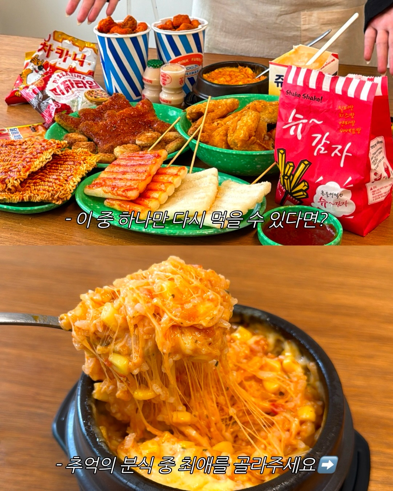|쓸 거리: 튀김 · 떡 이 중 기억에 남은 건?|☐ O ☐ X — pending|pending|pending|
|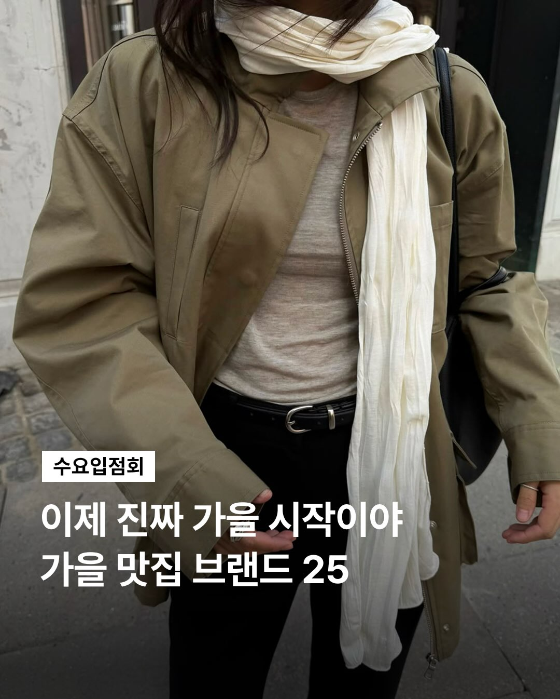|쓸 거리: 올리브색 재킷 · 흰색 스카프 이 중 기억에 남은 건?|☐ O ☐ X — pending|pending|pending|
|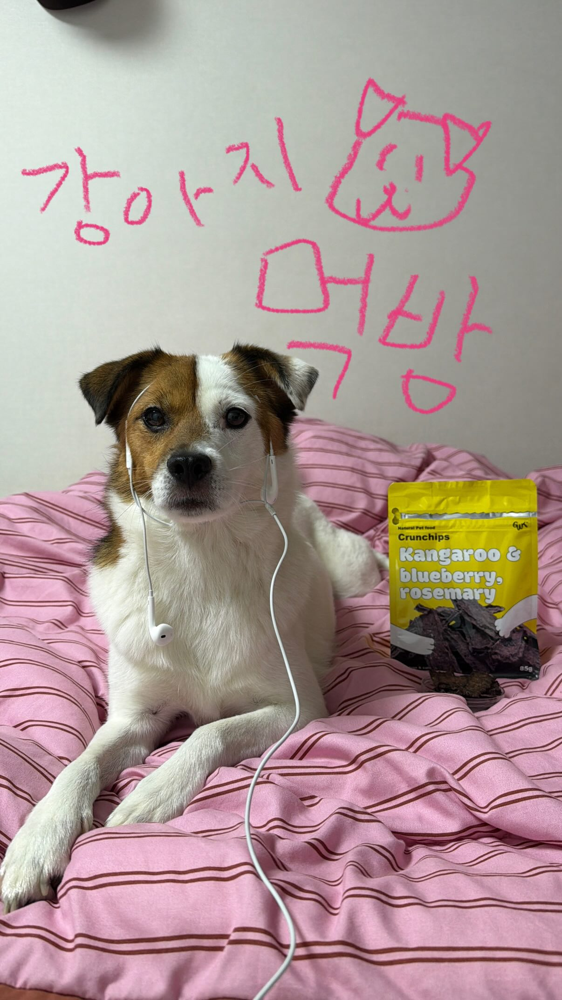|쓸 거리: 흰색 유선 이어폰 · 개 이 중 기억에 남은 건?|☐ O ☐ X — pending|pending|pending|
||쓸 거리: 파란색과 노란색 줄무늬 모자 · 황록색 가방 이 중 기억에 남은 건?|☐ O ☐ X — pending|pending|pending|
|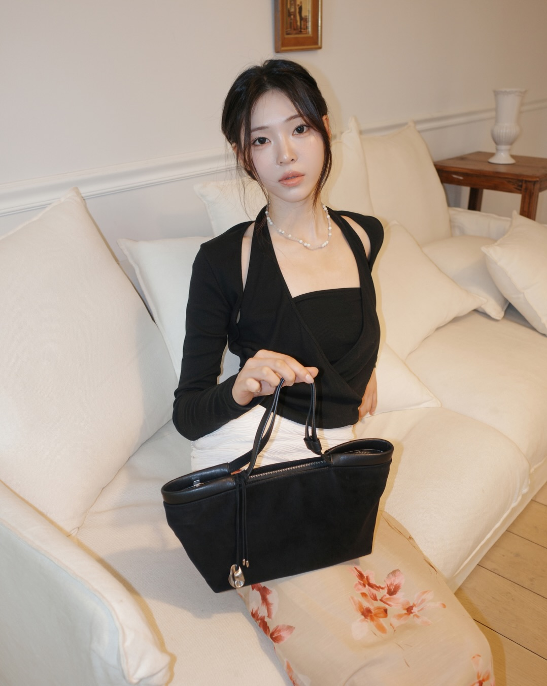|쓸 거리: 검은색 핸드백 · 진주 목걸이 이 중 기억에 남은 건?|☐ O ☐ X — pending|pending|pending|
|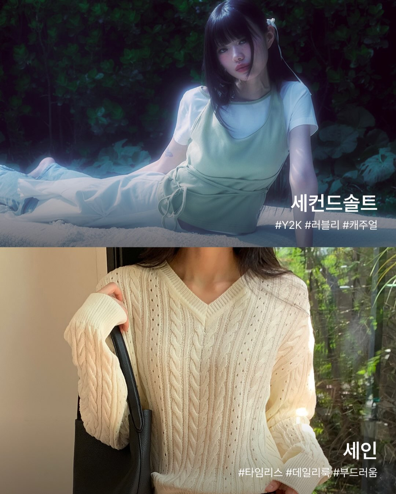|쓸 거리: 연한 녹색 민소매 상의 · 검은 가방 이 중 기억에 남은 건?|☐ O ☐ X — pending|pending|pending|
|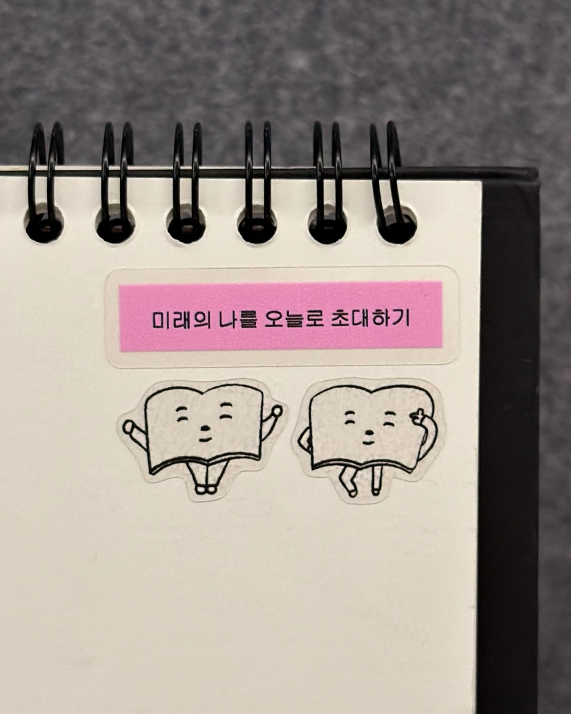|쓸 거리: 크림색 노트 · 검은 글씨 라벨 이 중 기억에 남은 건?|☐ O ☐ X — pending|pending|pending|
|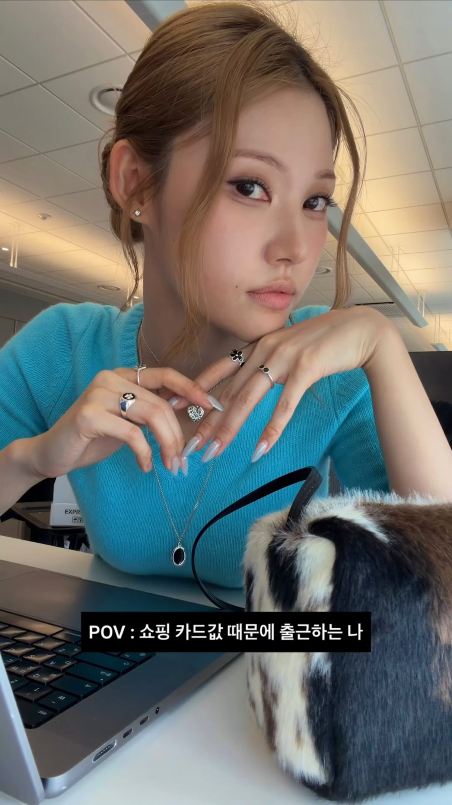|쓸 거리: 하늘색 니트 상의 · 반지 이 중 기억에 남은 건?|☐ O ☐ X — pending|pending|pending|
|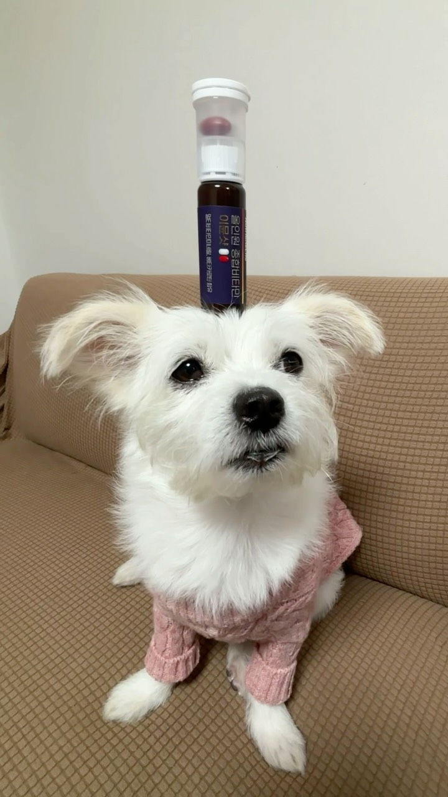|쓸 거리: 분홍색 니트 옷 · 개 이 중 기억에 남은 건?|☐ O ☐ X — pending|pending|pending|
|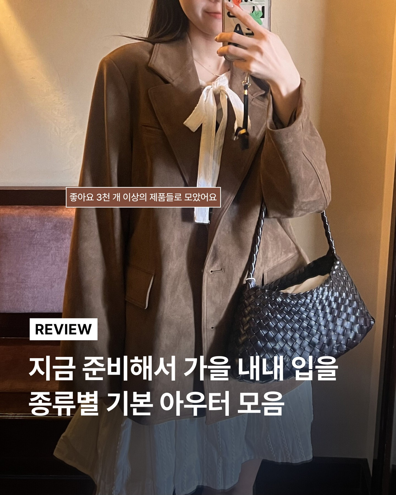|쓸 거리: 갈색 스웨이드 재킷 · 하늘색 주름 치마 이 중 기억에 남은 건?|☐ O ☐ X — pending|pending|pending|
|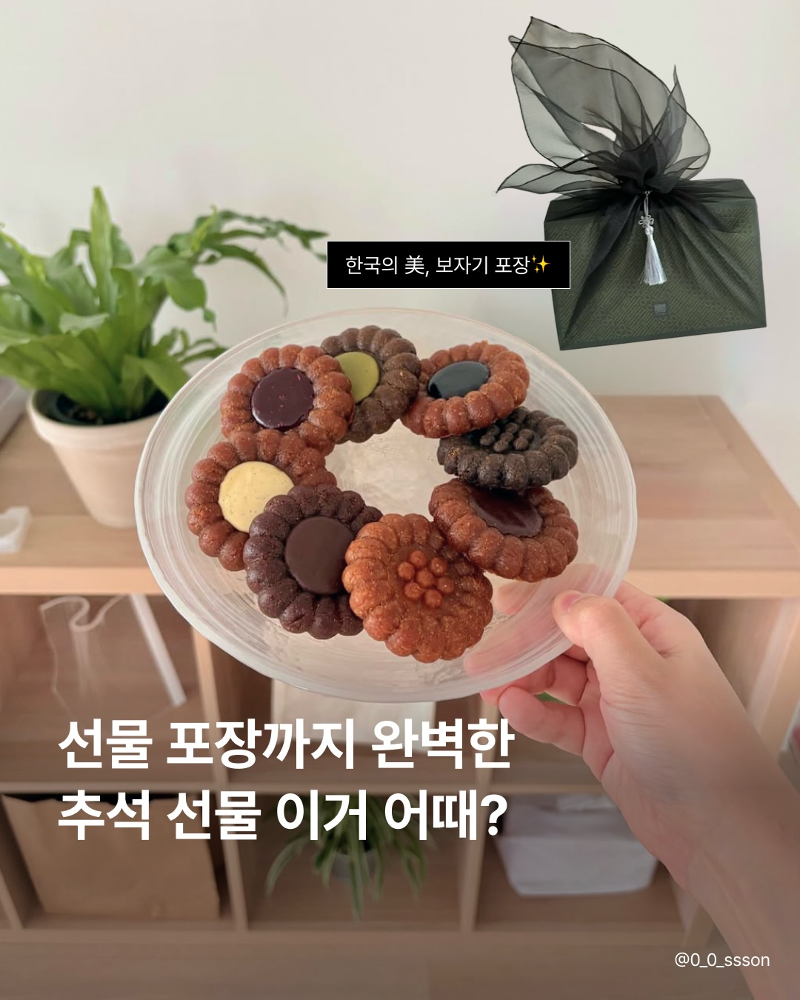|비움: 비슷한 소재(음식)를 앞자리에서 다뤘어서, 사진만 두는 편을 제안해요.|N/A (비움 유지 ☐)|pending|pending|
|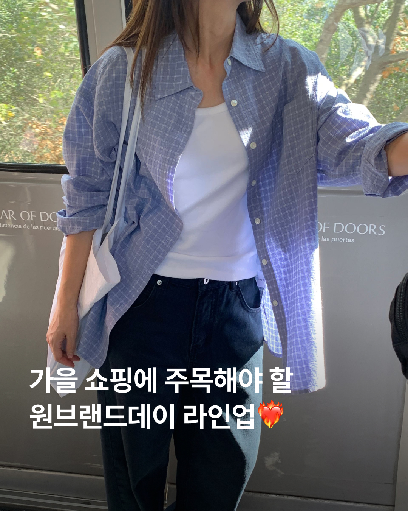|쓸 거리: 파란색 체크무늬 셔츠 · 진한 청색 청바지 이 중 기억에 남은 건?|☐ O ☐ X — pending|pending|pending|
|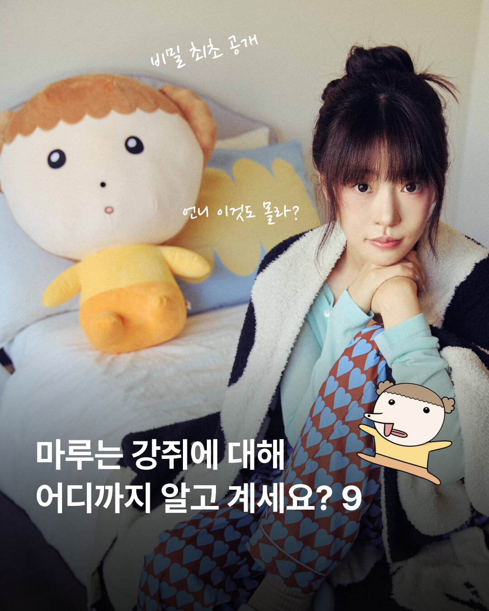|쓸 거리: 봉제 인형 · 파란 하트 무늬 바지 이 중 기억에 남은 건?|☐ O ☐ X — pending|pending|pending|
|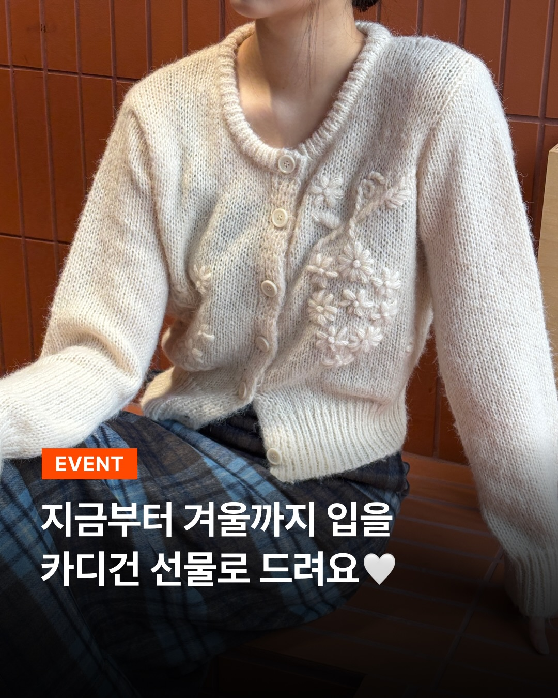|쓸 거리: 아이보리색 니트 카디건 · 흰색 자수 이 중 기억에 남은 건?|☐ O ☐ X — pending|pending|pending|
|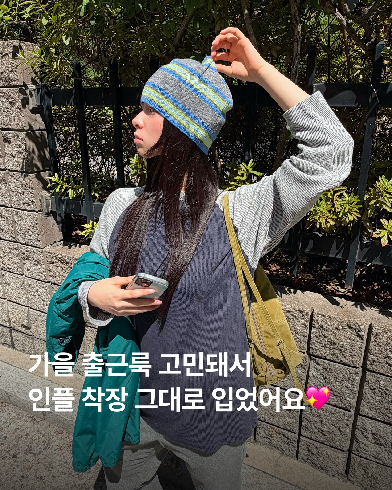|비움: 앞자리와 같은 소재(모자, 황록색 가방)를 반복해서, 사진만 두는 편을 제안해요.|N/A (비움 유지 ☐)|pending|pending|

## 2회차 — freetext

타이틀(수정 대상 아님): 차분한 색감으로 잇는 열다섯 장

|사진|제시된 단서 / 비움 이유|1분 내 작성 가능|빈 칸 조건의 결과|실제 캡션 / 시간|
|---|---|---|---|---|
||쓸 거리: 노트 · 크림색 이 중 기억에 남은 건?|☐ O ☐ X — pending|pending|pending|
||쓸 거리: 줄무늬 모자 · 황록색 가방 이 중 기억에 남은 건?|☐ O ☐ X — pending|pending|pending|
||쓸 거리: 개 · 분홍색 줄무늬 침구 이 중 기억에 남은 건?|☐ O ☐ X — pending|pending|pending|
||쓸 거리: 갈색 스웨이드 재킷 · 하늘색 주름 치마 이 중 기억에 남은 건?|☐ O ☐ X — pending|pending|pending|
||쓸 거리: 소파 · 진주 목걸이 이 중 기억에 남은 건?|☐ O ☐ X — pending|pending|pending|
||비움: 같은 종류의 소재가 여러 사진에 반복되어, 대표 사진에만 단서를 두었습니다.|N/A (비움 유지 ☐)|pending|pending|
||비움: 앞 사진과의 겹침 신호가 높아, 이 자리는 사진만 두어도 좋아요.|N/A (비움 유지 ☐)|pending|pending|
||비움: 같은 종류의 소재가 여러 사진에 반복되어, 대표 사진에만 단서를 두었습니다.|N/A (비움 유지 ☐)|pending|pending|
||비움: 앞 사진과의 겹침 신호가 높아, 이 자리는 사진만 두어도 좋아요.|N/A (비움 유지 ☐)|pending|pending|
||쓸 거리: 줄무늬 종이컵 · 초록 접시 이 중 기억에 남은 건?|☐ O ☐ X — pending|pending|pending|
||쓸 거리: 파란색 체크무늬 셔츠 · 흰색 천 가방 이 중 기억에 남은 건?|☐ O ☐ X — pending|pending|pending|
||비움: 앞 사진과의 겹침 신호가 높아, 이 자리는 사진만 두어도 좋아요.|N/A (비움 유지 ☐)|pending|pending|
||쓸 거리: 하늘색 니트 상의 · 은색 체인 목걸이 이 중 기억에 남은 건?|☐ O ☐ X — pending|pending|pending|
||비움: 앞 사진과의 겹침 신호가 높아, 이 자리는 사진만 두어도 좋아요.|N/A (비움 유지 ☐)|pending|pending|
||비움: 앞 사진과의 겹침 신호가 높아, 이 자리는 사진만 두어도 좋아요.|N/A (비움 유지 ☐)|pending|pending|

## 3회차 — photos_only

타이틀(수정 대상 아님): 옷과 소품, 일상의 순간들

|사진|제시된 단서 / 비움 이유|1분 내 작성 가능|빈 칸 조건의 결과|실제 캡션 / 시간|
|---|---|---|---|---|
||쓸 거리: 니트 모자 · 가방 이 중 기억에 남은 건?|☐ O ☐ X — pending|pending|pending|
||쓸 거리: 카디건 · 자수 이 중 기억에 남은 건?|☐ O ☐ X — pending|pending|pending|
||쓸 거리: 갈색 재킷 · 숄더백 이 중 기억에 남은 건?|☐ O ☐ X — pending|pending|pending|
||비움: 음식 사진의 세부 요소가 여러 슬롯에 반복되어, 대표 자리 외에는 사진만 두어도 좋아요.|N/A (비움 유지 ☐)|pending|pending|
||비움: 음식 사진의 세부 요소가 여러 슬롯에 반복되어, 대표 자리 외에는 사진만 두어도 좋아요.|N/A (비움 유지 ☐)|pending|pending|
||쓸 거리: 핸드백 · 목걸이 이 중 기억에 남은 건?|☐ O ☐ X — pending|pending|pending|
||쓸 거리: 올리브색 재킷 · 스카프 이 중 기억에 남은 건?|☐ O ☐ X — pending|pending|pending|
||쓸 거리: 체크무늬 셔츠 · 천 가방 이 중 기억에 남은 건?|☐ O ☐ X — pending|pending|pending|
||비움: 반려동물 사진이 여러 자리에 나타나, 대표 슬롯 외에는 사진만 두어도 좋아요.|N/A (비움 유지 ☐)|pending|pending|
||쓸 거리: 하늘색 니트 · 반지 이 중 기억에 남은 건?|☐ O ☐ X — pending|pending|pending|
||비움: 앞선 슬롯들의 의류와 소품이 유사한 맥락으로 반복되어, 이 자리는 사진만 두어도 좋아요.|N/A (비움 유지 ☐)|pending|pending|
||비움: 반려동물 사진이 여러 자리에 나타나, 대표 슬롯 외에는 사진만 두어도 좋아요.|N/A (비움 유지 ☐)|pending|pending|
||비움: 이전에 유사한 구성의 의류와 소품이 제시되었으므로, 이 자리는 사진만 두어도 좋아요.|N/A (비움 유지 ☐)|pending|pending|
||비움: 확인한 관측 사실이 물건의 시각 정보 중심이라 구체적인 쓸 거리를 제안하기 어려워요.|N/A (비움 유지 ☐)|pending|pending|
||쓸 거리: 케이블 니트 · 검은 가방 이 중 기억에 남은 건?|☐ O ☐ X — pending|pending|pending|

## 4회차 — corrected

타이틀(수정 대상 아님): 음식과 옷, 일상의 소재들

|사진|제시된 단서 / 비움 이유|1분 내 작성 가능|빈 칸 조건의 결과|실제 캡션 / 시간|
|---|---|---|---|---|
||쓸 거리: 튀김 · 떡 이 중 기억에 남은 건?|☐ O ☐ X — pending|pending|pending|
||쓸 거리: 올리브색 재킷 · 흰색 스카프 이 중 기억에 남은 건?|☐ O ☐ X — pending|pending|pending|
||쓸 거리: 개 · 노란색 파우치 이 중 기억에 남은 건?|☐ O ☐ X — pending|pending|pending|
||쓸 거리: 파란색과 노란색 줄무늬 모자 · 황록색 가방 이 중 기억에 남은 건?|☐ O ☐ X — pending|pending|pending|
||쓸 거리: 검은색 핸드백 · 진주 목걸이 이 중 기억에 남은 건?|☐ O ☐ X — pending|pending|pending|
||쓸 거리: 연한 녹색 민소매 상의 · 크림색 케이블 니트 이 중 기억에 남은 건?|☐ O ☐ X — pending|pending|pending|
||쓸 거리: 크림색 노트 · 분홍색 라벨 이 중 기억에 남은 건?|☐ O ☐ X — pending|pending|pending|
||쓸 거리: 하늘색 니트 · 은색 체인 목걸이 이 중 기억에 남은 건?|☐ O ☐ X — pending|pending|pending|
||비움: 반려동물 소재가 이미 앞에서 다뤄져 새로운 글감을 주지 않아요.|N/A (비움 유지 ☐)|pending|pending|
||쓸 거리: 갈색 스웨이드 재킷 · 하늘색 주름 치마 이 중 기억에 남은 건?|☐ O ☐ X — pending|pending|pending|
||비움: 음식 소재가 첫 번째 사진에서 이미 제시되어 반복되는 느낌이 있어요.|N/A (비움 유지 ☐)|pending|pending|
||쓸 거리: 파란색 체크무늬 셔츠 · 진한 청색 청바지 이 중 기억에 남은 건?|☐ O ☐ X — pending|pending|pending|
||비움: 의류 겹층과 악세서리 조합이 이전 슬롯들과 유사하게 관측되어 새로운 단서를 제공하기 어려워요.|N/A (비움 유지 ☐)|pending|pending|
||쓸 거리: 아이보리색 니트 카디건 · 흰색 자수 이 중 기억에 남은 건?|☐ O ☐ X — pending|pending|pending|
||쓸 거리: 회색 니트 모자 · 스마트폰 이 중 기억에 남은 건?|☐ O ☐ X — pending|pending|pending|

## 5회차 — reference

타이틀(수정 대상 아님): 음식과 패션, 일상 물건을 담은 열다섯 장

|사진|제시된 단서 / 비움 이유|1분 내 작성 가능|빈 칸 조건의 결과|실제 캡션 / 시간|
|---|---|---|---|---|
||쓸 거리: 초록색 접시 · 튀김 이 중 기억에 남은 건?|☐ O ☐ X — pending|pending|pending|
||쓸 거리: 올리브색 재킷 · 흰색 스카프 이 중 기억에 남은 건?|☐ O ☐ X — pending|pending|pending|
||쓸 거리: 개 · 이어폰 이 중 기억에 남은 건?|☐ O ☐ X — pending|pending|pending|
||쓸 거리: 회색 니트 모자 · 황록색 가방 이 중 기억에 남은 건?|☐ O ☐ X — pending|pending|pending|
||쓸 거리: 검은색 핸드백 · 진주 목걸이 이 중 기억에 남은 건?|☐ O ☐ X — pending|pending|pending|
||쓸 거리: 연한 녹색 민소매 상의 · 초록색 잎 이 중 기억에 남은 건?|☐ O ☐ X — pending|pending|pending|
||쓸 거리: 노트 · 크림색 이 중 기억에 남은 건?|☐ O ☐ X — pending|pending|pending|
||쓸 거리: 하늘색 니트 상의 · 은색 체인 목걸이 이 중 기억에 남은 건?|☐ O ☐ X — pending|pending|pending|
||쓸 거리: 개 · 분홍색 니트 옷 이 중 기억에 남은 건?|☐ O ☐ X — pending|pending|pending|
||쓸 거리: 갈색 스웨이드 재킷 · 하늘색 주름 치마 이 중 기억에 남은 건?|☐ O ☐ X — pending|pending|pending|
||쓸 거리: 투명한 유리 접시 · 갈색 과자 이 중 기억에 남은 건?|☐ O ☐ X — pending|pending|pending|
||쓸 거리: 파란색 체크무늬 셔츠 · 진한 청색 청바지 이 중 기억에 남은 건?|☐ O ☐ X — pending|pending|pending|
||쓸 거리: 봉제 인형 · 하늘색 베개 이 중 기억에 남은 건?|☐ O ☐ X — pending|pending|pending|
||쓸 거리: 아이보리색 니트 카디건 · 흰색 꽃 자수 이 중 기억에 남은 건?|☐ O ☐ X — pending|pending|pending|
||쓸 거리: 회색 니트 모자 · 스마트폰 이 중 기억에 남은 건?|☐ O ☐ X — pending|pending|pending|

## 6회차 — freetext

타이틀(수정 대상 아님): 차분한 톤으로 연결한 일상과 감정

|사진|제시된 단서 / 비움 이유|1분 내 작성 가능|빈 칸 조건의 결과|실제 캡션 / 시간|
|---|---|---|---|---|
||쓸 거리: 노트 · 크림색 이 중 기억에 남은 건?|☐ O ☐ X — pending|pending|pending|
||쓸 거리: 모자 · 황록색 가방 이 중 기억에 남은 건?|☐ O ☐ X — pending|pending|pending|
||쓸 거리: 개 · 이어폰 이 중 기억에 남은 건?|☐ O ☐ X — pending|pending|pending|
||비움: 앞 사진들과 비슷한 옷 소재가 반복되어, 이 자리는 사진만 두어도 좋아요.|N/A (비움 유지 ☐)|pending|pending|
||비움: 소파 위 인물 사진이 이전에 제안된 것과 유사해, 이 자리는 사진만 두어도 좋아요.|N/A (비움 유지 ☐)|pending|pending|
||쓸 거리: 케이블 니트 · 초록 잎 이 중 기억에 남은 건?|☐ O ☐ X — pending|pending|pending|
||비움: 반려동물을 소재로 한 장면이 이미 제시되어, 이 자리는 사진만 두어도 좋아요.|N/A (비움 유지 ☐)|pending|pending|
||쓸 거리: 흰색 스카프 · 검은 벨트 이 중 기억에 남은 건?|☐ O ☐ X — pending|pending|pending|
||비움: 음식 소재가 이미 나타났으므로, 이 자리는 사진만 두어도 좋아요.|N/A (비움 유지 ☐)|pending|pending|
||쓸 거리: 튀김 · 종이컵 이 중 기억에 남은 건?|☐ O ☐ X — pending|pending|pending|
||쓸 거리: 파란색 체크 셔츠 · 흰색 천 가방 이 중 기억에 남은 건?|☐ O ☐ X — pending|pending|pending|
||비움: 인물의 옷과 배경이 이전 슬롯과 유사해, 이 자리는 사진만 두어도 좋아요.|N/A (비움 유지 ☐)|pending|pending|
||쓸 거리: 은색 체인 목걸이 · 반지 이 중 기억에 남은 건?|☐ O ☐ X — pending|pending|pending|
||쓸 거리: 니트 카디건 · 꽃 자수 이 중 기억에 남은 건?|☐ O ☐ X — pending|pending|pending|
||비움: 처음 사진과 동일한 구도와 의류로 반복되어, 이 자리는 사진만 두어도 좋아요.|N/A (비움 유지 ☐)|pending|pending|

## 7회차 — photos_only

타이틀(수정 대상 아님): 선택한 사진들의 순서

|사진|제시된 단서 / 비움 이유|1분 내 작성 가능|빈 칸 조건의 결과|실제 캡션 / 시간|
|---|---|---|---|---|
||쓸 거리: 니트 모자 · 가방 이 중 기억에 남은 건?|☐ O ☐ X — pending|pending|pending|
||쓸 거리: 카디건 · 자수 이 중 기억에 남은 건?|☐ O ☐ X — pending|pending|pending|
||쓸 거리: 스웨이드 재킷 · 숄더백 이 중 기억에 남은 건?|☐ O ☐ X — pending|pending|pending|
||쓸 거리: 음식 · 튀김 이 중 기억에 남은 건?|☐ O ☐ X — pending|pending|pending|
||쓸 거리: 과자 · 초록 잎 식물 이 중 기억에 남은 건?|☐ O ☐ X — pending|pending|pending|
||쓸 거리: 크림색 소파 · 핸드백 이 중 기억에 남은 건?|☐ O ☐ X — pending|pending|pending|
||쓸 거리: 올리브색 재킷 · 흰색 스카프 이 중 기억에 남은 건?|☐ O ☐ X — pending|pending|pending|
||쓸 거리: 체크무늬 셔츠 · 천 가방 이 중 기억에 남은 건?|☐ O ☐ X — pending|pending|pending|
||쓸 거리: 분홍색 니트 옷 · 반려견 이 중 기억에 남은 건?|☐ O ☐ X — pending|pending|pending|
||쓸 거리: 하늘색 니트 상의 · 반지 이 중 기억에 남은 건?|☐ O ☐ X — pending|pending|pending|
||쓸 거리: 하늘색 상의 · 봉제 인형 이 중 기억에 남은 건?|☐ O ☐ X — pending|pending|pending|
||쓸 거리: 분홍색 줄무늬 침구 · 반려견 이 중 기억에 남은 건?|☐ O ☐ X — pending|pending|pending|
||쓸 거리: 니트 모자 · 조끼형 상의 이 중 기억에 남은 건?|☐ O ☐ X — pending|pending|pending|
||쓸 거리: 노트 · 스티커 이 중 기억에 남은 건?|☐ O ☐ X — pending|pending|pending|
||쓸 거리: 초록색 잎 · 케이블 니트 이 중 기억에 남은 건?|☐ O ☐ X — pending|pending|pending|

## 8회차 — corrected

타이틀(수정 대상 아님): 음식과 옷, 소품을 담은 15장

|사진|제시된 단서 / 비움 이유|1분 내 작성 가능|빈 칸 조건의 결과|실제 캡션 / 시간|
|---|---|---|---|---|
||쓸 거리: 초록색 접시 · 튀김 이 중 기억에 남은 건?|☐ O ☐ X — pending|pending|pending|
||쓸 거리: 올리브색 재킷 · 흰색 스카프 이 중 기억에 남은 건?|☐ O ☐ X — pending|pending|pending|
||쓸 거리: 흰색과 갈색 털의 개 · 노란색 파우치 이 중 기억에 남은 건?|☐ O ☐ X — pending|pending|pending|
||쓸 거리: 파란색과 노란색 줄무늬 모자 · 황록색 가방 이 중 기억에 남은 건?|☐ O ☐ X — pending|pending|pending|
||쓸 거리: 검은색 핸드백 · 진주 목걸이 이 중 기억에 남은 건?|☐ O ☐ X — pending|pending|pending|
||비움: 같은 종류의 인물 사진이 이미 단서에 포함되어 있어, 이 자리는 사진만 두는 편을 제안해요.|N/A (비움 유지 ☐)|pending|pending|
||쓸 거리: 노트 · 검은 스티커 이 중 기억에 남은 건?|☐ O ☐ X — pending|pending|pending|
||쓸 거리: 하늘색 니트 · 은색 체인 목걸이 이 중 기억에 남은 건?|☐ O ☐ X — pending|pending|pending|
||쓸 거리: 흰 털의 개 · 분홍색 니트 옷 이 중 기억에 남은 건?|☐ O ☐ X — pending|pending|pending|
||쓸 거리: 갈색 스웨이드 재킷 · 하늘색 주름 치마 이 중 기억에 남은 건?|☐ O ☐ X — pending|pending|pending|
||비움: 음식 소재가 이미 앞 슬롯에서 다루어져 반복을 피하기 위해 이 자리는 사진만 두는 편을 제안해요.|N/A (비움 유지 ☐)|pending|pending|
||비움: 의류 조합이 이미 제시된 슬롯과 유사하여 이 자리는 사진만 두는 편을 제안해요.|N/A (비움 유지 ☐)|pending|pending|
||비움: 인물 실내 촬영이 이미 여러 슬롯에서 제시되어 이 자리는 사진만 두는 편을 제안해요.|N/A (비움 유지 ☐)|pending|pending|
||쓸 거리: 아이보리색 카디건 · 흰색 꽃 자수 이 중 기억에 남은 건?|☐ O ☐ X — pending|pending|pending|
||비움: 위치 구성과 의류가 4번 슬롯과 같아 이 자리는 사진만 두는 편을 제안해요.|N/A (비움 유지 ☐)|pending|pending|

## 9회차 — reference

타이틀(수정 대상 아님): 음식과 일상의 순간

|사진|제시된 단서 / 비움 이유|1분 내 작성 가능|빈 칸 조건의 결과|실제 캡션 / 시간|
|---|---|---|---|---|
||쓸 거리: 초록색 접시 · 종이컵 이 중 기억에 남은 건?|☐ O ☐ X — pending|pending|pending|
||쓸 거리: 올리브색 재킷 · 흰색 스카프 이 중 기억에 남은 건?|☐ O ☐ X — pending|pending|pending|
||쓸 거리: 흰색 유선 이어폰 · 노란색 파우치 포장 이 중 기억에 남은 건?|☐ O ☐ X — pending|pending|pending|
||쓸 거리: 회색 니트 모자 · 황록색 가방 이 중 기억에 남은 건?|☐ O ☐ X — pending|pending|pending|
||쓸 거리: 검은색 핸드백 · 진주 목걸이 이 중 기억에 남은 건?|☐ O ☐ X — pending|pending|pending|
||쓸 거리: 연한 녹색 민소매 상의 · 크림색 케이블 니트 이 중 기억에 남은 건?|☐ O ☐ X — pending|pending|pending|
||쓸 거리: 분홍색 배경 라벨 · 책 모양 캐릭터 스티커 이 중 기억에 남은 건?|☐ O ☐ X — pending|pending|pending|
||쓸 거리: 하늘색 니트 상의 · 은색 체인 목걸이 이 중 기억에 남은 건?|☐ O ☐ X — pending|pending|pending|
||쓸 거리: 분홍색 니트 옷 · 남색 라벨 병 이 중 기억에 남은 건?|☐ O ☐ X — pending|pending|pending|
||쓸 거리: 갈색 스웨이드 재킷 · 하늘색 주름 치마 이 중 기억에 남은 건?|☐ O ☐ X — pending|pending|pending|
||쓸 거리: 투명한 유리 접시 · 흰 화분 이 중 기억에 남은 건?|☐ O ☐ X — pending|pending|pending|
||쓸 거리: 파란색 체크무늬 셔츠 · 흰색 천 가방 이 중 기억에 남은 건?|☐ O ☐ X — pending|pending|pending|
||쓸 거리: 검은색과 흰색 털 재질 겉옷 · 큰 봉제 인형 이 중 기억에 남은 건?|☐ O ☐ X — pending|pending|pending|
||쓸 거리: 아이보리색 니트 카디건 · 파란색 체크 하의 이 중 기억에 남은 건?|☐ O ☐ X — pending|pending|pending|
||쓸 거리: 회색 니트 모자 · 남색 조끼형 상의 이 중 기억에 남은 건?|☐ O ☐ X — pending|pending|pending|

## 10회차 — freetext

타이틀(수정 대상 아님): 차분한 여백 속 소재들

|사진|제시된 단서 / 비움 이유|1분 내 작성 가능|빈 칸 조건의 결과|실제 캡션 / 시간|
|---|---|---|---|---|
||쓸 거리: 노트 · 라벨 이 중 기억에 남은 건?|☐ O ☐ X — pending|pending|pending|
||쓸 거리: 모자 · 가방 이 중 기억에 남은 건?|☐ O ☐ X — pending|pending|pending|
||쓸 거리: 개 · 이어폰 이 중 기억에 남은 건?|☐ O ☐ X — pending|pending|pending|
||비움: 이전 슬롯과 옷·소품 소재가 겹쳐 단서를 반복하게 되어 사진만 두기를 제안해요.|N/A (비움 유지 ☐)|pending|pending|
||비움: 이전 슬롯과 옷·소품 소재가 겹쳐 단서를 반복하게 되어 사진만 두기를 제안해요.|N/A (비움 유지 ☐)|pending|pending|
||쓸 거리: 니트 · 가방 이 중 기억에 남은 건?|☐ O ☐ X — pending|pending|pending|
||비움: 이전 슬롯과 옷·소품 소재가 겹쳐 단서를 반복하게 되어 사진만 두기를 제안해요.|N/A (비움 유지 ☐)|pending|pending|
||비움: 이전 슬롯과 옷·소품 소재가 겹쳐 단서를 반복하게 되어 사진만 두기를 제안해요.|N/A (비움 유지 ☐)|pending|pending|
||쓸 거리: 과자 · 식물 이 중 기억에 남은 건?|☐ O ☐ X — pending|pending|pending|
||쓸 거리: 음식 · 튀김 이 중 기억에 남은 건?|☐ O ☐ X — pending|pending|pending|
||비움: 이전 슬롯과 옷·소품 소재가 겹쳐 단서를 반복하게 되어 사진만 두기를 제안해요.|N/A (비움 유지 ☐)|pending|pending|
||쓸 거리: 봉제 인형 · 침구 이 중 기억에 남은 건?|☐ O ☐ X — pending|pending|pending|
||비움: 이전 슬롯과 옷·소품 소재가 겹쳐 단서를 반복하게 되어 사진만 두기를 제안해요.|N/A (비움 유지 ☐)|pending|pending|
||비움: 이전 슬롯과 옷·소품 소재가 겹쳐 단서를 반복하게 되어 사진만 두기를 제안해요.|N/A (비움 유지 ☐)|pending|pending|
||비움: 앞 사진과 거의 같은 장면·소재로 구성되어 사진만 두기를 제안해요.|N/A (비움 유지 ☐)|pending|pending|

## 11회차 — reference

타이틀(수정 대상 아님): 음식과 옷, 일상의 소품들

|사진|제시된 단서 / 비움 이유|1분 내 작성 가능|빈 칸 조건의 결과|실제 캡션 / 시간|
|---|---|---|---|---|
||쓸 거리: 튀김 · 떡 이 중 기억에 남은 건?|☐ O ☐ X — pending|pending|pending|
||쓸 거리: 올리브색 재킷 · 흰색 스카프 이 중 기억에 남은 건?|☐ O ☐ X — pending|pending|pending|
||쓸 거리: 개 · 이어폰 이 중 기억에 남은 건?|☐ O ☐ X — pending|pending|pending|
||쓸 거리: 회색 니트 모자 · 황록색 가방 이 중 기억에 남은 건?|☐ O ☐ X — pending|pending|pending|
||쓸 거리: 검은색 핸드백 · 진주 목걸이 이 중 기억에 남은 건?|☐ O ☐ X — pending|pending|pending|
||쓸 거리: 연한 녹색 민소매 상의 · 크림색 케이블 니트 이 중 기억에 남은 건?|☐ O ☐ X — pending|pending|pending|
||비움: 앞 사진들에서 반복된 옷과 가방 종류를 주제로, 이 자리는 사진만 두어도 좋아요.|N/A (비움 유지 ☐)|pending|pending|
||쓸 거리: 하늘색 니트 상의 · 은색 체인 목걸이 이 중 기억에 남은 건?|☐ O ☐ X — pending|pending|pending|
||비움: 앞 슬롯에서 다룬 개의 주제와 유사한 내용이라, 이 자리는 사진만 두어도 좋아요.|N/A (비움 유지 ☐)|pending|pending|
||쓸 거리: 갈색 스웨이드 재킷 · 하늘색 주름 치마 이 중 기억에 남은 건?|☐ O ☐ X — pending|pending|pending|
||비움: 앞 사진들에서 여러 번 다룬 음식 소재를 반복하지 않기 위해 이 자리는 사진만 두어도 좋아요.|N/A (비움 유지 ☐)|pending|pending|
||쓸 거리: 파란색 체크무늬 셔츠 · 흰색 천 가방 이 중 기억에 남은 건?|☐ O ☐ X — pending|pending|pending|
||비움: 앞 사진들에서 여러 번 다룬 옷 색상과 소품 종류가 겹치므로, 이 자리는 사진만 두어도 좋아요.|N/A (비움 유지 ☐)|pending|pending|
||쓸 거리: 아이보리색 니트 카디건 · 파란색 체크 무늬 하의 이 중 기억에 남은 건?|☐ O ☐ X — pending|pending|pending|
||쓸 거리: 회색 니트 모자 · 황록색 가방 이 중 기억에 남은 건?|☐ O ☐ X — pending|pending|pending|

## 12회차 — freetext

타이틀(수정 대상 아님): 차분한 일상 속 색감 변주

|사진|제시된 단서 / 비움 이유|1분 내 작성 가능|빈 칸 조건의 결과|실제 캡션 / 시간|
|---|---|---|---|---|
||쓸 거리: 노트 · 라벨 이 중 기억에 남은 건?|☐ O ☐ X — pending|pending|pending|
||쓸 거리: 모자 · 가방 이 중 기억에 남은 건?|☐ O ☐ X — pending|pending|pending|
||쓸 거리: 개 · 이어폰 이 중 기억에 남은 건?|☐ O ☐ X — pending|pending|pending|
||쓸 거리: 스웨이드 재킷 · 숄더백 이 중 기억에 남은 건?|☐ O ☐ X — pending|pending|pending|
||쓸 거리: 핸드백 · 목걸이 이 중 기억에 남은 건?|☐ O ☐ X — pending|pending|pending|
||쓸 거리: 케이블 니트 · 민소매 상의 이 중 기억에 남은 건?|☐ O ☐ X — pending|pending|pending|
||쓸 거리: 분홍색 니트 옷 · 병 이 중 기억에 남은 건?|☐ O ☐ X — pending|pending|pending|
||쓸 거리: 올리브색 재킷 · 스카프 이 중 기억에 남은 건?|☐ O ☐ X — pending|pending|pending|
||쓸 거리: 유리 접시 · 과자 이 중 기억에 남은 건?|☐ O ☐ X — pending|pending|pending|
||쓸 거리: 초록색 접시 · 튀김 이 중 기억에 남은 건?|☐ O ☐ X — pending|pending|pending|
||쓸 거리: 파란색 체크무늬 셔츠 · 천 가방 이 중 기억에 남은 건?|☐ O ☐ X — pending|pending|pending|
||쓸 거리: 봉제 인형 · 베개 이 중 기억에 남은 건?|☐ O ☐ X — pending|pending|pending|
||쓸 거리: 하늘색 니트 상의 · 반지 이 중 기억에 남은 건?|☐ O ☐ X — pending|pending|pending|
||쓸 거리: 아이보리색 카디건 · 체크 하의 이 중 기억에 남은 건?|☐ O ☐ X — pending|pending|pending|
||쓸 거리: 니트 모자 · 울타리 이 중 기억에 남은 건?|☐ O ☐ X — pending|pending|pending|
