# 큐레이션 문장 검증 보고서

기준 SHA: `4474bb90b42596d47778724608185b1279901166`, 실행일: 2026-09-18.
코디네이터가 `develop` 기준 유지와 사람 판정 pending을 명시적으로 확인했다. `dev`는 폐기된 기준이다.

## 결과와 한계

- `rationale.value`는 묶음 컨셉·자리 설명, `rationale.evidence`는 기존 측정·규칙·선택 계산으로 분리했다.
- 첫 슬롯 설명 앞 문장으로 컨셉을 표시한다. 별도 피드 헤더/새 필드 없이 기존 화면의 표시 경로를 사용한다.
- 지향 없음 경로는 입력 순서를 보존하면서 같은 컨셉을 표시한다. 값 범위가 작으면 컨셉 미확정을 알린다.
- 실사진 15장 앞 문장의 금지어 0건, 순서·caption_inputs 불변, 기존 근거와 계산 설명 보존을 실행 검증했다.
- 사진 한 장마다 analyzePhoto를 한 번씩 호출했다. 유료 모델 호출 0회이며 피사체·장소는 생성 문장의 입력으로 쓰지 않았다.
- 원본 15장을 각각 직접 열어 S4를 대조했다. 없는 장소·시간·감정을 단정한 문장 0/15건(에이전트 대조)이다.
- 사람 판정: **0/15장 응답, 통과율 미측정(분모 0)**. 0%나 100%로 대신 쓰지 않는다. 아래 O/X 칸에 응답 후 O/(O+X)로 계산한다.
- 에이전트 적합성 의견: **10/15 = 66.7%**. 차이가 작아 역할만 남은 5문장은 반복적이어서 X다. 사람 결과와 독립이다.
- 인스타 게시 캡션이 아니라 큐레이션 설명을 바꿨다. 타이틀·캡션 모델 출력 품질과 전체 화면 금지어 0건을 주장하지 않는다.
- UI 수동 조작/배포·서로 다른 모델 2개 리뷰는 미실행이다. API 실제 buildFeed 경로 2종은 테스트했다.
- 컨셉은 색/명암에 한정된다. 감성 만족도는 사람의 검증이 남아 있다. 사진 재정렬 이후 기존 이유를 보존하는 UI 정책도 유지된다.

## 구현 파일과 경계

`lib/curation-voice.js`, `lib/order.js`, `lib/pipeline.js`와 관련 테스트/재현 스크립트만 변경했다.
`schemas/` 4종·프론트엔드·다른 워크트리·pivot 원본은 수정하지 않았다. 접힌 근거의 사진 참조는 입력 사진 ID로 해소된다.
컨셉 대비 기준 0.25, 인접 대비 기준 0.12는 **설계 상수**다. 정확한 의미 인식이나 사용자 선호를 검증한 수치가 아니다.

## 재현

```sh
npm ci
node scripts/verify-curation-voice.js /Users/chowonjae/Desktop/projects/wanted/pivot/apify-check/fixtures/images
npm test
npm run eval
npm run check
npm run lint
npm run typecheck
```

`before.json`은 구현 전 실제 실행 저장본, `after.json`은 동일 원본 재측정 실행 결과다.
분석 시각만 비교에서 제외한다. 전체 픽셀 기반 분석값·순서·캡션 입력은 대조한다.
원본 목록은 before.json의 file_ref, 240px 검토용 사본은 photos/에 있다. 사진 원본은 변경하지 않았다.
기계 탐지는 value에만 `/채도|밝기\s*0\.|색 거리|\bR[1-4]\b|측정값|#[0-9a-f]{6}\b/gi`를 적용한다.
기존 회귀 18개를 먼저 통과시켰고, 변경 후 기존 수치 회귀는 접힌 근거를 검사하도록 이동했다.
첫 전체 검사에서 화면 문자열의 구도 문구를 찾는 기존 테스트 1개가 실패했으며 근거 검사로 옮긴 뒤 215/215 통과했다.
`npm ci`는 Node 22.22.3과 요구 Node 24.x 불일치 경고를 냈다. 아래 검사는 현재 Node 22에서 실행한 결과다.

# 실사진 15장 전후 비교

| 자리 / 사진 | 수정 전 | 수정 후 | 에이전트 의견 (사람 아님) | 사람 판정: 그대로 인스타에 올릴 수 있는가 |
|---|---|---|---|---|
| 1 / ph_11 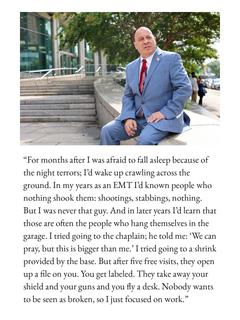 | 밝기 0.808 · 채도 0.086 인 사진이라 지향 방향(조용한 쪽) 점수가 입력 15장 중 가장 높아 1번에 뒀다 | 옅은 색과 짙은 색이 어우러지는 흐름으로 엮어요. 이 사진으로 묶음의 첫인상을 열어요. | O: 시각 대비와 자리 설명이 자연스러움 | □ O / □ X |
| 2 / ph_02 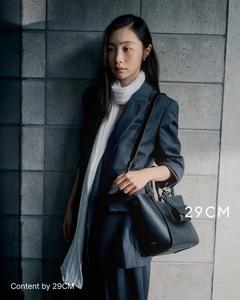 | 앞자리 사진과 측정 색 거리 0.296 로 남은 사진 중 가장 멀어 2번에 뒀다 (밝기 0.346 · 채도 0.273) | 앞 장보다 어두운 화면으로 흐름을 이어가요. | O: 시각 대비와 자리 설명이 자연스러움 | □ O / □ X |
| 3 / ph_09 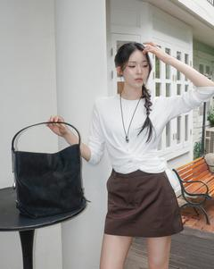 | 앞자리 사진과 측정 색 거리 0.205 로 남은 사진 중 가장 멀어 3번에 뒀다 (밝기 0.612 · 채도 0.097) | 앞 장보다 환한 화면으로 흐름을 이어가요. | O: 시각 대비와 자리 설명이 자연스러움 | □ O / □ X |
| 4 / ph_01 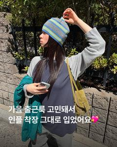 | 앞자리 사진과 측정 색 거리 0.179 로 남은 사진 중 가장 멀어 4번에 뒀다 (밝기 0.375 · 채도 0.288) | 앞 장보다 어두운 화면으로 흐름을 이어가요. | O: 시각 대비와 자리 설명이 자연스러움 | □ O / □ X |
| 5 / ph_03 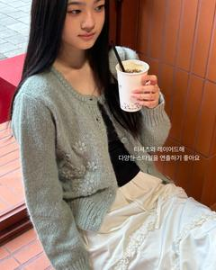 | 앞자리 사진과 측정 색 거리 0.134 로 남은 사진 중 가장 멀어 5번에 뒀다 (밝기 0.589 · 채도 0.343) | 앞 장보다 환한 화면으로 흐름을 이어가요. | O: 시각 대비와 자리 설명이 자연스러움 | □ O / □ X |
| 6 / ph_06 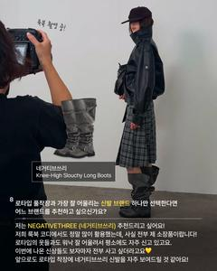 | 앞자리 사진과 측정 색 거리 0.161 로 남은 사진 중 가장 멀어 6번에 뒀다 (밝기 0.429 · 채도 0.188) | 앞 장보다 어두운 화면으로 흐름을 이어가요. | O: 시각 대비와 자리 설명이 자연스러움 | □ O / □ X |
| 7 / ph_13 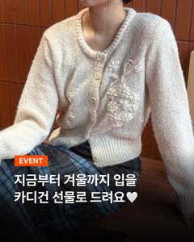 | 앞자리 사진과 측정 색 거리 0.1 로 남은 사진 중 가장 멀어 7번에 뒀다 (밝기 0.501 · 채도 0.293) | 다음 사진을 이어서 보여줘요. | X: 역할만 남아 반복적 | □ O / □ X |
| 8 / ph_14  | 앞자리 사진과 측정 색 거리 0.064 로 남은 사진 중 가장 멀어 8번에 뒀다 (밝기 0.555 · 채도 0.176) | 다음 사진을 이어서 보여줘요. | X: 역할만 남아 반복적 | □ O / □ X |
| 9 / ph_04 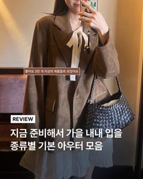 | 앞자리 사진과 측정 색 거리 0.116 로 남은 사진 중 가장 멀어 9번에 뒀다 (밝기 0.441 · 채도 0.362) | 앞 장보다 짙은 색으로 흐름을 이어가요. | O: 시각 대비와 자리 설명이 자연스러움 | □ O / □ X |
| 10 / ph_07 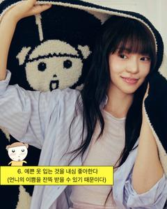 | 채도 0.399 로 남은 사진 중 가장 진해 10번 전환 자리에 뒀다 | 이 사진을 흐름의 연결점으로 두어요. | X: 역할만 남아 반복적 | □ O / □ X |
| 11 / ph_08 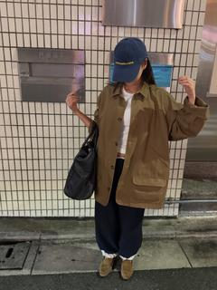 | 앞자리 사진과 측정 색 거리 0.124 로 남은 사진 중 가장 멀어 11번에 뒀다 (밝기 0.452 · 채도 0.241) | 앞 장보다 옅은 색으로 흐름을 이어가요. | O: 시각 대비와 자리 설명이 자연스러움 | □ O / □ X |
| 12 / ph_15 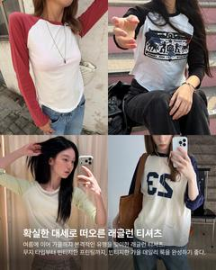 | 앞자리 사진과 측정 색 거리 0.053 로 남은 사진 중 가장 멀어 12번에 뒀다 (밝기 0.524 · 채도 0.196) | 다음 사진을 이어서 보여줘요. | X: 역할만 남아 반복적 | □ O / □ X |
| 13 / ph_12 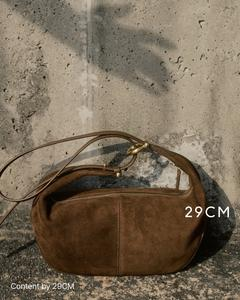 | 앞자리 사진과 측정 색 거리 0.068 로 남은 사진 중 가장 멀어 13번에 뒀다 (밝기 0.472 · 채도 0.322) | 앞 장보다 짙은 색으로 흐름을 이어가요. | O: 시각 대비와 자리 설명이 자연스러움 | □ O / □ X |
| 14 / ph_10 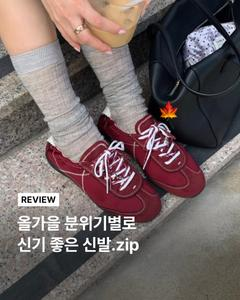 | 앞자리 사진과 측정 색 거리 0.053 로 남은 사진 중 가장 멀어 14번에 뒀다 (밝기 0.456 · 채도 0.214) | 다음 사진을 이어서 보여줘요. | X: 역할만 남아 반복적 | □ O / □ X |
| 15 / ph_05 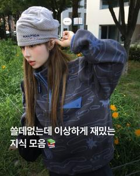 | 밝기 0.328 로 남은 사진 중 가장 어두워 마지막 15번에 뒀다 | 앞 장보다 어두운 화면으로 묶음을 마무리해요. | O: 시각 대비와 자리 설명이 자연스러움 | □ O / □ X |

## S4 원본 전수 대조

| 사진 | 직접 본 내용 | 생성 문장 대조 |
|---|---|---|
| ph_01 | 회색 비니·어두운 상의·초록 식물 | PASS: 문장은 색/명암/역할만 사용 |
| ph_02 | 짙은 옷·가방과 회색 벽 | PASS: 문장은 색/명암/역할만 사용 |
| ph_03 | 연한 카디건·흰 치마·주황 벽 | PASS: 문장은 색/명암/역할만 사용 |
| ph_04 | 갈색 겉옷과 갈색 계열 배경 | PASS: 문장은 색/명암/역할만 사용 |
| ph_05 | 짙은 파랑 상의와 초록 식물 | PASS: 문장은 색/명암/역할만 사용 |
| ph_06 | 회색 배경과 검은 옷 | PASS: 문장은 색/명암/역할만 사용 |
| ph_07 | 어두운 무늬 천·흰 옷·노란 문구 | PASS: 문장은 색/명암/역할만 사용 |
| ph_08 | 갈색 셔츠와 회색 타일 | PASS: 문장은 색/명암/역할만 사용 |
| ph_09 | 흰 상의와 흰 벽 | PASS: 문장은 색/명암/역할만 사용 |
| ph_10 | 회색 양말·붉은 신발·검은 가방 | PASS: 문장은 색/명암/역할만 사용 |
| ph_11 | 흰 바탕이 넓은 인물·영문 카드 | PASS: 문장은 색/명암/역할만 사용 |
| ph_12 | 갈색 가방과 회색 벽 | PASS: 문장은 색/명암/역할만 사용 |
| ph_13 | 흰 카디건과 주황 벽 | PASS: 문장은 색/명암/역할만 사용 |
| ph_14 | 짙은 옷·붉은 가방과 밝은 실내 합성 | PASS: 문장은 색/명암/역할만 사용 |
| ph_15 | 흰 티셔츠 중심의 네 사진 합성 | PASS: 문장은 색/명암/역할만 사용 |

## 실제 검증 출력

### real15

원문: [real15.txt](real15.txt)

```text
PASS: 15 real photos; visible forbidden hits 0; order/caption inputs unchanged; original evidence and decision calculations retained

```

### test

원문: [test.txt](test.txt)

```text
1..215
# tests 215
# suites 0
# pass 215
# fail 0
# cancelled 0
# skipped 0
# todo 0
# duration_ms 1350.599708
```

### eval

원문: [eval.txt](eval.txt)

```text

> gyeol@0.1.0 eval
> node eval/run.js

Synthetic manual bootstrap only; no AI quality or human agreement claim.
┌─────────┬─────────┬───────────┬────────┬────────┐
│ (index) │ case    │ invariant │ result │ reason │
├─────────┼─────────┼───────────┼────────┼────────┤
│ 0       │ 'quiet' │ 'E1'      │ 'PASS' │ ''     │
│ 1       │ 'quiet' │ 'E2'      │ 'PASS' │ ''     │
│ 2       │ 'quiet' │ 'E3'      │ 'PASS' │ ''     │
│ 3       │ 'quiet' │ 'E6'      │ 'PASS' │ ''     │
│ 4       │ 'quiet' │ 'E8'      │ 'PASS' │ ''     │
│ 5       │ 'quiet' │ 'E9'      │ 'PASS' │ ''     │
│ 6       │ 'quiet' │ 'E10'     │ 'PASS' │ ''     │
│ 7       │ 'quiet' │ 'E11'     │ 'PASS' │ ''     │
└─────────┴─────────┴───────────┴────────┴────────┘
quiet broken E1: EXPECTED FAIL — $.feed.slots.0.rationale.evidence: needs at least one evidence
quiet broken E2: EXPECTED FAIL — E2: duplicate, missing or foreign photo ID
quiet broken E3: EXPECTED FAIL — E3: positions must cover 1..N exactly once
quiet broken E6: EXPECTED FAIL — E6.title: expected nonempty string
quiet broken E8: EXPECTED FAIL — E8: absent current requires honest target-only disclosure
quiet broken E9: EXPECTED FAIL — E9: target profile ID differs from actual input
quiet broken E10: EXPECTED FAIL — E10: feed.slots.0.rationale.evidence.0.ref does not resolve to an actual input photo
quiet broken E11: EXPECTED FAIL — E11: describable fact is not a fact of ph_01
┌─────────┬──────────┬───────────┬────────┬────────┐
│ (index) │ case     │ invariant │ result │ reason │
├─────────┼──────────┼───────────┼────────┼────────┤
│ 0       │ 'detail' │ 'E1'      │ 'PASS' │ ''     │
│ 1       │ 'detail' │ 'E2'      │ 'PASS' │ ''     │
│ 2       │ 'detail' │ 'E3'      │ 'PASS' │ ''     │
│ 3       │ 'detail' │ 'E6'      │ 'PASS' │ ''     │
│ 4       │ 'detail' │ 'E8'      │ 'PASS' │ ''     │
│ 5       │ 'detail' │ 'E9'      │ 'PASS' │ ''     │
│ 6       │ 'detail' │ 'E10'     │ 'PASS' │ ''     │
│ 7       │ 'detail' │ 'E11'     │ 'PASS' │ ''     │
└─────────┴──────────┴───────────┴────────┴────────┘
detail broken E1: EXPECTED FAIL — $.feed.slots.0.rationale.evidence: needs at least one evidence
detail broken E2: EXPECTED FAIL — E2: duplicate, missing or foreign photo ID
detail broken E3: EXPECTED FAIL — E3: positions must cover 1..N exactly once
detail broken E6: EXPECTED FAIL — E6.title: expected nonempty string
detail broken E8: EXPECTED FAIL — E8: absent current requires honest target-only disclosure
detail broken E9: EXPECTED FAIL — E9: target profile ID differs from actual input
detail broken E10: EXPECTED FAIL — E10: feed.slots.0.rationale.evidence.0.ref does not resolve to an actual input photo
detail broken E11: EXPECTED FAIL — E11: describable fact is not a fact of ph_15
E4/E5/E7: manual spot-check only; real demo review pending.
Injected model variant 0: E1/E2/E3/E8/E9/E10/E11 PASS; foreign fact E11 EXPECTED FAIL (not AI quality).
Injected model variant 1: E1/E2/E3/E8/E9/E10/E11 PASS; foreign fact E11 EXPECTED FAIL (not AI quality).

```

### check

원문: [check.txt](check.txt)

```text

> gyeol@0.1.0 check
> node scripts/check.js

PASS: 68 JS/JSON files checked; four schema examples match fixtures. Foundation JS syntax/JSON parsing; TypeScript is checked separately by npm run typecheck.

```

### lint

원문: [lint.txt](lint.txt)

```text

> gyeol@0.1.0 lint
> biome check .

Checked 40 files in 72ms. No fixes applied.

```

### typecheck

원문: [typecheck.txt](typecheck.txt)

```text

> gyeol@0.1.0 typecheck
> next typegen && tsc --noEmit

Generating route types...
✓ Types generated successfully

```

## 인수 체크리스트

- ✅ 기존 화면이 읽는 첫 rationale에 관측 기반 컨셉 또는 미확정 안내가 있다.
- ✅ 자리 설명 금지어 0건, 측정·규칙은 evidence에 보존했다.
- ✅ 실사진 15장 전후 표와 원본 직접 열기 S4 대조를 남겼다.
- ✅ test/eval/check/lint/typecheck 실제 실행 로그를 남겼다.
- ⏳ 사람 인스타 적합성 판정과 최종 통과율, 다중 모델 리뷰 및 브라우저 인수는 pending이다.

작업 중 origin/develop에 `558e21d` 복구 커밋이 추가됐다. 이 보고서의 검증 기준은 위 4474bb9이며, 복구 변경을 합친 통합 검증으로 읽으면 안 된다.

## 코드 리뷰

CodeRabbit CLI 0.7.6을 실행했다. 최초 기존 파일 5개 검토는 지적 0건이며 새 파일을 stage한 뒤 8개 구현·검증 파일을 다시 제출했다.
최종 8개 파일 검토 완료: minor 1건, 그 외 지적 0건이다. minor 1건은 검증 스크립트의 JSON 문자열 비교가 객체 키 순서에 의존한다는 지적이다. 실제 코드를 확인하고 isDeepStrictEqual로 바꾼 뒤 실사진 15장 검증과 구문 검사를 재실행해 통과했다. 원문은 review-coderabbit-final.txt다.

Draft PR: https://github.com/Daterl/gyeol/pull/113 (`develop`, Draft). 보드 상태: 검토·인수 대기.
