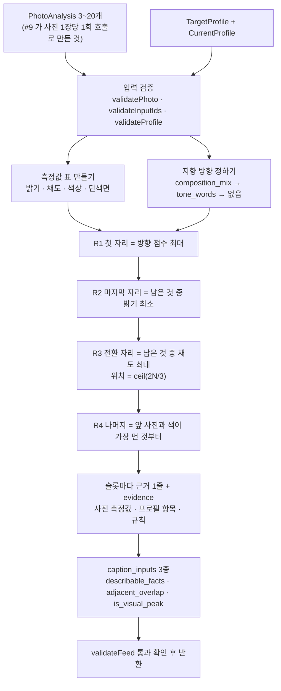

# spec.md — #12 F2 순서 제안

출력 계약은 `schemas/ordered_feed.md` 와 `lib/contracts.js` 의 `validateFeed` 다.
**스키마는 바꾸지 않는다.** 스키마가 표현하지 못하는 상태는 이 spec 이 맞추고, 변경 요청은 8절에 적어 PR 본문으로 넘긴다.

---

## 1. 전체 흐름

두 줄 요약:
- **모델을 호출하지 않는다.** 순서는 #9 의 측정값과 명시된 서사 규칙으로만 정한다. 그래서 `prompts/input/order.md` 를 만들지 않는다(7절).
- **F2 는 캡션 상태를 결정하지 않는다.** `caption_inputs` 는 재료이고, 채울지 비울지는 F3(#13) 소관이다.

---

## 2. ★ 근거로 쓸 값을 실제 사진으로 확인했다

`docs/intent.md` 8절 A2 와 #9 의 `scale` 반증 때문에, **쓰기 전에 먼저 확인했다.**
방법: `pivot/apify-check/fixtures/images/` 의 실제 인스타 사진 15장을 #9 브랜치(`feat/9-photo-analysis`)의 분석기로 측정하고,
그중 4장을 **직접 열어서 눈으로 대조**했다. 원 출력과 재현 방법은 `report.md` 2절에 있다.

| PhotoAnalysis 필드 | 실제로 재는 것 | 눈 대조 결과 | 이 이슈에서 |
|---|---|---|---|
| `color.bright_mean` | 화소 평균 밝기(HSV 의 V) | 0.742 = 크림색 배경 스튜디오컷(가장 밝음), 0.328 = 그늘진 야외 + 짙은 플리스(가장 어두움). **일치** | **쓴다** |
| `color.sat_mean` | 화소 평균 채도 | 0.126 = 회색 메모지, 0.344 = 청록 니트. **일치** | **쓴다** |
| `color.hue_mean` | 채도 가중 원형평균 색상각 | 152.8 = 청록, 318.3 = 자보라. **일치** | **인접 색 거리 계산에만 쓴다** |
| `composition` | **가장 넓은 단색 면이 프레임의 28% 이상인가** | 4장 중 3장은 "여백"과 일치. **1장(그늘진 야외 인물컷)은 여백이 아니라 짙은 플리스 재킷이 28.5% 를 덮어서 `negative_space` 가 됐다** | **쓰되 "여백"이라고 부르지 않는다.** 근거 문장은 "한 색이 넓게 깔렸다"로만 쓴다 |
| `scale` | **아무것도 재지 않는다** — 휴리스틱 경로 고정값 `midshot` | 실사진 15장 전부 `midshot`. 상수다 | **쓰지 않는다** |
| `has_face` | 모델 경로만 `true` 를 낸다. 휴리스틱은 항상 `false` | 내가 연 4장 중 3장에 사람 얼굴이 또렷한데 전부 `has_face:false`. 즉 `false` 는 "없다"가 아니라 "못 봤다" | **`true` 일 때만 쓴다**(`false` 는 근거로 쓰지 않는다) |

**이 표가 이 이슈의 안전장치다.** `composition` 을 "여백이 많은 사진"이라고 썼으면 그건 15장 중 최소 1장에서 거짓이고,
`scale` 을 썼으면 상수를 근거로 내놓는 것이며, `has_face:false` 를 "사람이 없다"로 읽었으면 11장을 틀리게 말한다.

### 2-1. 캐러셀 근거와 `carousel_count=0` 불일치 처리

- **A2 자체는 확인됐다.** #11 이 10장·20장 캐러셀 2건을 브라우저 실제 순서와 대조해 **불일치 0**, 코디네이터가 3계정 80개에서 커버 == `children[0]` 100% 확인.
- **불일치의 정체:** 레포 `fixtures/` 4종의 `sequence.carousel_count` 가 전부 0 인데,
  실제 데이터 `pivot/apify-check/fixtures/ig_feed_29cm.json` 을 내가 직접 세어 보면 **30건 중 캐러셀 26건**(`type:"Sidecar"` 26, `Video` 4)이다.
  갈라지는 이유는 **출처가 다르기 때문**이다 — 커밋된 fixture 는 자연어/합성 스냅샷으로 만든 목업이라 캐러셀을 한 건도 관측하지 않았고(`carousel_count: 0` 이 정직한 값),
  실제 ref 스냅샷에서 뽑으면 #10 의 추출기가 `posts.filter(p => child_count >= 2).length` 로 26 을 채운다.
- **그래서 이 이슈의 처리:** `carousel_count` 를 **내가 고치지 않는다**(fixture 는 #10·#1 소관이고 값 자체는 그 출처에서 맞다).
  대신 코드가 **관측된 캐러셀 수에만 의존**하게 만든다 — `opener_tendency` 가 없거나 값이 `"불명"` 이면 캐러셀 보너스는 **아예 계산하지 않는다.**
  계약상 `carousel_count=0` 이면 `opener_tendency` 는 생략되거나 `"불명"` 뿐이므로, 현재 fixture 로는 이 경로가 **자동으로 꺼진다.** 추측으로 켜지지 않는다.

---

## 3. 입력·출력 계약

`orderFeed({ photoAnalyses, targetProfile, currentProfile, sessionId, feedId, now })` — `lib/order.js`

| 이름 | 타입 | 규칙 |
|---|---|---|
| `photoAnalyses` | PhotoAnalysis[] | **3~20개.** 각각 `validatePhoto` 통과, `photo_id` 중복 금지 |
| `targetProfile` | TargetProfile | `validateProfile(_, 'target')` 통과. `present:false` 는 계약상 불가 |
| `currentProfile` | CurrentProfile | `validateProfile(_, 'current')` 통과. **`present:false` 를 명시적으로 넘긴다.** 생략·undefined 는 거부 |
| `sessionId` / `feedId` | nonempty string 또는 생략 | 생략하면 입력 photo_id 목록 해시로 만든다 |
| `now` | ISO timestamp 또는 생략 | 생략하면 현재 시각. 테스트 결정성용 |

출력: `validateFeed(feed, photo_ids, currentProfile, targetProfile, photoAnalyses)` 를 통과하는 **OrderedFeed 1개**.
실패는 `ContractError` 로 던진다. **부분 결과를 만들어 반환하지 않는다.**

이 함수는 **순수 함수**다. 네트워크·파일·모델 호출이 없고, 같은 입력은 같은 출력을 낸다(`now` 고정 시 바이트 단위로 같다).

### `applied_profile` — F2 는 두 축을 합성하지 않는다

| 필드 | 값 |
|---|---|
| `target_profile_id` | 입력 TargetProfile 의 `profile_id` 그대로 (E9) |
| `current_profile_id` | `present` 면 그 ID, 아니면 `null` (E8) |
| `corrected` / `disclosure` | **항상 `false` / `"target_only"`** |
| `deltas` | **항상 `[]`** |
| `visual`/`language`/`sequence` | TargetProfile 의 같은 필드를 **그대로 복사** |

두 축 합성과 `caption_len_gap` 델타는 **#13(F1 축소판) 소관**이다. F2 가 미리 만들면 두 곳에서 같은 판단을 하게 된다.
현재 프로필이 있어도 `target_only` 인 것은 **계약상 정상**이며(E8 은 `current_profile_id` 가 실제 입력과 일치하기만 요구한다) 숨기는 것이 아니다 — 현재 축을 **읽었지만 아직 보정에 쓰지 않았다**는 뜻이고, 그 사실이 `disclosure` 에 그대로 드러난다.

---

## 4. 판단 규칙 — 순서를 어떻게 정하는가

### 4-1. 지향 방향 (한 번만 정한다)

| 순위 | 출처 | 방향 | 근거 종류 |
|---|---|---|---|
| 1 | `target.visual.composition_mix` | `negative_space ≥ 0.5` → `quiet`, 아니면 `dense` | 구조화된 수치. confidence **1** |
| 2 | `target.visual.tone_words` | 아래 키워드표 | 사용자가 쓴 말의 **해석**. confidence **0.5** |
| 3 | 둘 다 없음 | `null` (기본 규칙) | — |

키워드표(전부 부분 문자열 일치):
- `quiet` ← 조용 · 차분 · 고요 · 잔잔 · 여백 · 심플 · 미니멀 · 담백 · 짧게
- `dense` ← 자세 · 기록 · 촘촘 · 빼곡 · 화려 · 선명 · 풍부

양쪽이 다 걸리거나 하나도 안 걸리면 **`null`** 이다. 애매한 것을 한쪽으로 밀지 않는다.
**이 표는 측정이 아니라 설계 결정이다.** 그래서 이 경로로 정해진 슬롯의 `confidence` 는 0.5 이고, 근거 문장에 "지향 문구를 …로 읽었다"가 그대로 들어간다.

### 4-2. 자리 배정 규칙

| # | 규칙 | 무엇으로 정하는가 |
|---|---|---|
| **R1** | **1번 = 방향 점수 최대** | `quiet`: `0.4·밝기 + 0.4·단색면 + 0.2·(1-채도)` · `dense`: `0.4·(1-단색면) + 0.4·채도 + 0.2·밝기` · `null`: `0.5·밝기 + 0.5·단색면` |
| **R1b** | **캐러셀 보너스(있으면 보태는 것)** | `opener_tendency` 가 있고 값이 `"불명"` 이 아닐 때만. `"인물"` → `has_face===true` 인 사진에 **+0.15**. `"풀샷"`/`"클로즈업"` → `analysis_source==="vision_model"` 인 사진에만 적용(휴리스틱의 `scale` 은 상수라서). 조건 미달이면 **보너스를 계산하지 않는다** |
| **R2** | **N번 = 남은 것 중 밝기 최소** | 측정값. "끝을 가라앉힌다"는 서사 규칙 |
| **R3** | **전환 자리 = 남은 것 중 채도 최대**, 위치는 `ceil(2N/3)` (2 이상 N-1 이하) | 측정값 + 위치 규칙 |
| **R4** | **나머지 = 앞자리 사진과 색이 가장 먼 것** | 위치 오름차순 그리디. 비슷한 사진이 연달아 붙지 않게 |

R4 의 알려진 천장: 그리디라서 **앞쪽 자리가 먼 사진을 먼저 가져가고 뒤쪽에 비슷한 사진들이 남는다**
(실측 15장에서 색 거리 0.296 → 0.053 으로 단조 감소했다). 전역 최적(교환 개선·순회 탐색)은 이 이슈에서 하지 않는다 — 15~20장에서 눈에 띄는 개선인지 확인하지 않았고, 확인 없이 복잡도를 올리지 않는다.

동점은 **입력 순서(`input_index`)가 작은 쪽**이 이긴다. 그래서 출력은 결정적이다.
0.4/0.4/0.2 와 +0.15 는 **측정값이 아니라 설계 상수**다. 보너스 상한을 0.15 로 둔 이유는 **측정값 차이가 큰 두 사진의 순서를 캐러셀 경향이 뒤집지 못하게** 하기 위해서다.

### 4-3. 색 거리와 `caption_inputs`

`color_distance(a,b) = 0.5·|밝기차| + 0.3·|채도차| + 0.2·(색상각 원형거리/180)·min(채도a,채도b)` → 0..1.
색상각은 **채도가 낮으면 노이즈**이므로 두 사진의 낮은 쪽 채도로 가중한다(#9 가 같은 이유로 원형평균에 채도 가중을 썼다).

| `caption_inputs` | 값 | 정의 |
|---|---|---|
| `describable_facts` | 그 슬롯 사진의 `describable_facts` **전부 복사** | 다른 사진의 사실을 섞으면 E11 로 거부된다 |
| `adjacent_overlap` | `1 - color_distance(앞자리 사진, 이 사진)`, 1번 자리는 **0** | **"인접 사진과 측정 색이 얼마나 겹치는가"**. 사실(텍스트) 겹침이 아니다 |
| `is_visual_peak` | 입력 전체에서 **측정 평균 채도가 최대인 사진 1장만 `true`** | 측정값. 동점은 입력 순서 |

**`adjacent_overlap` 의 실측 범위:** 실사진 20장의 190개 쌍에서 색 거리는 **0.020~0.305 (평균 0.109)** 였다.
즉 실제로 나오는 `adjacent_overlap` 은 대략 **0.70~0.98** 에 몰린다. 절대값을 "70% 겹친다"로 읽으면 안 되고,
F3 는 **한 피드 안에서 상대 비교**로 써야 한다. 이 압축을 없애려고 관측 분포에 맞춘 상수를 넣지는 않았다 — 그건 측정처럼 보이는 설계값이 된다.

**`is_visual_peak` 이름에 대한 정직한 한계:** 이 필드가 재는 것은 **평균 채도 최대**이고, "사람이 느끼는 시각적 정점"과 같다는 것은 **확인하지 않았다.**
그래서 근거 문장에는 "시각적 정점"이라고 쓰지 않고 `채도 0.399 로 가장 진해` 처럼 **측정값 그대로** 쓴다. 이름의 간극은 8절 변경 요청에 적었다.

`adjacent_overlap` 을 사실 겹침(자카드)으로 정의하는 안을 먼저 봤고 **버렸다**: 휴리스틱 경로의 `describable_facts` 는
해상도·밝기·채도·주요색 문장이라 서로 기계적으로 겹친다(합성 fixture 는 15장 전부 "단색 카드"를 공유한다). 겹침이 있어 보이지만 내용이 없다.

---

## 5. 근거(evidence) 를 어떻게 붙이는가

슬롯마다 `rationale` 은 `Claim<string>` 이고 evidence 는 아래 순서로 쌓는다.

1. **`{kind:"uploaded_photo", ref:"<그 슬롯의 photo_id>", note:"측정값 — 밝기 … · 채도 … · 주요 색 …"}`** — 항상 1개. E10 이 `ref` 가 실제 입력 사진으로 해소되는지 검사한다.
2. **프로필 항목 근거** — 방향을 정하는 데 쓴 프로필 Claim 의 evidence 를 **그대로 복사**한다(`kind` 는 `user_text`/`aggregate`). R1 슬롯과, 보너스가 붙은 경우에만.
3. **`{kind:"rule", ref:"order.R1|R2|R3|R4", note:"…"}`** — 어떤 서사 규칙으로 그 자리에 놓았는지.

즉 **모든 슬롯이 1번을 반드시 갖는다.** 그래서 `kind:"rule"` 만으로 된 슬롯은 구조적으로 0개다(S1).
`confidence` 는 확률이 아니라 **근거 종류 라벨 2단계**다: `1` = 측정값만으로 결정, `0.5` = 지향 문구 해석(4-1 의 2순위)이 개입.
스키마가 0..1 number 만 허용해서 이 두 값을 쓴다.

---

## 6. 정확성 기준 — 무엇을 하면 틀린 것인가

| # | 틀린 것 |
|---|---|
| **W1** | 출력 슬롯 수가 입력 사진 수와 다르거나 `position` 이 1..N 을 정확히 한 번씩 덮지 않는다 (E2·E3) |
| **W2** | 어떤 슬롯의 `rationale.evidence` 가 전부 `kind:"rule"` 이다 (S1) |
| **W3** | `uploaded_photo` evidence 의 `ref` 가 실제 입력 사진 ID 가 아니다 (E10) |
| **W4** | `caption_inputs.describable_facts` 에 **다른 사진의 사실**이 들어 있다 (E11) |
| **W5** | 근거 문장이 `scale` 이나 `has_face:false` 를 사실처럼 말한다 (2절에서 반증된 값) |
| **W6** | 근거 문장이 `composition` 을 "여백"이라고 부른다 (2절 대조에서 15장 중 최소 1장이 반례) |
| **W7** | `carousel_count` 가 0 인데 캐러셀 경향 보너스가 걸렸다 |
| **W8** | `CurrentProfile.present === false` 인데 `disclosure` 가 `target_only` 가 아니거나 예외로 끝난다 (E8) |
| **W9** | 같은 입력인데 실행할 때마다 순서가 달라진다 |
| **W10** | 프로필 2벌을 넣었는데 `position` 정렬 `photo_id` 가 같다 (S3) — 같으면 프로필이 실제로는 안 쓰인 것이다 |
| **W11** | 출력에 좋아요·도달 예측, 사진에 없는 장소·인물·시간이 들어간다 |

W1·W3·W4·W8 은 `npm run eval` 의 불변식이 본다. W2·W7·W9·W10 은 `test/order.test.js` 가 본다.
W5·W6·W11 은 근거 문장 생성기가 **그 문장을 만들 경로를 아예 갖지 않게** 해서 막고, 15슬롯 전수 대조로 확인한다.

---

## 7. 경계값

| 입력 | 결과 |
|---|---|
| 사진 2장 이하 / 21장 이상 | `ContractError` (`validateInputIds`) |
| 사진 3장 | opener 1 · turn 2 · closer 3. 정상 |
| `photo_id` 중복 | `ContractError` |
| `CurrentProfile.present === false` | 정상. `current_profile_id: null` · `target_only` · `deltas: []` |
| `targetProfile.language === null` | 정상. `applied_profile.language` 도 `null` |
| `describable_facts` 가 빈 배열인 사진 | 정상. 그 슬롯의 `describable_facts` 도 `[]` |
| 모든 사진의 측정값이 동일 | 정상. 동점은 `input_index` 로 풀려 입력 순서가 유지된다 |
| `opener_tendency` 없음/`"불명"` | 보너스 경로 자체를 타지 않는다 |

**안 만드는 것:** `prompts/input/order.md`(모델을 안 쓴다) · `src/app/api/feed/route.ts`(#24 배선 소관, 이 레포는 `api/feed.js` 구조다) ·
진행률 UI · 확인용 화면 · 캡션 상태 판단 · 델타 합성.

---

## 8. 스키마 변경 요청 (바꾸지 않고 적어 둔다)

1. `slots[].rationale.confidence` 가 0..1 number 라서 **근거 종류 라벨**을 숫자로 위장해야 한다. `evidence_grade` 같은 enum 이 맞다.
2. `caption_inputs.adjacent_overlap` 의 **정의가 계약에 없다.** 색 겹침인지 사실 겹침인지 구현마다 달라질 수 있다(이 spec 4-3 이 색으로 고정했다).
3. `narrative_role` 에 4종(opener/sustain/turn/closer)만 있어 **N=3 에서도 turn 을 반드시 배정**해야 한다.
4. `caption_inputs.is_visual_peak` 의 **이름과 측정 가능한 정의가 어긋난다.** 우리가 잴 수 있는 것은 평균 채도뿐이고 "시각적 정점"은 사람 판단이다. `peak_metric` 같은 필드로 무엇을 재서 그렇게 판정했는지 같이 실을 수 있어야 한다.
5. (#9 가 이미 올린 것과 같은 자리) `scale` 에 `unknown` 이 없어서 관측 못 한 값이 단정으로 나온다 — 그 결과 **#12 는 `scale` 을 통째로 못 쓴다.**

네 건 모두 `CLAUDE.md` 4-2절(L 크기, 양쪽 사람 승인) 대상이므로 이 PR 에서 손대지 않는다.
