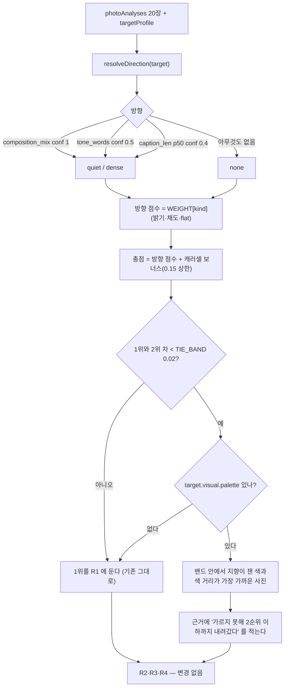

# spec.md — #41 무엇을 만드는가

범위는 **R1 한 자리**와 **테스트 픽스처 한 파일**이다. `schemas/` 4종은 건드리지 않는다.
선택지 A(R2~R4 전체를 프로필 기반으로)는 이번 범위가 **아니다**.

## 1. R1 결정 흐름 (바뀐 부분만 굵게)

## 2. 입력/출력 계약

바뀐 것은 **읽는 필드 하나**와 **근거 문장 한 갈래**뿐이다.

| | 값 |
|---|---|
| 새로 읽는 입력 | `targetProfile.visual.palette` — `Claim<{hue_mean, sat_mean, bright_mean, palette_hex}>` |
| 근거 | `schemas/target_profile.md` 26행이 이미 선언한 선택 항목이다. **스키마를 바꾸지 않는다.** |
| 값의 출처 | `lib/target_profile.js` 의 `planFromPhotos` 가 PhotoAnalysis 에서 그대로 계산해 내는 값이다 (`색 평균 + 최빈 색 3개`). 새 신호가 아니다. |
| 없을 때 | 타이브레이크가 **아예 켜지지 않는다.** 추측으로 채우지 않는다. |
| 출력 변화 | 1번 슬롯 `rationale.value` 문장 1갈래 추가, `rationale.evidence` 에 palette Claim 의 evidence 추가, R1 rule note 에 한 문장 추가. 슬롯 구조·필드는 그대로다. |

### 왜 하필 `palette` 인가 — 다른 선택지를 버린 이유

`#9` 가 `composition` 을 상수로 만들면서 **1순위 방향 신호(`composition_mix`)가 가리키던 사진 축이 죽었다.**
살아 있는 사진 축은 `bright_mean` · `sat_mean` · `hue_mean` 셋뿐이고,
지향 프로필 쪽에서 **그 세 축을 그대로 말하는 항목은 `visual.palette` 하나다.**

| 후보 | 버린 이유 |
|---|---|
| `language.caption_len` 의 크기를 연속 손잡이로 | 이미 방향을 정하는 데 쓴다. 같은 값을 두 번 읽어 "측정한 척하는 값" 을 늘린다 |
| `language.emoji_rate` · `ending_style` · `linebreak_habit` | 사진 축에 닿는 매핑이 없다. 만들면 `#9`·`#12` 가 두 번 빠진 함정이다 |
| `sequence.opener_tendency` | 이미 R1 보너스로 쓰고 있다. 휴리스틱 경로에서는 `has_face`·`scale` 이 상수라 어차피 꺼져 있다 |
| 무작위성 | 결정성이 깨지고 근거를 못 댄다. 금지 |

## 3. 판단 규칙

1. `totalScore(photo) = WEIGHT[direction.kind](photo) + (캐러셀 보너스면 0.15)`
2. `band = { p | totalScore(p) >= max(totalScore) - TIE_BAND }`
3. `band.length > 1` **그리고** `visual.palette` 가 있으면 → `band` 안에서 `distance(잰 색, 사진)` 최소를 고른다.
   `distance` 는 **R4 가 이미 쓰는 함수 그대로**다 (`0.5·|Δ밝기| + 0.3·|Δ채도| + 0.2·색상각차·min(채도)`). 새 지표를 만들지 않았다.
4. 그 외에는 기존과 **완전히 같다.**

### `TIE_BAND = 0.02` 의 근거

측정값이 아니라 **설계 상수**다. 두 가지로 묶어 둔다.

- **아래로:** 방향 점수의 입력(밝기·채도)은 소수 셋째 자리까지만 보고되고 가중치(0.2~0.5)도 측정값이 아니다.
  이보다 좁은 차이를 두고 "방향 점수가 두 사진을 갈랐다" 고 말할 자격이 없다.
- **위로:** `OPENER_BONUS`(0.15)보다 반드시 작다. 밴드가 보너스보다 넓으면 밴드가 보너스를 삼킨다.

실측 20장에서 이 값이 잡아내는 것은 `dense` 1·2위 차 **0.007** 이고,
잡지 않는 것은 `quiet` 1·2위 차 **0.072** 다. 4절의 천장이 이 선택의 직접적인 결과다.

## 4. 정확성 기준 — 무엇을 하면 틀린 것인가

| 틀린 것 | 왜 |
|---|---|
| 밴드 밖의 측정 차이를 잰 색이 뒤집는다 | 프로필 신호가 측정값을 덮는다. `OPENER_BONUS` 상한을 둔 이유와 같다 |
| 타이브레이크가 걸렸는데 "점수가 가장 높아 1번에 뒀다" 고 말한다 | 사용자에게 보이는 문장이 선택의 진짜 원인을 숨긴다 (#12 `review-codex.md` M1 과 같은 종류의 구멍) |
| `palette` 가 없는데 추측으로 채운다 | 없는 근거를 지어내는 것이다 (E9 가 막는 위조) |
| 같은 입력이 두 번 다른 순서를 낸다 | 무작위성 금지. 동점은 입력 순서가 이긴다 |
| 픽스처를 손으로 고쳐 테스트를 통과시킨다 | 이 이슈가 없애려는 상태를 다시 만든다 |

## 5. 경계값

| 상황 | 동작 |
|---|---|
| `band.length === 1` | 타이브레이크 꺼짐. 기존과 동일 |
| `visual.palette` 없음 (현재 두 추출 경로 전부) | 타이브레이크 꺼짐. 기존과 동일 → **회귀 0** |
| 밴드 안에서 색 거리까지 동점 | `pick()` 의 기존 동점 규칙 — `input_index` 오름차순. 결정적 |
| 캐러셀 보너스가 2위를 올려 밴드가 잡힌 경우 | 밴드는 **총점**(보너스 포함) 기준이라 보너스가 먼저 반영된 뒤 색이 가른다 |
| `direction.kind === 'none'` | 방향이 없어도 밴드·타이브레이크는 똑같이 동작한다. 근거 문장은 "첫 자리 기본 규칙" 으로 쓴다 |

## 6. 알려진 천장 — 이 spec 이 **못** 하는 것

- **S3 은 여전히 R1 한 자리에 매달려 있다.** 타이브레이크는 그 한 자리가 읽는 프로필 신호를 하나 늘렸을 뿐이다.
  R2·R3·R4 는 그대로 프로필과 무관하다.
- **밴드 밖의 겹침은 못 막는다.** 이슈가 적은 `quiet` vs `none` 겹침(실측 1·2위 차 0.072)은 밴드 밖이라
  잰 색이 있어도 R1 이 안 바뀐다. 두 식이 `flat` 이 죽은 뒤 `밝기` 지배로 거의 같아졌기 때문이고,
  이건 타이브레이크가 아니라 **식 자체의 문제**다 (선택지 A 영역).
- **현재 두 추출 경로는 `visual.palette` 를 채우지 않는다.** `freetext` 는 `tone_words` 만,
  `ig_reference` 는 캡션만 채운다. 즉 오늘 프로덕션에서는 이 경로가 **꺼져 있다.**
  `composition_mix`(1순위 방향 신호)도 똑같이 아무 추출기가 채우지 않는데 이미 읽고 있다 — 같은 성격의 선행 읽기다.
  사진 기반 레퍼런스가 들어오는 순간(#13/#24) 켜진다.
