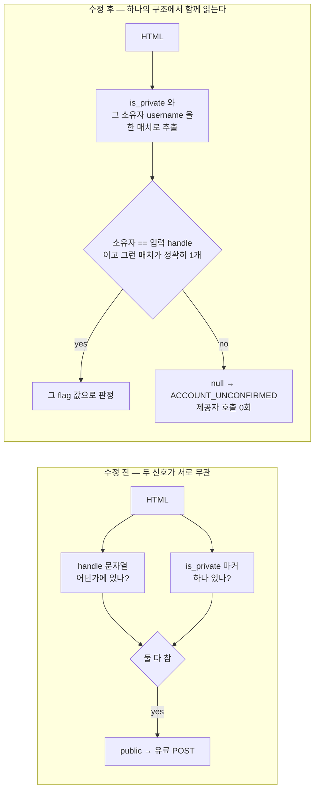

# PR #84 수정 2회차 — 판별 신호를 대상 계정에 묶는다

`docs/specs/68-apify-ingest/review-codex-fix.md` §2 의 HIGH 1건만 고쳤다. 검증일 2026-09-18, Node v22.22.3.
**신규 Apify 수집 0회, 실제 Apify 요청 0회.** 판별용 logged-out Instagram GET 은 무료라 실제로 6회 수행했다
(구조 확인 3회 + 기본 경로 실측 3회). 제공자 POST 는 전부 가짜 응답으로 막았다.
`pivot/` 은 이 워크트리에 없어 읽지 않았고, 다른 워크트리는 건드리지 않았다.

## 1. 무엇이 문제였나

`privacyFromHtml()` 은 두 가지를 **각각** 확인했다.

1. HTML 안에 `"username":"<handle>"` 가 있는지
2. 공백 없는 `"is_private":true|false` 가 정확히 하나 있는지

둘을 서로 연결하지 않으므로, **그 flag 가 누구 것인지**를 모른 채로 공개/비공개를 정했다.



## 2. 무엇을 고쳤나

`lib/apify_ingest.js:45-58`. logged-out 프로필 페이지에서 flag 와 그 소유자를 **한 정규식 매치로 함께** 읽는다.
실제 페이지의 구조는 `"is_private":<v>}` 직후 형제 키 `xig_logged_out_dynamic_dialog_info.user.username` 이
같은 프로필의 계정명을 담고 있다. 그 구조에서 뽑은 (flag, username) 쌍 중 **입력 handle 의 것이 정확히 하나** 일
때만 값을 읽고, 그 밖의 모든 경우(구조 없음 · 다른 계정 것만 있음 · 같은 계정에 상충하는 값 둘)는 `null` 이다.
`start()` 는 이미 `null` 을 `ACCOUNT_UNCONFIRMED` 로 차단하므로, 기존 "판별 실패 시 보수적 차단" 원칙을 그대로 쓴다.

구조에 기댄 결과는 리뷰어가 지적한 그대로다 — **Instagram 이 이 키를 바꾸면 판별이 실패하고, 실패는 차단이다.**
잘못 허용되는 방향으로는 깨지지 않는다.

### 구조가 한 계정 특수가 아님을 실측으로 확인

실제 logged-out 페이지 3개를 받아(HTTP 200, 무료) `is_private` 전 occurrence 의 문맥을 직접 읽었다.

| 계정 | HTTP | 크기 | `is_private` occurrence | 위 구조 occurrence | flag 소유자 |
|---|---|---:|---:|---:|---|
| `hauny_bee` (비공개) | 200 | 1,109,930 B | 1 (`true`) | 1 | `hauny_bee` |
| `hong_a1302` (공개) | 200 | 1,570,813 B | 1 (`false`) | 1 | `hong_a1302` |
| `29cm.official` (공개, 점 포함 handle) | 200 | 2,108,147 B | 1 (`false`) | 1 | `29cm.official` |

세 페이지 모두 flag 가 1개이고, 그 flag 는 예외 없이 위 구조를 통해 자기 계정명과 붙어 있었다.
리뷰어가 "발췌라 구조 귀속 검증의 근거로 부족하다"고 한 점을 좁히기 위해 `29cm.official` 발췌를
`fixtures/instagram_profile_markers.json` 에 `public_dotted` 로 추가했다(다른 항목과 같은 400 B 발췌, 점 포함 handle 케이스).

## 3. 증명 — 리뷰어의 반례, 기본 `start()` 경유

HEAD 의 `lib/apify_ingest.js` 와 수정본을 같은 입력에 대해 **기본 `readVisibility` 경로**로 돌렸다
(`checkPublic` 주입 없음, 프로필 GET 은 주어진 HTML 을 돌려주고 제공자 POST 만 카운트).

| 입력 | 수정 전 | 수정 후 |
|---|---|---|
| 리뷰어 §2 반례 — 대상 flag 에 공백 `: true`, 타 계정 `is_private:false` | `public` / `RUNNING` / **유료 POST 1회** | `null` / `ACCOUNT_UNCONFIRMED` / **POST 0회** |
| 대상 flag 소멸 + 대상 계정명이 페이지에 있고 타 계정 flag 만 남음 | `public` / `RUNNING` / **유료 POST 1회** | `null` / `ACCOUNT_UNCONFIRMED` / **POST 0회** |
| 대상 flag 소멸, 대상 계정명도 없음 | `null` / `ACCOUNT_UNCONFIRMED` / POST 0회 | 동일 (변화 없음) |
| 실제 공개 페이지 `hong_a1302` | `public` / `RUNNING` / POST 1회 | **동일 — 그대로 통과** |
| 실제 공개 페이지 `29cm.official` | `public` / `RUNNING` / POST 1회 | **동일 — 그대로 통과** |
| 실제 비공개 페이지 `hauny_bee` | `private` / `PRIVATE_ACCOUNT` / **POST 0회** | **동일 — 그대로 차단** |

리뷰어가 쓴 두 반례 모두 수정 전에는 유료 POST 가 실제로 나갔고, 수정 후에는 제공자 호출 0회로 막힌다.

### 실제 네트워크 경유 재확인 (제공자는 가짜)

기본 경로가 실제 Instagram 응답에 대해서도 같게 동작하는지 따로 확인했다. 프로필 GET 만 실제이고 제공자 POST 는 가짜다.

```text
hauny_bee       start=PRIVATE_ACCOUNT      0.859s  profileGET=1  fakeProviderPOST=0
hong_a1302      start=RUNNING              0.909s  profileGET=1  fakeProviderPOST=1
29cm.official   start=RUNNING              0.810s  profileGET=1  fakeProviderPOST=1
```

비공개 차단은 0.859초 · 제공자 호출 0회다(리뷰의 1.280초와 같은 동작, 시간은 새 실측값).

## 4. 회귀 테스트와 되돌림 검사

`test/apify_ingest.test.js` 에 2건 추가했다 (222 → 224).

- **`another account's public flag is never read as this account's, so no paid run starts`**
  네 가지 미결합 입력(리뷰어 반례, 대상 flag 소멸, 타 계정만 올바른 구조, 대상 계정명은 있으나 결합 없음)에 대해
  `privacyFromHtml === null` 이고, 기본 `start()` 가 `ACCOUNT_UNCONFIRMED` + `stage: 'precheck'` 로 거부하며,
  **호출 목록이 프로필 GET 1건뿐**(제공자 0건)임을 확인한다.
- **`the account's own flag decides it even when a stranger's contradicting flag shares the page`**
  실제 비공개 페이지에 타 계정의 공개 구조를 앞·뒤로 붙여도 `private` 이고, 실제 공개 페이지는 `public` 을 유지하며,
  같은 계정을 주장하는 flag 가 둘이면 `null` 이다.

기존 실제 페이지 판정 테스트에는 `public_dotted` 단정을 추가했다.

되돌림 검사 — `lib/apify_ingest.js` 만 HEAD 로 복구하고(테스트·fixture 는 수정본 유지) 실행했다.

| 변형 | 결과 | 실패한 검사 |
|---|---|---|
| 수정본 | 34 / 0 | — |
| `privacyFromHtml` 을 HEAD 로 되돌림 | 32 pass / **2 fail** | 위 신규 2건 |

## 5. 게이트

| 명령 | 결과 |
|---|---|
| `npm test` | **224 pass / 0 fail**, 1.082초 |
| `npm run eval` | E1/E2/E3/E6/E8/E9/E10/E11 PASS, 오류 주입은 EXPECTED FAIL; E4/E5/E7 은 기존과 같이 수동 검증 미포함 |
| `npm run check` | 72 JS/JSON 파일 PASS |
| `npm run lint` | biome 41 파일, 수정 없음, exit 0 |
| `npm run typecheck` | route typegen + `tsc --noEmit` 통과, exit 0 |

## 6. 범위와 남는 것

**이번에 고친 것은 §2 HIGH 1건뿐이다.** 리뷰가 머지 차단 사유로 삼지 않은 항목은 그대로 남는다.

- **§3 판별과 수집 사이의 시간차** — 여전히 존재한다. 보장은 "사전 판별 시점에 공개로 확인됨"으로 한정된다.
  이번 수정은 그 시점의 판정이 **대상 계정의 것**임을 보장할 뿐, 판정 이후의 상태 전환을 막지는 않는다.
- **§5 누적 비용 상한 부재** — 화면 미연결 확인으로 이번 머지 차단 사유에서 제외된 상태를 유지한다.
  화면 연결 전 계정/세션 요청·누적 비용·일 예산 상한은 선행 조건으로 남는다.
- **구조 의존** — `xig_logged_out_dynamic_dialog_info` 는 관측된 3개 페이지에서 일관됐지만 Instagram 의 비공개 구조다.
  바뀌면 판별이 전부 실패해 **모든 수집이 차단**된다. 잘못 허용되지는 않으나, 제품 관점에서는 수집 불가로 나타난다.
- Node 24 재검증은 하지 않았다 (`engines: 24.x` 배포 환경 보증은 여전히 남는다).
- 세부 출력: 같은 세션 scratchpad 의 `probe.log`(전후 대조), `live.log`(실제 네트워크), `gates.log`, `eval.log`.
  보조 스크립트는 저장소 산출물에 포함하지 않았다.
