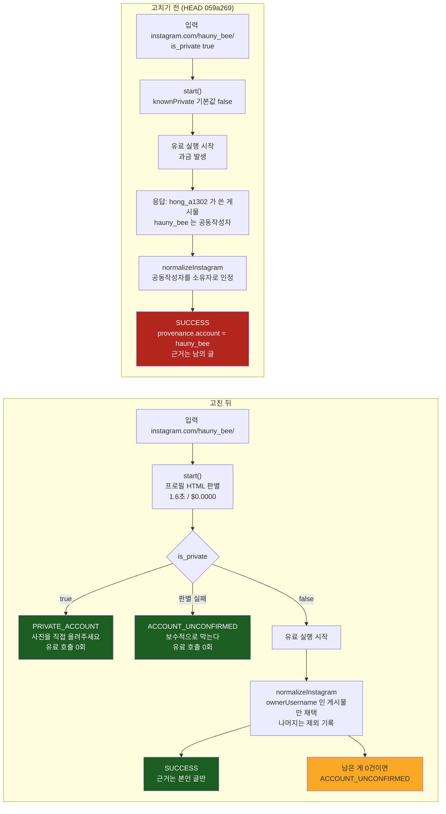

# PR #84 수정 1회차 — 비공개 계정을 수집 전에 막는다

- 대상: PR #84 `feat/68-apify-ingest` → `develop`, 이슈 #68
- 근거 문서: [`review-claude.md`](review-claude.md) 의 BLOCKER 2건 + HIGH 2건
- 워크트리: `/Users/chowonjae/Desktop/projects/wanted/.work/gyeol-68`, base `059a269`
- 사용자 결정: **"수집 전에 막고 사진 업로드로 안내"**. 공동작성자 게시물 선별 수용·고지만 하기는 탈락.
- **이 수정을 위해 새로 돌린 Apify 수집: 0건. 새로 쓴 돈: $0.0000.**
  판별 단계는 공짜고, 제공자 응답은 리뷰가 이미 남긴 데이터셋을 재다운로드해서 썼다.

---

## 한 줄

> 비공개 계정은 **돈이 나가기 전에** 막힌다. 공동작성자를 소유자로 인정하던 로직은 없앴고, 공개 계정은 그대로 동작한다. 실제 비공개 계정으로 전/후를 같은 데이터에 돌려 대조했다.

---

## 1. 무엇이 어떻게 바뀌었나



바뀐 파일은 **2개**(`lib/apify_ingest.js`, `test/apify_ingest.test.js`)이고 새 픽스처 3개를 추가했다.
`+143 / -28`. 기존 제품 경로(`src/`, `api/feed`, `api/analyze`, 데모 기본 경로)는 **한 줄도 건드리지 않았다.**

---

## 2. BLOCKER-1 — 비공개 계정이 수집을 통과한다

### 2-1. 수집을 시작하기 전에 판별한다 (`lib/apify_ingest.js`)

리뷰가 찾은 공짜 판별법을 서버 안으로 넣었다. 로그인 없이 `https://www.instagram.com/<handle>/` 를 GET 하면
HTML 에 그 계정의 `"is_private"` 값이 그대로 들어 있다.

```js
export function privacyFromHtml(html, account) {
  if (!text(html) || !text(account)) return null;
  if (!html.includes(`"username":"${account}"`)) return null;   // 남의 계정 마커를 잘못 읽지 않는다
  const found = html.match(/"is_private":(true|false)/g);
  if (found?.length !== 1) return null;                          // 두 개 이상이면 누구 것인지 모른다
  return found[0].endsWith('true') ? 'private' : 'public';
}
```

`start()` 는 유료 POST 를 보내기 **직전**에 이것을 부른다.

```js
const visibility = await readVisibility(input);
if (visibility !== 'public') fail(visibility === 'private' ? 'PRIVATE_ACCOUNT' : 'ACCOUNT_UNCONFIRMED', { stage: 'precheck', account: input.account });
```

**판별이 실패했을 때는 막는다.** `'public'` 이 **확인된 경우에만** 통과한다 —
네트워크 오류, 200 아닌 응답, 마커 소멸, 계정 이름 불일치, 마커가 여러 개인 경우는 전부 `null` 로 떨어져 차단된다.
리뷰가 경고한 대로 **HTML 구조가 바뀌면 판별이 실패한다.** 그때 이 코드는 수집을 여는 쪽이 아니라 닫는 쪽으로 넘어진다.

세 가지를 더 지켰다.

| 지킨 것 | 어떻게 |
|---|---|
| 제공자 토큰이 instagram.com 으로 새지 않는다 | 판별 요청은 `Authorization` 헤더를 붙이지 않는다. 회귀 테스트가 요청 전체를 직렬화해 `apify_api_...` 문자열 0건을 확인한다 |
| 조용한 빈 성공이 없다 | 막힐 때마다 코드 + 한국어 문구 + `details.stage: 'precheck'` 가 나간다 |
| 조용한 폴백이 없다 | 판별 실패 시 수집으로 넘어가지 않는다. 막고 알린다 |

### 2-2. 사용자에게 무엇을 하면 되는지 알린다

```diff
- PRIVATE_ACCOUNT: '비공개로 확인된 계정은 지원하지 않아요.',
+ PRIVATE_ACCOUNT: '비공개 계정은 읽을 수 없어요. 올렸던 사진을 직접 올려주시면 그대로 분석해 드려요.',
- ACCOUNT_NOT_FOUND: '계정을 찾을 수 없어요.',
+ ACCOUNT_NOT_FOUND: '계정을 찾을 수 없어요. 주소를 확인하거나, 올렸던 사진을 직접 올려주세요.',
- ACCESS_UNAVAILABLE: '계정에 접근할 수 없어요. 비공개 여부는 확인되지 않았어요.',
+ ACCESS_UNAVAILABLE: '계정에 접근할 수 없어요. 올렸던 사진을 직접 올려주시면 그대로 분석해 드려요.',
- ACCOUNT_UNCONFIRMED: '계정 상태나 게시물을 확인하지 못했어요.',
+ ACCOUNT_UNCONFIRMED: '계정 상태나 게시물을 확인하지 못했어요. 올렸던 사진을 직접 올려주시면 그대로 분석해 드려요.',
```

막히는 네 경로 전부가 **왜 막혔는지 + 무엇을 하면 되는지**를 한 문장에 담는다.
사진 업로드는 이 제품의 원래 기본 입력 경로다([ADR-0001](../../adr/0001-single-screen-photo-only-entry.md)) — 없는 기능을 안내하지 않는다.

### 2-3. 공동작성자를 소유자로 인정하는 로직을 없앴다

```diff
- const owners = [row.ownerUsername, ...(row.coauthorProducers ?? []).map(x => x.username)].filter(text).map(x => x.toLowerCase());
- if ((inputAccount && inputAccount !== account) || !owners.includes(account)) fail('INVALID_DATA');
+ const owner = text(row.ownerUsername) ? row.ownerUsername.toLowerCase() : null;
+ if (!owner) fail('INVALID_DATA');
+ if (owner !== account) { excluded.push(owner); continue; }
```

`test/apify_ingest.test.js` 에서 이 동작을 축복하던 단언은 뒤집었다.

```diff
- assert.equal(normalizeInstagram([{ ...post, ownerUsername: 'coauthor', coauthorProducers: [{ username: 'public_account' }], inputUrl: url }], options).posts[0].owner_username, 'coauthor');
+ assert.throws(() => normalizeInstagram([...]), e => e.code === 'ACCOUNT_UNCONFIRMED' && e.details.excluded_owners.includes('coauthor'));
```

### 2-4. ⚠️ 전량 실패가 아니라 제외인 이유 — 측정해서 정했다

"입력 계정이 `ownerUsername` 인 게시물만 그 계정의 것"을 **한 건이라도 어긋나면 배치 전체 실패**로 구현하면
**모든 공개 계정이 실패한다.** 이미 받아 둔 공개 계정 수집 결과를 세어 보고 알았다.

| 픽스처 (신규 수집 없음) | 입력 계정 | 전체 | 본인 글 | 남이 쓰고 입력 계정을 공동작성자로 단 글 |
|---|---|---:|---:|---:|
| `ig_feed_29cm.json` | `29cm.official` | 30 | **26** | **4** (`kkyeongeun_`, `ko_ng__e`, `yeoreum829`, `mapogu_won`) |
| `ig_feed_humansofny.json` | `humansofny` | 100 | **97** | **3** (`powerhousearena`, `juilliardschool`, `shanefanx`) |
| `wantedlab_ko.json` | `wantedlab` | 11 | 11 | 0 |
| `dazedkorea_ko.json` | `dazedkorea` | 10 | 10 | 0 |

공동작성자 게시물은 비공개 계정만의 현상이 아니라 **공개 계정 수집에도 정상적으로 섞여 들어온다.**
그래서 이렇게 했다 — 사용자 결정("`ownerUsername` 인 것만 그 계정의 것")을 그대로 지키면서 공개 계정을 살리는 유일한 읽기다.

- 남이 쓴 게시물은 **관찰에서 제외한다.** 그 계정의 프로필 재료로 절대 쓰이지 않는다. (= "선별 수용" 이 아니다)
- 제외를 **조용히 하지 않는다.** `provenance.coauthored_excluded` 에 건수와 작성자를 남긴다.
- **남는 게 0건이면 성공이 아니다** — `ACCOUNT_UNCONFIRMED` 로 실패하고 `details` 에 제외된 작성자를 담는다.
  비공개 계정이 정확히 이 경우다(돌려받는 게 전부 남의 글이므로).

```jsonc
// 공개 계정 스냅샷의 provenance 에 새로 붙는 항목
"coauthored_excluded": { "count": 4, "owners": ["kkyeongeun_","ko_ng__e","mapogu_won","yeoreum829"],
                         "note": "입력 계정이 작성자가 아닌 게시물은 이 계정의 관찰에서 제외했다" }
```

---

## 3. BLOCKER-2 — provenance 와 evidence 가 다른 사람을 가리킨다

`evidence_refs` 는 `posts` 에서만 만들어지고, `posts` 에는 이제 `ownerUsername === provenance.account` 인 것만 들어간다.
따라서 **근거가 다른 사람을 가리킬 남은 경로가 없다.** 이것을 가정이 아니라 검사로 고정했다.

```js
test('every observation a snapshot carries belongs to the account the provenance names', () => {
  for (const p of snapshot.posts) assert.equal(p.owner_username, snapshot.provenance.account);
  const owned = new Set(snapshot.posts.map(p => p.url));
  for (const [ref, target] of Object.entries(snapshot.provenance.evidence_refs))
    assert.ok(owned.has(target) || target === snapshot.provenance.source_url, `${ref} points outside the account`);
});
```

공개 계정 픽스처로도 같은 것을 확인한다 — 26건 스냅샷의 `currentProfile` · `targetProfile` 양쪽에서
모든 `evidence.ref` 가 **본인 글에만** 해소된다(§5 C).

---

## 4. HIGH 2건

### HIGH-1 — 죽은 분기 3개를 제공자의 실제 오류코드로 교체

제공자가 실제로 주는 것은 `not_found` 하나다(리뷰가 실행해서 확보). `account_not_found` · `access_denied` · `login_required` · `private_account` 는
이 제공자에 대해 **한 번도 뜨지 않는 코드**였다.

```diff
 const responseError = row => {
   const error = row?.error ?? row?.['#error'];
-  if (row?.isPrivate === true || row?.private === true || error === 'private_account') fail('PRIVATE_ACCOUNT');
-  if (error === 'account_not_found') fail('ACCOUNT_NOT_FOUND');
-  if (error === 'access_denied' || error === 'login_required') fail('ACCESS_UNAVAILABLE');
-  if (error) fail('ACCOUNT_UNCONFIRMED');
+  if (!text(error)) return;
+  const details = { provider_error: error, ...(text(row.errorDescription) ? { provider_message: row.errorDescription } : {}) };
+  fail(error === 'not_found' ? 'ACCOUNT_NOT_FOUND' : 'ACCOUNT_UNCONFIRMED', details);
 };
```

제공자가 준 `errorDescription` 을 **버리지 않고** `details.provider_message` 로 보존한다.
`inspect()` 가 실행 정보를 덧붙일 때 이 값을 덮어쓰던 버그도 같이 고쳤다.

```diff
- catch (error) { if (error instanceof IngestError) error.details = context; throw error; }
+ catch (error) { if (error instanceof IngestError) error.details = { ...error.details, ...context }; throw error; }
```

관측되지 않은 코드는 **추측해서 분류하지 않는다** — `ACCOUNT_UNCONFIRMED` 로 두되 제공자의 원래 코드·문구를 그대로 실어 보낸다.

### HIGH-2 — 실패 분류 테스트를 실제 응답으로 교체

합성 fixture(`{isPrivate:true}`, `{error:'account_not_found'}` …)를 지우고, **실제 제공자 데이터셋**을 픽스처로 커밋했다.
리뷰가 이미 돌려 둔 실행에서 받았으므로 **추가 비용 0**이다.

| 새 픽스처 | 출처 | 무엇의 증거인가 |
|---|---|---|
| `fixtures/apify_real_responses.json` | run `RBvzOhrElqm5fGbHJ` / `9CO4MCJwjVs6cFgA7` | 비공개 계정의 실제 응답(오류 없음 + 남의 글) · 없는 계정의 실제 오류 행 |
| `fixtures/apify_public_account_run.json` | `29cm.official` 30건 (기존 수집 재사용) | 공개 계정이 정상 동작하는지, 공동작성자 게시물이 섞여 오는지 |
| `fixtures/instagram_profile_markers.json` | 2026-09-18 로그인 없이 GET (HTTP 200, $0.0000) | 비공개/공개/없는 계정의 실제 프로필 HTML 마커 |

> 픽스처의 만료된 CDN 서명 쿼리스트링은 제거했고(`?_nc_...` 이하), 없는 계정 실행에 딸려 온
> 무관한 개인 계정 3곳의 게시물 본문은 넣지 않았다. 그 외 값은 전부 원문 그대로다.

---

## 5. 전/후 대조 — 같은 데이터, 같은 코드 경로

`git show HEAD:lib/apify_ingest.js` 로 수정 전 코드를 그대로 불러와 **같은 입력**에 돌렸다.

### A. 비공개 계정 `hauny_bee` — 실제 제공자 응답 (run `RBvzOhrElqm5fGbHJ`, 신규 수집 없음)

```
provider returned : 1 post(s), ownerUsername=hong_a1302, coauthor ids=["6024842245"], error=none

BEFORE (059a269) : {"verdict":"SUCCESS","posts":1,"sample_size":1,
                    "provenance_account":"hauny_bee","evidence_owners":["hong_a1302"]}

AFTER            : {"verdict":"BLOCKED","code":"ACCOUNT_UNCONFIRMED",
                    "message":"계정 상태나 게시물을 확인하지 못했어요. 올렸던 사진을 직접 올려주시면 그대로 분석해 드려요.",
                    "details":{"excluded_post_count":1,"excluded_owners":["hong_a1302"]}}
```

### B. ★ 수집을 시작하기 전 단계 — 유료 실행이 아예 안 걸리는가 (실제 네트워크, 비용 0)

`api.apify.com` 으로 나가는 요청만 가로채 세었다. 판별 요청은 **실제 instagram.com** 으로 나갔다.

```
hauny_bee       -> {"started":false,"code":"PRIVATE_ACCOUNT",
                    "message":"비공개 계정은 읽을 수 없어요. 올렸던 사진을 직접 올려주시면 그대로 분석해 드려요.",
                    "details":{"stage":"precheck","account":"hauny_bee"}}
                   billable provider calls = 0 | elapsed 1.62s | cost $0.0000

29cm.official   -> {"started":true,"status":"RUNNING"}
                   billable provider calls = 1 | elapsed 0.96s | cost $0.0000
```

**비공개 계정은 제공자 호출 0회로 막혔다.** 공개 계정은 그대로 수집으로 넘어간다.

### C. 공개 계정 `29cm.official` — 기존 픽스처 재사용 (신규 수집 없음)

```
BEFORE : {"verdict":"SUCCESS","posts":30,"sample_size":30,"provenance_account":"29cm.official",
          "evidence_owners":["29cm.official","kkyeongeun_","ko_ng__e","yeoreum829","mapogu_won"]}   ← 남의 글 4건 포함

AFTER  : {"verdict":"SUCCESS","posts":26,"sample_size":26,"provenance_account":"29cm.official",
          "evidence_owners":["29cm.official"],                                                       ← 본인 글만
          "excluded":{"count":4,"owners":["kkyeongeun_","ko_ng__e","mapogu_won","yeoreum829"],
                      "note":"입력 계정이 작성자가 아닌 게시물은 이 계정의 관찰에서 제외했다"}}
```

**공개 계정은 여전히 성공한다.** 표본이 30 → 26 으로 줄었고, 줄어든 4건은 처음부터 그 계정의 글이 아니었다.

### D. 없는 계정 — 제공자 실제 오류 행 (run `9CO4MCJwjVs6cFgA7`)

```
provider row : {"url":"https://www.instagram.com/gyeol68nonexistentaccount9z/","username":"gyeol68nonexistentaccount9z",
                "error":"not_found","errorDescription":"Post does not exist"}

BEFORE : {"code":"ACCOUNT_UNCONFIRMED","message":"계정 상태나 게시물을 확인하지 못했어요.","details":{}}   ← 제공자 설명 버려짐
AFTER  : {"code":"ACCOUNT_NOT_FOUND","message":"계정을 찾을 수 없어요. 주소를 확인하거나, 올렸던 사진을 직접 올려주세요.",
          "details":{"provider_error":"not_found","provider_message":"Post does not exist"}}
```

---

## 6. 되돌리면 실패하는가 — 회귀 검사 확인

통과만 확인한 수정은 증거가 아니므로(CLAUDE.md 교차 리뷰 규칙), 고친 코드를 **일부러 되돌려** 검사가 깨지는지 봤다.

| 되돌린 것 | 결과 |
|---|---|
| 공동작성자를 다시 소유자로 인정 | **fail 2** — `missing observations, mixed errors, duplicate posts or wrong accounts cannot become success` / `the real private-account run cannot become that account's profile` |
| 수집 전 판별 게이트 삭제 | **fail 2** — `a private account is refused before the provider is paid, and is told what to do instead` / `the visibility check reads the profile page anonymously and never carries the provider token` |
| (둘 다 원복) | **pass 32 / fail 0** |

추가된 검사 6개:

1. `the real profile pages decide public, private and undecidable without any paid call` — 실제 HTML 3종 + 계정 불일치 + 빈 입력
2. `a private account is refused before the provider is paid, and is told what to do instead` — private / 판별실패 / 예상 밖 값 3경로 × 제공자 호출 0회
3. `the visibility check reads the profile page anonymously and never carries the provider token` — 토큰 유출 0건
4. `the real private-account run cannot become that account's profile` — 실제 데이터셋
5. `every observation a snapshot carries belongs to the account the provenance names` — BLOCKER-2
6. `a real public account still collects, minus the posts other people wrote` — 30 → 26, 근거 전량 해소

---

## 7. 게이트 5종

```
$ npm test
# tests 222   # pass 222   # fail 0        (수정 전 216 → 222)

$ npm run eval
E1/E2/E3/E6/E8/E9/E10/E11 전부 PASS, exit 0

$ npm run check
PASS: 72 JS/JSON files checked; four schema examples match fixtures.

$ npm run lint
Checked 41 files in 47ms. No fixes applied.

$ npm run typecheck
✓ Types generated successfully
```

환경: Node v22.22.3 (`engines` 는 24.x — LOW-2 는 여전히 미해소).

---

## 8. 고치지 않은 것 — 수용 사유

리뷰의 MEDIUM·LOW 는 이번 범위 밖이다. 수용 사유를 남긴다.

| 항목 | 수용 사유 |
|---|---|
| **MEDIUM-2 비용 상한 없음** | ⚠️ **이번에 고치지 않았다. 위험이 남아 있다.** `POST /api/ingest {action:'start'}` 에 누적 상한이 없어 **URL 을 반복 입력하면 입력 횟수만큼 실행이 계속 돌고 그만큼 돈이 나간다**(최악 `$0.10 × N`). 완화 요인은 고정 Bearer 키 + `confirmLive: true` 요구 + 화면 미연결뿐이다. **화면에 붙이기 전에 계정/세션당 누적 상한이 반드시 선행해야 한다.** 이번 수정으로 비공개 계정 실행이 사라져 최악 시나리오의 빈도는 줄었지만 상한 자체는 그대로 없다 |
| MEDIUM-1 캡션 길이 단위 불일치 | `current`(코드포인트, trim 후) vs `target`(UTF-16, trim 없음). 두 추출기 파일을 건드리는 별도 변경이고 이번 BLOCKER 와 코드 경로가 겹치지 않는다. 화면 연결 전 통일 필요 |
| MEDIUM-3 `knownPrivate` 죽은 안전장치 | **남겨 뒀다.** 서버 사전 판별이 생겨 실질적으로 대체됐으나, 클라이언트가 `true` 를 보내면 여전히 즉시 차단되는 fail-closed 경로라 무해하다. 제거는 `lib/ingest_api.js` 를 함께 건드려야 해서 이번 범위 밖 |
| LOW-1 receipt 가 CLI stderr 평문 노출 | 서명 키는 새지 않아 위조 불가. 서버 API 응답에는 안 나간다. CLI 전용 표면 |
| LOW-2 검증이 Node 22, `engines` 는 24 | 이번 수정도 Node 22 에서 검증했다. Node 24 재검증 전에는 배포 환경 보증이 아니다 |
| LOW-3 데이터셋 조회 타임아웃 여유 | `limit=3` 현 설정에서는 여유가 있다. `LIMITS.posts=30` 을 실제로 쓸 때 재검토 |

> 새 판별 요청에는 `profileTimeoutMs = 10000` 을 따로 뒀다. 실측 1.4~1.6초 / 1.1MB 라 기존 5초 기본값은 느린 회선에서 오탐 위험이 있었다.

---

## 9. 남은 한계 — 정직하게

1. **`is_private` 마커는 비공식 신호다.** Instagram 이 HTML 구조를 바꾸면 판별은 실패한다.
   그때 제품은 **수집을 여는 게 아니라 막는 쪽으로 넘어진다**(§2-1). 다만 그 상태가 되면 **정상 공개 계정도 전부 막힌다** — 조용히 잘못 수집하는 것보다 낫다고 보고 택한 쪽이다. 마커가 바뀌면 판별 경로를 갈아야 한다.
2. **없는 계정은 이제 사전 판별에서 `ACCOUNT_UNCONFIRMED` 로 막힌다** (프로필 HTML 이 HTTP 200 을 주면서 마커를 안 담기 때문). `ACCOUNT_NOT_FOUND` 는 수집 후 데이터셋 경로에서만 뜬다. "없는 계정"이라고 딱 집어 말하려면 별도 신호가 필요하다 — 이번엔 브리틀한 내부 마커(`PolarisErrorRoot`)에 기대지 않는 쪽을 택했다.
3. **화면은 아직 이 API 를 부르지 않는다.** 이번 수정도 서버·CLI 경로의 검증이다. 사용자 관점의 "비공개 URL 을 넣으면 안내가 뜬다"는 화면 연결 이후 확인 대상이다.
4. **`hauny_bee` 는 리뷰 시점과 지금 모두 `is_private: true`** 로 확인했다. 계정 주인이 공개로 바꾸면 이 대조는 재현되지 않는다 — 그때는 `fixtures/instagram_profile_markers.json` 에 박아 둔 실제 HTML 로 판별 로직만 재현된다.

---

## 부록 — 재현 방법

```bash
cd /Users/chowonjae/Desktop/projects/wanted/.work/gyeol-68
npm test && npm run eval && npm run check && npm run lint && npm run typecheck

# 비용 0 공개/비공개 판별 (직접)
curl -s -A "Mozilla/5.0 (compatible; Googlebot/2.1; +http://www.google.com/bot.html)" \
  "https://www.instagram.com/hauny_bee/" | grep -o '"is_private":[a-z]*'      # -> "is_private":true

# 비공개 계정이 유료 호출 0회로 막히는지 (신규 수집 없음)
node --input-type=module -e '
import { createInstagramIngest } from "./lib/apify_ingest.js";
const paid = [];
const c = createInstagramIngest({ token: "unused", secret: "x".repeat(40), fetchImpl: async (u, i) =>
  String(u).startsWith("https://api.apify.com") ? (paid.push(u), Response.json({ data: { id: "x" } })) : fetch(u, i) });
try { console.log(await c.start({ url: "https://www.instagram.com/hauny_bee/" })); }
catch (e) { console.log(e.code, "|", e.message, "| paid calls =", paid.length); }'

# 리뷰가 남긴 제공자 데이터셋 (추가 비용 없이 재다운로드 가능)
apify datasets get-items 2ySfuglRgPeUTnqUu --format json   # 비공개 계정 hauny_bee
apify datasets get-items 9w4gWeDkx5ry3IWnn --format json   # 없는 계정 + 개인 계정 3
```
