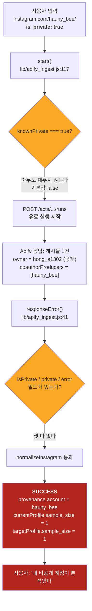

# PR #84 교차 리뷰 (Claude) — Apify 실수집 배선

- 대상: PR #84 `feat/68-apify-ingest` → `develop`, 이슈 #68
- 리뷰어: Claude (Opus 5). 작성자는 Codex. **다른 모델로 본다**는 전제의 교차 리뷰다.
- 워크트리: `/Users/chowonjae/Desktop/projects/wanted/.work/gyeol-68` (HEAD `059a269`, base `23d5f00`)
- 환경: Node v22.22.3 (package `engines.node`는 24.x), Apify 계정 `intellectual_explorer`
- 리뷰가 쓴 실비: **신규 run 2회 / 합계 USD 0.0108** (아래 §2에 내역)
- 코드는 한 줄도 고치지 않았다. 검증 스크립트는 전부 `/tmp`에만 썼다.

---

## 한 줄 판정

> **머지 불가.** 비공개 계정 URL을 실제로 넣었더니 제품이 **성공으로 처리**하고, 그 프로필을 **다른 사람이 쓴 글**로 만들어 낸다. ADR-0006과 이슈 #68의 핵심 금지선 두 개를 동시에 넘는다.

데모 기본 경로가 라이브로 바뀌었는지는 **바뀌지 않았다**(BLOCKER 아님). 시간·비용 주장은 **독립 재현됐다**. 막는 것은 오직 비공개 계정 처리다.

---

## 1. 재현 결과 — 작성자 주장 대조

| 항목 | 작성자 주장 | 리뷰 재현 | 판정 |
|---|---|---|---|
| `npm test` | 216 pass | **216 pass / 0 fail** (600ms) | ✅ 일치 |
| `npm run eval` | 통과 | E1/E2/E3/E6/E8/E9/E10/E11 전부 PASS, exit 0 | ✅ 일치 |
| `npm run check` | 통과 | `PASS: 69 JS/JSON files checked`, exit 0 | ✅ 일치 |
| `npm run lint` | 통과 | `Checked 41 files in 28ms. No fixes applied.` | ✅ 일치 |
| `npm run typecheck` | 통과 | `✓ Types generated successfully`, exit 0 | ✅ 일치 |
| 실수집 15.74초 / $0.0081 | run `h9dl4E9wmvW8wYaUa` | 제공자 API 직접 조회: `stats.runTimeSecs=15.74`, `usageTotalUsd=0.0081`, `maxItems=3`, `maxTotalChargeUsd=0.1`, `isMaxTotalChargeUsdSetByUser=true` | ✅ **독립 검증됨** |
| 두 프로필 추출 | sample_size=3 | 실제 fixture 30건으로 재현: current/target 모두 sample_size=30 | ✅ 일치 |
| 기존 파일 무변경 | 주장함 | `git diff origin/develop...HEAD --name-status` → **11건 전부 `A`(신규), 수정 0건** | ✅ 일치 |

게이트 5종은 전부 재현된다. 작성자 보고는 이 축에서 정직하다.

---

## 2. 리뷰가 새로 돌린 수집 (실비 내역)

| run id | 입력 | 실행 시간 | 비용 | 목적 |
|---|---|---|---|---|
| `9CO4MCJwjVs6cFgA7` | 없는 계정 1 + 개인 계정 3, `resultsLimit:1` | 26.95초 | **$0.0108** | 존재하지 않는 계정의 **실제** 오류 모양 확보 |
| `RBvzOhrElqm5fGbHJ` | **확인된 비공개 계정** `hauny_bee`, `resultsLimit:1` | 14.28초 | **$0.0000** | 비공개 계정 실제 동작 확인 |

> 비공개 계정을 고르기 전에 **돈 안 드는 사전 판별**을 먼저 찾았다. Googlebot User-Agent로 `https://www.instagram.com/<handle>/`을 그냥 GET하면 HTML에 `"is_private":true|false`가 그대로 들어 있다. 10개 후보를 비용 0으로 판별했고 `hauny_bee`가 **`is_private:true`**(팔로워 295, 게시물 414)로 확인됐다. 리뷰 시점에 다시 찍어도 여전히 `true`다. — 이 사실 자체가 §4 MEDIUM-3의 근거다.

---

## 3. BLOCKER — 비공개 계정이 "성공"으로 통과한다

### 무슨 일이 일어나는가



### 실제 실행 출력

`RBvzOhrElqm5fGbHJ`의 데이터셋을 제품 코드(`normalizeInstagram` → `buildCurrentProfile` → `extractFromReference`)에 그대로 넣은 결과:

```
=== PRIVATE (is_private:true) hauny_bee (1 raw items) ===
   raw item keys of first: id,type,shortCode,caption,hashtags,mentions,url,commentsCount
   RESULT: *** SUCCESS *** posts = 1
   provenance: {"account":"hauny_bee","collected_at":"...","method":"apify",
                "actor":"apify/instagram-scraper","run_id":"REVIEW",
                "source_url":"https://www.instagram.com/hauny_bee/"}
   currentProfile.sample_size = 1 | targetProfile.sample_size = 1
   current.caption_len = {"p50":144,"p90":144,"unit":"자"}
```

원본 항목의 필드:

```
ownerUsername      = hong_a1302          ← 입력한 계정이 아니다
ownerFullName      = 홍아영
inputUrl           = https://www.instagram.com/hauny_bee/
coauthorProducers  = [{ id: 6024842245, ... }]   ← 여기에 hauny_bee 가 들어 있다
has isPrivate? False | has private? False | has error? False
```

### 왜 이렇게 되는가

`apify/instagram-scraper` 공식 README(빌드 0.0.782) 969행:

> *"if the private profile is **tagged as a collaborator/co-author on a post**, and at least one of the other collaborators has a public profile, Instagram treats that post as public — regardless of the target account's own privacy setting."*

즉 **제공자는 비공개 계정에 대해 오류를 주지 않는다.** 공동 작성자로 엮인 공개 게시물을 그냥 돌려준다. 그런데 이 PR의 `normalizeInstagram`은 `lib/apify_ingest.js:58-59`에서 공동 작성자를 **정당한 소유자로 인정**한다:

```js
const owners = [row.ownerUsername, ...(row.coauthorProducers ?? []).map(x => x.username)].filter(text).map(x => x.toLowerCase());
if ((inputAccount && inputAccount !== account) || !owners.includes(account)) fail('INVALID_DATA');
```

`test/apify_ingest.test.js:57`이 이 동작을 **명시적으로 축복**한다 (`owner_username === 'coauthor'`를 통과시킴). 귀속(attribution) 방어를 위해 넣은 장치가, 결과적으로 비공개 계정 차단선에 구멍을 냈다.

### 두 개의 별도 피해

**BLOCKER-1 — 비공개 계정 미차단.**
ADR-0006: *"공개 계정·공개 게시물만 수집한다. 비공개 계정은 제외"*. 이슈 #68: *"비공개 계정은 제품 조회 대상에서 제외한다 … 조용한 빈 성공은 금지"*.
실제로는 빈 성공도 아니고 **내용이 찬 성공**이다. 유료 실행이 돌고, 프로필이 만들어지고, `provenance.method: 'apify'`가 정상 수집처럼 찍힌다. 사용자는 "내 비공개 부계가 분석됐다"고 이해한다. pivot 문서가 말하는 1차 타깃이 *"대부분 비공개·개인 계정"*이라는 점에서 이 경로는 드문 예외가 아니라 **주요 경로**다.

**BLOCKER-2 — 근거가 다른 사람을 가리킨다 (P2 위반).**
`provenance.account = "hauny_bee"`인데 `evidence_refs`의 모든 항목은 `hong_a1302`가 쓴 게시물 URL을 가리킨다. 캡션 길이·이모지율·말투 종결형 — 전부 **남의 글**에서 뽑혀 `hauny_bee`의 프로필로 반환된다. 이슈 #68의 *"근거가 그것을 가리킨다"*는 형식적으로는 해소되지만(ref가 실재 URL에 닿는다) **의미적으로는 틀린 사람을 가리킨다**. 근거 추적의 뿌리가 썩는다.

### 고칠 수 있는가 — 있다, 그리고 공짜다

§2에서 실증했듯 `is_private` 판별은 **Apify를 부르기 전에, 비용 0으로** 가능하다. 지금 `start()`의 `knownPrivate` 플래그는 **호출자가 손으로 넘겨야 하는 값이고 제품 안에서 아무도 채우지 않는다** — 실질적으로 죽은 안전장치다. 사전 판별을 `start()` 안으로 넣으면 (a) 유료 실행 전에 막히고 (b) `PRIVATE_ACCOUNT` 메시지가 실제로 뜬다. 부수적으로 공동 작성자 허용도 `ownerUsername === account`로 좁히면 BLOCKER-2가 함께 닫힌다.

---

## 4. 심각도별 지적

### HIGH-1 — 실패 분류가 제공자의 실제 오류 코드와 맞지 않는다 (실증)

없는 계정(`gyeol68nonexistentaccount9z`)에 대한 **실제** 제공자 출력:

```json
{ "error": "not_found",
  "errorDescription": "Post does not exist",
  "url": "https://www.instagram.com/gyeol68nonexistentaccount9z/",
  "username": "gyeol68nonexistentaccount9z" }
```

그런데 `lib/apify_ingest.js:41-47`이 기다리는 값은 `account_not_found` / `access_denied` / `login_required` / `private_account`다. 하나도 맞지 않는다. 제품 코드에 그대로 넣은 결과:

```
=== NONEXISTENT gyeol68nonexistentaccount9z (1 raw items) ===
   RESULT: FAILED code = ACCOUNT_UNCONFIRMED | message = 계정 상태나 게시물을 확인하지 못했어요.
```

- 실패는 한다(조용한 성공 아님 ✅). 그러나 **"없는 계정"이라는 사실은 사용자에게 전달되지 않는다.**
- `ACCOUNT_NOT_FOUND` / `ACCESS_UNAVAILABLE` / `PRIVATE_ACCOUNT` 세 분기는 **실제 제공자에 대해 도달 불가능한 死코드**다. 트리거된 것은 포괄 분류 `ACCOUNT_UNCONFIRMED` 하나뿐이다.
- 제공자가 준 `errorDescription: "Post does not exist"`는 **버려진다.** `details`에도 안 담긴다. 이슈 #68의 *"각 경우에 무엇이 왜 안 됐는지가 드러나야 한다"*를 만족하지 못한다.

### HIGH-2 — 실패 분류 테스트가 자기 확인(self-confirming)이다

`test/apify_ingest.test.js:51-54`는 `{isPrivate:true}`, `{error:'private_account'}`, `{error:'account_not_found'}`, `{error:'login_required'}` 같은 **합성 입력**으로 분류기를 검사한다. HIGH-1이 보여주듯 이 모양들은 제공자가 실제로 내놓는 것이 아니다. 작성자도 `report.md:1523`에서 *"합성 실패 fixture는 분류 규칙의 회귀 검사이며 제공자의 실제 비공개/없는 계정 동작 증명이 아니다"*라고 정직하게 적어 두었다 — **그 경고가 맞았다.**

결과적으로 **"216 테스트 통과"는 실패 처리 축에서 증거력이 0이다.** 통과하는 테스트와 실제로 일어나는 일이 서로 다른 세계에 있다. `pivot/apify-check/fixtures/`의 실제 제공자 응답 5종 어디에도 `isPrivate` / `private` / `#error` 키는 없다 — 이것만으로도 배선 전에 잡을 수 있었다.

### MEDIUM-1 — 캡션 길이 단위 불일치 (작성자 자진 신고, 실측 확인)

같은 30건(`ig_feed_29cm.json`)을 두 추출기에 넣은 결과:

| 축 | 계산 방식 | p50 | p90 |
|---|---|---|---|
| current (`lib/current_profile.js:52`) | `[...t.trim()].length` — 유니코드 **코드포인트**, trim 후 | 289 | 888 |
| target (`lib/target_profile.js:88`) | `p.caption.length` — **UTF-16 코드 유닛**, trim 없음 | 292 | 914 |

- **30건 중 28건에서 두 값이 다르다.** 최대 격차 36자.
- 둘 다 `unit: '자'`로 **같은 라벨**을 달고 나간다.
- 제품의 핵심 산출물은 "현재 vs 지향의 차이"인데, 이 차이 중 p50에서 3자, p90에서 26자가 **계산 방식 때문에 생긴 가짜 격차**다. 서로게이트 페어 이모지(🍂 등)가 많은 계정일수록 벌어진다.
- 작성자는 PR 본문에서 이를 밝히고 "후속 검토 사항"으로 남겼다. 신고는 정직하지만, **같은 unit 라벨을 붙인 채 내보내는 것**은 다운스트림에서 조용히 틀린 비교를 만든다. 최소한 라벨을 분리하거나, 한 줄로 통일해야 한다(`[...t.trim()].length` 한 쪽으로).
- `emoji_rate`(5.5 vs 5.5)와 `empty_caption_ratio`(0 vs 0)는 일치한다. 문제는 길이 축 하나다.

### MEDIUM-2 — 교차 실행 비용 상한이 없다

- 실행 **1회당** 상한은 있다: `maxTotalChargeUsd=0.10`, `maxItems≤30`, `timeout=120s`. 제공자 측에서 강제되는 것을 run 옵션으로 확인했다(`isMaxTotalChargeUsdSetByUser: true`).
- 그러나 **누적 상한이 없다.** 동일한 `POST /api/ingest {action:'start'}`를 8번 보내면:

```
=== C. cost ceiling ===
   8 identical POSTs -> billable provider runs started = 8
```

- 사용자가 URL을 반복 입력하면 **입력 횟수만큼 돈이 나간다.** 최악 `0.10 × N`.
- 완화 요인: 라우트가 `APIFY_INGEST_ACCESS_KEY` 고정 Bearer로 막혀 있고 `confirmLive: true`를 요구한다. 화면은 아직 이 API를 부르지 않으므로 **현재 배포 상태에서 실사용자 노출은 0**이다.
- 작성자도 "분산 요청량 제한"을 남은 게이트로 적어 두었다. 다만 **화면 연결 전에** 계정/세션당 한도와 일 예산 상한이 반드시 앞서야 한다. 접근 키 하나만 새면 상한이 사라진다.

### MEDIUM-3 — `knownPrivate`는 실질적으로 죽은 안전장치다

`start()`는 `knownPrivate === true`일 때만 사전 차단한다. 그런데 이 값을 계산하는 코드가 제품 어디에도 없다 — `lib/ingest_api.js:32`가 **HTTP 요청 본문에서 그대로 받아 넘긴다.** 즉 "비공개인지 아는 주체"가 클라이언트다. 클라이언트는 모른다.

§2에서 보였듯 서버가 비용 0으로 판별할 수 있다. 사전 판별 없이 유료 실행부터 거는 현재 구조는 *"비공개 계정에 실제 수집을 시도하거나 우회하지 않는다"*(이슈 #68)를 만족하지 못한다 — **실제로 시도했고, 실행됐다.**

### LOW-1 — receipt가 CLI stderr에 평문으로 찍힌다

`scripts/ingest-instagram.js:34`가 `error.details`를 그대로 출력하는데, 여기에 `receipt`가 들어 있다. receipt는 실행 조회·취소 권한을 담은 서명 토큰이다.

```
CLI would print to stderr: {"code":"PROVIDER_ERROR", ... "details":{"receipt":"eyJydW5JZCI6...ssDxk0FNGNSmgSeKhKvtT3SfXGcUslvFhKaM5s1StmI", ...}}
  contains token? false | contains receipt? true
```

본문은 base64url 평문(`{"runId":"runX","url":"...","limit":3,"accountScope":"n/a"}`)이고 서명만 HMAC다. 서명 키는 새지 않으므로 위조는 불가하나, 로그 수집기에 들어가면 그대로 재사용 가능한 자격증명이다. `.tmp/`·`storage/`는 `.gitignore`에 있고 파일은 `0600`으로 쓴다 — 그 부분은 잘 돼 있다.

### LOW-2 — 검증 환경이 `engines`와 다르다

`package.json`은 `"node": "24.x"`인데 모든 검증(작성자·리뷰 양쪽)은 **Node v22.22.3**에서 돌았다. 작성자도 남은 게이트로 적어 두었다. Node 24 재검증 전에는 "통과"가 배포 환경 보증이 아니다.

### LOW-3 — 데이터셋 조회 타임아웃 여유가 얇다

`requestTimeoutMs` 기본값은 5000ms이고 **데이터셋 본문 조회에도 같은 값**이 적용된다. 30건 데이터셋의 실제 크기는 `ig_feed_29cm.json` 기준 **1.09MB**다. GET은 1회 재시도가 있어 치명적이진 않으나, `LIMITS.posts = 30`을 쓰는 순간 느린 회선에서 `PROVIDER_TIMEOUT` 오탐이 난다. 실행은 성공했는데 조회만 실패하면 사용자는 돈을 쓰고 결과를 못 본다(receipt로 재조회는 가능).

---

## 5. 토큰·인증 정보 누출 — 실제로 찍어 봤다

가짜 토큰 `apify_api_SUPERSECRETTOKENVALUE123456`을 주입하고 전 경로를 직렬화해 검사했다.

| 표면 | 결과 |
|---|---|
| 제공자 401 → HTTP 응답 본문 | `{"error":{"code":"UNAUTHORIZED","message":"라이브 수집 권한이 없어요.","details":{}}}` — **토큰 없음** ✅ |
| `IngestError.details` (CLI stderr) | 토큰 없음 ✅ / receipt 있음 (LOW-1) |
| snapshot + currentProfile + targetProfile 전체 직렬화 | `apify_api` 문자열 **0건** ✅ |
| 요청 URL | 토큰은 `Authorization` 헤더에만, 쿼리스트링 아님 ✅ |
| 커밋된 `live-evidence.json` | `apify_api` **0건**, `Bearer` 패턴 0건 ✅ |
| 비밀 저장 위치 | `.tmp/apify-68/`, `.gitignore` 41-42행에 포함 ✅ / 파일 모드 `0600` ✅ |

**이 축은 통과다.** 제공자 응답 본문을 오류에 싣지 않는 설계(`api()`가 `response.json()` 없이 `fail()`)가 제대로 작동한다.

---

## 6. 이슈 #68 DoD 항목별 판정

| DoD | 작성자 판정 | **리뷰 판정** | 근거 |
|---|---|---|---|
| 공개 계정 URL에서 실제 수집·스냅샷 생성 | PASS | ⚠️ **부분 PASS** | 서버 API·CLI로는 동작 확인(run `h9dl4E9wmvW8wYaUa`). 그러나 **화면에서 URL을 넣는 경로는 이 API를 부르지 않는다** — 제품 사용자 관점의 "넣어 보면 수집된다"는 아직 없다. 작성자도 명시함. |
| 스냅샷으로 current/target 추출 동작 | PASS | ✅ **PASS** | fixture 30건 재현: 양쪽 sample_size=30, 계약 검증 통과 |
| 확인된 비공개를 접근불가/미확인과 구분 | PASS | ❌ **FAIL** | §3. 실제 비공개 계정은 세 분류 어디에도 안 가고 **SUCCESS**로 간다. 합성 fixture 통과는 실제 동작과 무관(HIGH-2) |
| provenance 존재 + 근거가 그것을 가리킴 | PASS | ⚠️ **부분 PASS** | 형식은 완전: `account / collected_at / method / actor / run_id / dataset_id / source_url` 모두 채워짐. 근거 해소 **28/28**, per-post ref **60/60**이 실제 수집 게시물 URL에 닿음. 그러나 §3 BLOCKER-2에서 **가리키는 대상이 틀린 사람**이 되는 경우가 있다 |
| 시간·비용 실측 기록 | PASS | ✅ **PASS** | 제공자 API 직접 조회로 15.74초 / $0.0081 독립 확인. 추정치 아님 |
| **데모 기본 경로는 여전히 사전 스냅샷** | PASS | ✅ **PASS — BLOCKER 아님** | `git diff --name-status`가 **11건 전부 신규(A), 기존 파일 수정 0건**. `src/features/sample/`·`api/feed`·`api/analyze`·`page.tsx` 무변경. `src/` 어디에도 `api/ingest` 호출 없음. 라이브 경로는 인증된 서버 API + CLI로만 열린다 |
| `npm test`/eval/check/lint/typecheck | PASS | ✅ **PASS** | §1, 5종 전부 재현 |
| Actor 고정·댓글 제외·미디어/순서/출처/결측 | PASS | ✅ **PASS** | `ACTOR` 상수 고정, `latestComments` 제외 확인, 자식 ID/순서/타입 보존, 미확인 필드 `null` 유지. `carousel_order_check.verdict: '확인 불가'`로 이번 실행에서 대조 안 했음을 정직하게 표기 |
| 실패 처리: 없는 계정 / 장애 / 시간초과 / 비용한도 | (표에 없음) | ⚠️ **부분 PASS** | 조용한 성공은 없다 ✅. 그러나 없는 계정이 `ACCOUNT_UNCONFIRMED`로 뭉개진다(HIGH-1). 타임아웃·비용한도·START_UNCONFIRMED 분기 설계는 견고 |

---

## 7. 잘 된 것 (교차 리뷰로서 인정할 부분)

지적만 남기면 왜곡이므로 적어 둔다.

1. **유료 시작의 모호성 처리가 모범적이다.** POST 실패 시 재시도하지 않고 `START_UNCONFIRMED`로 떨어뜨린 뒤 *"다시 시작하기 전에 제공자 실행 목록을 확인해 주세요"*라고 안내한다. CLI도 `flag: 'wx'`로 receipt 파일을 먼저 예약해 이전 실행의 유일한 receipt를 덮어쓰지 않는다. 중복 과금을 막는 정공법이다.
2. **취소와 늦은 완료의 경쟁 상태를 실제로 다뤘다.** abort 후 같은 run을 **다시 읽고**, 완료됐으면 결과를 버리지 않는다(`lib/apify_ingest.js:134-140`). 이미 돈 낸 결과를 날리지 않는다.
3. **비용 관측이 잠정치임을 구분한다.** 완료 10초 이내 관측은 `provisional: true`로 표시하고, 재조회해서 확정값을 받는다. 과금 반영 지연을 아는 사람의 코드다.
4. **서버 키와 receipt 서명 키를 분리했다.** API 접근 키를 가진 쪽도 receipt를 위조할 수 없다(테스트 163행이 이를 검증). 둘 다 `timingSafeEqual`로 비교한다.
5. **HTTP 입력을 스트림에서 8KB로 바운드한다.** `Content-Length`가 없거나 거짓이어도 막힌다.
6. **작성자가 자기 한계를 먼저 적었다.** 길이 단위 차이, 합성 fixture의 증거력 한계, Node 버전 불일치, 화면 미연결 — 리뷰가 찾기 전에 본문과 `report.md`에 다 있다. 이 리뷰의 HIGH-2는 작성자 본인의 경고가 실제로 현실화된 것을 확인한 것이다.

---

## 8. 머지 전 필요한 것

**BLOCKER (이것 없이는 머지 불가)**
1. 유료 실행 **전에** 계정 공개 여부를 서버가 판별하고, 비공개면 `PRIVATE_ACCOUNT`로 차단할 것. 판별은 비용 0으로 가능함을 §2에서 실증했다.
2. 공동 작성자 허용 범위를 좁힐 것. 입력 계정이 `ownerUsername`이 아닌 게시물로 그 계정의 프로필을 만들면 안 된다 — 최소한 `provenance`에 "이 게시물의 작성자는 입력 계정이 아니다"가 드러나야 한다.

**HIGH (머지 전 처리 권장)**
3. 제공자의 **실제** 오류 코드(`not_found` 등)로 분기를 다시 맞추고, `errorDescription`을 `details`에 보존할 것.
4. 합성 fixture 기반 실패 분류 테스트에 **실제 제공자 응답 fixture**를 최소 2건(없는 계정 / 비공개 계정) 추가할 것. 이 리뷰가 확보한 두 데이터셋(`9w4gWeDkx5ry3IWnn`, `2ySfuglRgPeUTnqUu`)을 그대로 쓰면 추가 비용 0이다.

**MEDIUM (화면 연결 전 필수)**
5. 캡션 길이 단위를 한 쪽으로 통일하거나 unit 라벨을 분리.
6. 계정/세션당 누적 비용·요청 상한.

---

## 부록 — 재현 방법

```bash
cd /Users/chowonjae/Desktop/projects/wanted/.work/gyeol-68
npm test && npm run eval && npm run check && npm run lint && npm run typecheck

# 비용 0 공개/비공개 판별
curl -s -A "Mozilla/5.0 (compatible; Googlebot/2.1; +http://www.google.com/bot.html)" \
  "https://www.instagram.com/hauny_bee/" | grep -o '"is_private":[a-z]*'
# → "is_private":true

# 리뷰가 남긴 제공자 데이터셋 (추가 비용 없이 재다운로드 가능)
apify datasets get-items 2ySfuglRgPeUTnqUu --format json   # 비공개 계정 hauny_bee
apify datasets get-items 9w4gWeDkx5ry3IWnn --format json   # 없는 계정 + 개인 계정 3

# 작성자 run 독립 검증
apify runs info h9dl4E9wmvW8wYaUa --json   # runTimeSecs 15.74 / usageTotalUsd 0.0081
```
