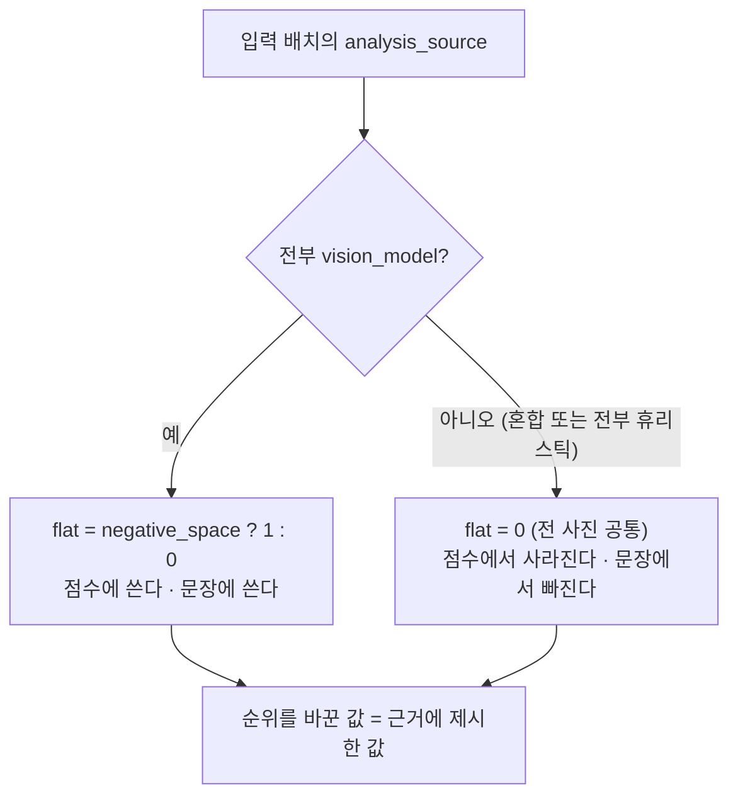

# PR #75 수정 1회차 — 교차 리뷰 P2 해소

대상 리뷰: [review-codex.md](review-codex.md). 수정 전 HEAD 는 `e0b4f442dea3e84473ee900486d889224349597b`.
실행 환경: macOS, Node v22.22.3 (package.json 의 `engines.node`는 24.x 이므로 Node 24 재현은 주장하지 않는다 — 리뷰와 같은 한계).

## 1. 고친 것 — P2 하나

> 혼합 입력(모델 관측 + 휴리스틱)에서 미관측 구도 상수가 순위를 바꾸는데 근거 문장에서는 빠진다.

리뷰가 준 두 방향 중 **1번(그 값을 순위 계산에서 뺀다)** 을 골랐다.

### 왜 1번인가

2번(상수임을 문장에 드러낸다)을 고르려면 "관측한 적 없는 상수가 순위를 바꾸는 것이 정당하다"를 설명할 수 있어야 한다. 설명할 수 없다:

- 휴리스틱 경로의 `composition` 은 사진을 보고 정한 값이 아니라 항상 `full_frame` 이다. `lib/photo_analysis.js` 는 그 경로에서 `negative_space` 를 낼 수 없다 (`test/photo_analysis.test.js` — "heuristic must not claim negative space").
- 즉 그 값은 **그 사진에 대해 아무것도 말하지 않는다.** 그런 값이 관측된 사진과의 순위를 가르면, 사용자가 받는 순서는 측정되지 않은 가정 위에 서 있다. 문장에 "이건 상수입니다"라고 적어도 순서 자체는 여전히 근거가 없다.
- 같은 상황에서 이 저장소가 이미 세 번 **버리는 쪽**을 골랐다: `#9`(휴리스틱 `scale` 고정값), `#12`(`has_face === false` 는 "관측 못 함"이지 "없음"이 아님), `#41`. `lib/order.js` 머리말 주석의 "쓰지 않는다" 목록이 그 결과다. 같은 종류의 값에 다른 규칙을 적용할 이유가 없다.

### 규칙

**구도는 배치 전체가 모델 관측일 때만 순위와 근거에 쓴다.** 한 장이라도 휴리스틱이 섞이면 그 배치에서는 구도 항을 끈다 — 점수에서도, 사용자에게 보이는 문장에서도.



"끈다"의 구현은 `flat` 을 전 사진 `0` 으로 두는 것이다. `WEIGHT` 의 구도항(`0.4*flat`, `0.4*(1-flat)`, `0.5*flat`)이 배치 공통 상수가 되므로 순위에 영향을 주지 않는다. 별도 분기나 가중치 재정규화가 필요 없다.

부작용 확인:

| 배치 | 수정 전 | 수정 후 |
|---|---|---|
| 전부 `vision_model` | 구도 관측값이 순위·문장에 반영 | 동일 (변화 없음) |
| 전부 `heuristic` | 전 사진 `flat=0` → 순위 영향 없음, 문장에서 제외 | 동일 (변화 없음) |
| **혼합** | 미관측 상수가 순위를 가름, 문장에서 제외 | **순위에서 제외, 문장에서 제외** |

전부 휴리스틱인 배치는 원래도 전 사진 `flat=0` 이었으므로 순서가 바뀌지 않는다. 실사진 15장 재배치 테스트가 그대로 통과하는 이유다.

### 코드

`lib/order.js` — `attributes` 에서 배치 단위로 한 번 판정하고, 판정 결과를 사진 속성에 싣는다. `observedComposition(photo)` 함수(사진별 판정)는 사라졌다.

```js
function attributes(analyses) {
  const observed = analyses.every(analysis => analysis?.analysis_source === 'vision_model');
  return analyses.map((analysis, order) => {
    validatePhoto(analysis);
    return {
      // ...
      flat: observed && analysis.composition === 'negative_space' ? 1 : 0, observedComposition: observed,
      // ...
    };
  });
}
```

`lib/pipeline.js` 는 주석 한 줄만 갱신했다(동작 변경 없음).

## 2. 증명 — 같은 입력의 전/후 대조

리뷰가 재현에 쓴 **합성 계약 입력** 그대로다. `test/order.real20.json` 앞 3개를 복제하고 ID·source·model·composition·밝기/채도·input_index 만 바꿨다. 입력 순서는 `dark, observed, unknown`, 지향은 target B = `자세하게, 기록하듯`(→ dense).

| ID | source | composition | bright | sat |
|---|---|---|---:|---:|
| dark | vision_model | negative_space (관측) | 0.1 | 0.1 |
| observed | vision_model | negative_space (관측) | 0.8 | 0.3 |
| unknown | heuristic | full_frame (**미관측 상수**) | 0.5 | 0.2 |

dense 점수는 `0.4*(1-flat) + 0.4*sat + 0.2*bright` 다.

| ID | 근거로 제시된 값만 (`0.4*sat + 0.2*bright`) | 구도항까지 포함 (수정 전 실제 점수) |
|---|---:|---:|
| dark | 0.060 | 0.060 |
| observed | **0.280** | 0.280 |
| unknown | 0.180 | **0.580** |

재현은 `POST /api/feed` 와 같은 코드 경로(`handleFeed` 에 `Request` 를 직접 넣음)로 돌렸다.

### 수정 전 (HEAD `e0b4f44`)

```text
HTTP 200
입력 순서 : dark observed unknown
출력 순서 : unknown observed dark
opener    : unknown
opener 근거: 밝기 0.5 · 채도 0.2 인 사진이라 지향 방향(빼곡한 쪽) 점수가 입력 3장 중 가장 높아 1번에 뒀다
opener 측정 note: 측정값 — 밝기 0.5 · 채도 0.2 · 주요 색 #120d0d
```

근거 문장이 제시한 값은 밝기 0.5 · 채도 0.2 뿐이다. 그 둘만의 가중합은 0.180 으로 `observed`(0.280)보다 **낮다**. `unknown` 을 1번으로 올린 0.4 는 문장에 없는 미관측 `full_frame` 에서 왔다.

### 수정 후

```text
HTTP 200
입력 순서 : dark observed unknown
출력 순서 : observed unknown dark
opener    : observed
opener 근거: 밝기 0.8 · 채도 0.3 인 사진이라 지향 방향(빼곡한 쪽) 점수가 입력 3장 중 가장 높아 1번에 뒀다
opener 측정 note: 측정값 — 밝기 0.8 · 채도 0.3 · 주요 색 #0a1014
```

1번은 **근거로 제시된 값만의 가중합 1위**(observed, 0.280)와 일치한다. 순위를 바꾼 값과 사용자에게 보여준 값이 같아졌다.

## 3. 회귀 테스트 2개와 그 검출력

`test/pipeline.test.js` 에 추가했다.

1. `#69 P2 an unobserved composition constant must not decide the order in a mixed batch`
   — 위 혼합 입력의 opener 가 `observed` 여야 한다. 더해서 어떤 슬롯의 문장·근거에도 `넓게 깔` 이 없어야 한다(혼합 배치에서는 관측된 사진의 구도도 비교 대상이 없으므로 제외된다).
2. `#69 P2 flipping an unobserved photo's composition constant changes nothing`
   — 휴리스틱 사진의 `composition` 만 `full_frame` → `negative_space` 로 뒤집어도 출력 순서가 같아야 한다. **관측하지 않은 값의 인과적 영향이 0 임을 직접 고정한다.**

검출력은 리뷰가 지적한 방식으로 실제 확인했다. `lib/order.js` 만 수정 전(`git checkout HEAD -- lib/order.js`)으로 되돌리고 새 테스트를 돌렸다:

```text
=== 수정 전 코드(lib/order.js @HEAD)로 새 회귀 테스트 실행 ===
not ok 9 - #69 P2 an unobserved composition constant must not decide the order in a mixed batch
not ok 10 - #69 P2 flipping an unobserved photo’s composition constant changes nothing
# tests 10
# pass 8
# fail 2

=== 복구 후 ===
# tests 10
# pass 10
# fail 0
```

둘 다 이전 코드에서 실패한다. 재도입하면 빨간불이 켜진다.

## 4. 게이트 출력

```text
$ npm test
# tests 195
# suites 0
# pass 195
# fail 0
# cancelled 0
# skipped 0
# todo 0
(193 → 195. 위 회귀 테스트 2개가 늘어난 수다.)

$ npm run eval
quiet/detail E1 E2 E3 E6 E8 E9 E10 E11 PASS
broken E1/E2/E3/E6/E8/E9/E10/E11: EXPECTED FAIL
E4/E5/E7: manual spot-check only; real demo review pending.
Injected model variant 0: E1/E2/E3/E8/E9/E10/E11 PASS; foreign fact E11 EXPECTED FAIL (not AI quality).
Injected model variant 1: E1/E2/E3/E8/E9/E10/E11 PASS; foreign fact E11 EXPECTED FAIL (not AI quality).

$ npm run check
PASS: 65 JS/JSON files checked; four schema examples match fixtures.
Foundation JS syntax/JSON parsing; TypeScript is checked separately by npm run typecheck.

$ npm run lint
biome check .
Checked 40 files in 35ms. No fixes applied.

$ npm run typecheck
next typegen && tsc --noEmit
Generating route types...
✓ Types generated successfully
(tsc --noEmit 오류 없음, exit 0)
```

## 5. 이번에 고치지 않고 수용한 항목

코디네이터 지시에 따라 P2 하나만 고쳤다. 나머지는 사유와 함께 기록한다.

| 리뷰 항목 | 판정 | 사유 |
|---|---|---|
| 사진 1장(ph_06)을 512px 로 축소해야 성공 | **수용** | 리뷰의 실행 환경 제약이지 이 PR 의 결함이 아니다. 모델 타임아웃 예산(20초)과 입력 크기 정책은 별도 이슈 소관이며, 순서 제안 로직과 무관하다. |
| ph_13 모델 타임아웃 2회 후 3번째 성공 | **수용** | 같은 이유. 모델 호출 재시도 정책은 `lib/photo_analysis.js` / `lib/model.js` 소관이고 #79 가 다룬 영역이다. 이 PR 은 모델을 호출하지 않는 `orderFeed` 를 바꾼다. |
| Node 22 로 실행해 Node 24 재현은 미주장 | **수용** | 검증 환경 한계이지 코드 결함이 아니다. 이번 수정도 같은 Node 22 에서 돌렸고 같은 한계를 명시했다(위 머리말). CI 에서 Node 24 게이트를 거는 것은 별도 작업이다. |
| 기존 회귀 테스트 3개 중 2개가 이전 코드에서도 통과 | **수용 + 부분 해소** | 지적 자체는 맞다. 다만 그 2개는 기존 동작 보호용이고 무의미하지 않다. 이번에 추가한 2개는 **둘 다 이전 코드에서 실패함을 실제로 확인**했다(3절). 기존 3개의 재설계는 하지 않았다. |
| P3 — `photo_plan` 유지의 제품적 단정("지향이 없으면 순서의 근거를 댈 수 없다")이 코드와 불일치 | **수용** | 구조·호환성 근거는 리뷰도 옳다고 확인했다. 주석 문구의 범위를 좁히는 것은 동작 변경이 아니며, photo-only 재설계는 리뷰도 merge 조건으로 요구하지 않았다. 별도 이슈로 다룬다. |
| P3 — `report.md` 에 #79 이전 차단 상태와 192건이 남아 있음 | **수용, 이 문서가 대체** | `report.md` §6·§8 은 재베이스 이전 실행 기록이다. 현재 상태는 **실모델 경로 정상 · 테스트 195건 통과**이며 이 문서가 현재 판정이다. `report.md` 를 과거 기록으로 읽어야 한다. |

## 6. 건드리지 않은 것

- `schemas/` 4종
- `eval/`, `fixtures/`
- 다른 워크트리(`gyeol-68`, `gyeol-model`, `gyeol-sop`)
- 읽기 전용 `pivot/`
- `WEIGHT` 상수와 `TIE_BAND`·`OPENER_BONUS` 값 — 가중치를 재정규화하지 않았다. 구도항이 배치 공통 상수가 되면 순위에서 자동으로 사라지므로 손댈 필요가 없다.
