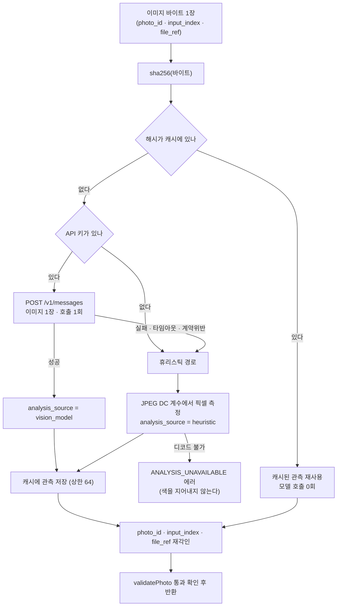

# spec.md — #9 PhotoAnalysis 추출

출력 계약은 `schemas/photo_analysis.md` 와 `lib/contracts.js` 의 `validatePhoto` 다.
**스키마는 바꾸지 않는다.** 스키마가 표현하지 못하는 상태는 이 spec 이 맞추고, 필요한 변경 요청은 PR 본문에 남긴다(8절).

---

## 1. 전체 흐름



핵심 두 줄:
- **호출 단위는 사진 1장이다.** 여러 장을 한 요청에 담는 경로는 만들지 않는다(`docs/intent.md` 8절 A1 대응 ①, #6 실측 미도착).
- **캐시는 관측만 저장한다.** `photo_id`·`input_index`·`file_ref` 는 호출마다 새로 각인한다. 그래서 같은 바이트가 다른 `photo_id` 로 들어오면 모델 호출 없이 정상 처리되고, 그 사실이 `duplicate_of:` 로 남는다.

---

## 2. 입력 계약

`analyzePhoto({ bytes, photoId, inputIndex, fileRef, ... })` — `lib/photo_analysis.js`

| 이름 | 타입 | 규칙 |
|---|---|---|
| `bytes` | `Uint8Array`/`Buffer` | 1 바이트 이상. 잠정 상한 **10 MiB**(#24 미확정, 3절) |
| `photoId` | nonempty string | 호출자가 발급. 이 모듈은 만들지 않는다 |
| `inputIndex` | 0 이상 정수 | 입력 순서. 정렬 결과가 아니다 |
| `fileRef` | nonempty string | 입력 파일 또는 오브젝트 참조 |
| `mediaType` | `image/jpeg` \| `image/png` \| `image/webp` \| `image/gif` \| `image/svg+xml` | 생략 시 바이트 매직으로 판정 |
| `client` | 함수 또는 `null` | 모델 호출 주입점. 테스트와 실패 주입에 쓴다 |

출력: `validatePhoto` 를 통과하는 PhotoAnalysis 객체 **1개**. 배열을 반환하지 않는다.

### `POST /api/analyze`
요청 1건 = 사진 1장. `Content-Type: application/json`.

```json
{ "photo_id": "ph_01", "input_index": 0, "file_ref": "upload/ph_01.jpg",
  "media_type": "image/jpeg", "image_base64": "<base64>" }
```

응답 200 = PhotoAnalysis 1개. 오류는 `api/feed.js` 와 같은 모양 `{"error":{"code":"...","message":"..."}}`:

| 상태 | code | 언제 |
|---|---|---|
| 405 | `METHOD_NOT_ALLOWED` | GET 등 |
| 400 | `INVALID_REQUEST` | 필수 필드 누락·타입 불일치·base64 아님 |
| 413 | `IMAGE_TOO_LARGE` | 디코드 후 바이트가 상한 초과 |
| 415 | `UNSUPPORTED_MEDIA_TYPE` | 허용 목록 밖 |
| 422 | `ANALYSIS_UNAVAILABLE` | 모델도 실패하고 픽셀도 못 읽음 |

**배열 입력은 400 이다.** 여러 장을 한 번에 받는 문법을 아예 두지 않아 A1 회피 설계가 코드에서 깨지지 않게 한다.
`photos: [...]` 같은 키가 오면 `INVALID_REQUEST` 로 거절한다.

> 이 요청/응답 모양은 **잠정**이다. 업로드 전송 방식·해상도 한도·오류 코드의 확정은 #24 소관이며 착수 시점에 미확정이었다. #24 가 다르게 확정하면 이 핸들러를 맞춘다.

---

## 3. 경계값과 상한

| 항목 | 값 | 근거 |
|---|---|---|
| 요청당 사진 | **1장 고정** | A1 미실측 |
| 이미지 바이트 | 10 MiB (잠정) | Anthropic Messages API 요청 상한 32 MB, base64 팽창 4/3 배 → 10 MiB 원본은 약 13.3 MiB 로 상한 안. #24 확정 전 잠정값 |
| 캐시 항목 수 | **64** | 아래 |
| 캐시 수명 | **프로세스 수명** | 아래 |
| 모델 호출 타임아웃 | 20 초 | A1 이 미실측이므로 함수 상한(미확인)보다 확실히 짧은 값을 고른다. 넘으면 휴리스틱 |
| 모델 재시도 | **0회** | 재시도는 A1 의 지연을 배로 만든다. 실패는 즉시 휴리스틱으로 떨어뜨린다 |
| `palette_hex` | 최대 3개 | 스키마 제약 |

### 캐시 — 무엇을 가정하지 않는가

- 키는 `sha256(이미지 바이트)` 다. 파일명·경로·`photo_id` 는 키에 넣지 않는다. 같은 사진이 다른 이름으로 와도 맞는다.
- 저장 위치는 **모듈 스코프 `Map` 하나**다. 디스크·KV·외부 저장소를 쓰지 않는다.
- 수명은 **살아 있는 프로세스(서버리스 인스턴스) 범위**다. 인스턴스가 재시작하면 비어 있다. **영속성을 가정하는 코드·문구·DoD 를 만들지 않는다.**
- 상한은 64 항목이고 초과 시 **가장 오래 넣은 항목부터 제거**(삽입순 FIFO)한다. 15장 기준 4벌 분량이며, 1080×1350 관측 1건이 수백 바이트이므로 메모리 위험이 없다.
- 적중은 **이득이지 계약이 아니다.** 비어 있으면 그냥 다시 측정한다. 적중률 목표를 두지 않는다.
- 캐시가 반환하는 것은 관측(`color`·`composition`·`scale`·`subjects`·`has_face`·`text_in_image`·`describable_facts`·`analysis_source`·`model`·`analyzed_at`)뿐이다. `analyzed_at` 은 **최초 분석 시각을 유지**한다 — 재사용을 새 분석으로 위장하지 않는다.

---

## 4. 판단 규칙 — 모델 경로

- 프롬프트는 **파일**이다: `prompts/input/photo_analysis.md`. 실행 시점에 읽는다(`CLAUDE.md` 4-1절 규칙 3). 코드 안 문자열로 복제하지 않는다.
- 요청 1건 = `image` 블록 1개 + 프롬프트. 모델은 환경변수 `GYEOL_VISION_MODEL`, 기본값 `claude-opus-5`.
- 응답은 **구조화 출력**(`output_config.format`)으로 받는다. 자유 텍스트에서 JSON 을 긁어내지 않는다.
- SDK 를 쓰지 않고 `fetch` 로 직접 호출한다. 이유는 이 레포의 **의존성 0개 제약**이다(`scripts/check.js` 가 `dependencies`/`devDependencies` 가 비어 있지 않으면 실패시킨다). 선택이 아니라 기존 게이트를 지키는 것이다.
- **색은 픽셀 측정값이 모델 추정값을 항상 이긴다.** 모델은 사진을 보지만 화소 평균을 재지는 않는다. JPEG 를 읽을 수 있으면 `color` 는 5절의 측정값으로 덮어쓰고, 모델이 낸 `color` 는 **읽을 수 없는 포맷(PNG·WebP·GIF)일 때만** 쓴다. 그래서 `analysis_source: "vision_model"` 인 출력의 `color` 는 보통 측정값이다 — `analysis_source` 필드 하나로는 이 구분이 표현되지 않으므로 `run_pipeline` 의 측정값 요약표에 남긴다.
- `quality_flags` 의 `dark` 는 모델 판단과 측정값(`bright_mean < 0.25`)의 합집합이다.
- 모델이 낸 값도 **계약 검증을 통과해야 채택된다.** `validatePhoto` 가 거부하면 그 응답은 버리고 휴리스틱으로 떨어진다. 모델 출력을 신뢰해서 통과시키지 않는다.

### 모델에 요구하는 것과 금지하는 것

| 필드 | 요구 |
|---|---|
| `subjects` | 사진에서 보이는 사물만. 모르면 빈 배열 |
| `describable_facts` | **캡션이 말해도 되는 사실만.** 사진을 안 보고도 검증할 수 있게 구체적으로 |
| `text_in_image` | 사진에 **실제로 인쇄·표기된** 글자. 없으면 `null` |
| `has_face` | 사람 얼굴이 보이면 `true` |
| `quality_flags` | `blurry`/`dark` 만. 확실할 때만 |

금지(넣으면 그 출력은 틀린 것이다): 장소명·지명·상호, 인물 신원·관계·나이, 촬영 날짜·시각·계절, 감정·분위기 형용, 브랜드·가격·모델명 추정, 사진에 없는 사건.

---

## 5. 판단 규칙 — 휴리스틱 경로

**휴리스틱은 사진을 이해하지 못한다. 픽셀만 센다.** 그래서 낼 수 있는 것과 낼 수 없는 것을 먼저 고정한다.

### 무엇을 실제로 측정하는가

의존성 0개 제약 때문에 이미지 디코더를 쓸 수 없다. 대신 **JPEG 의 DC 계수만 읽는다.** DC 계수는 8×8 블록의 평균 화소값이므로(`mean = DC_dequantized / 8 + 128`), 블록 단위로 8배 축소된 실제 이미지를 얻는 것과 같다. IDCT·업샘플링·AC 계수는 필요하지 않다. 베이스라인(SOF0/SOF1)과 프로그레시브(SOF2, DC first scan)를 모두 읽는다 — 실제 인스타 이미지가 프로그레시브 JPEG 이다(`pivot/apify-check/fixtures/images/` 확인).

| 산출 | 계산 |
|---|---|
| `bright_mean` | 블록 RGB → HSV 의 V 산술평균 / 1 |
| `sat_mean` | HSV 의 S 산술평균 |
| `hue_mean` | HSV 의 H **채도 가중 원형평균**(circular mean). 무채색 블록의 hue 는 노이즈이므로 가중치를 준다 |
| `palette_hex` | 블록 RGB 를 채널당 6단계(216 버킷)로 양자화 → 점유율 5% 이상 상위 최대 3개 버킷의 평균색 |
| `composition` | 최상위 버킷 점유율 ≥ **0.28** → `negative_space`, 그 미만 → `full_frame` |
| `quality_flags` | `bright_mean < 0.25` → `dark`. 그 외 플래그는 내지 않는다 |
| (참고 측정값) | 인접 블록 평균 색차 = 디테일량. 계약 필드가 아니며 `run_pipeline` 요약표에만 남긴다 |

`composition` 의 0.28 은 실제 사진 15장에서 관측된 점유율 분포(0.079~0.334, p75 ≈ 0.26)에서 정했다. 관측 근거는 `report.md` 에 있다.

색공간 변환은 JFIF/BT.601 full range 고정. 그레이스케일(1성분)은 Cb=Cr=128.

### 휴리스틱이 내지 않는 것

| 필드 | 값 | 왜 |
|---|---|---|
| `subjects` | `[]` | 피사체를 못 본다. 스키마가 "불명확하면 빈 배열"을 허용한다 |
| `text_in_image` | `null` | OCR 이 없다 |
| `describable_facts` | **측정값 문장만** | 아래 |
| `quality_flags` 의 `blurry` | 내지 않음 | DC 계수만으로는 흐림과 단색을 구별할 수 없다 |

`describable_facts` 는 휴리스틱 경로에서 **다음 세 종류만** 담는다. 전부 파일에서 측정한 값의 서술이다.
1. 해상도·비율 — 예: `"1080×1350 세로 이미지"`
2. 밝기·채도 구간 — 예: `"평균 밝기 0.62 (중간)"`, `"평균 채도 0.18 (낮음)"`
3. 주요 색 — 예: `"주요 색 #b8a99a (점유 31%)"`

여기에 피사체·장소·인물·시간·감정은 **한 개도 들어가지 않는다.** 이슈 DoD("휴리스틱 fallback이 내지 못한 피사체·장소·시간을 사실처럼 채우지 않는다")를 이 목록으로 구조적으로 만족시킨다.

### 스키마가 표현하지 못하는 두 자리 — 어떻게 정직하게 처리하는가

`has_face`(필수 boolean)와 `scale`(필수 enum)에는 "관측하지 못했다"를 적을 값이 없다.

- `has_face` 는 `false` 로 둔다. 다만 **`describable_facts` 와 `subjects` 에 인물 관련 항목을 한 개도 넣지 않는다.** `schemas/photo_analysis.md` 가 "F3는 describable_facts 밖의 장소·인물·시간·감정을 만들어내지 않는다"고 못박았으므로, 휴리스틱의 `has_face:false` 는 **캡션에 도달하지 않는다.**
- `scale` 은 **측정할 수 없어서 `midshot` 고정값**으로 둔다. 디테일량(인접 블록 색차)으로 3분할하는 안을 먼저 만들었고 **실제 사진으로 확인해 버렸다**: 15장 중 디테일이 가장 낮은 사진이 평평한 배경 앞의 인물 미드샷이었다. 즉 디테일량은 피사체 거리가 아니라 **배경의 평평함**을 재고 있었다. 변하는 틀린 값은 #12 에게 "측정된 것처럼 보이는" 순서 근거를 주고, `docs/intent.md` 8절 A2 가 그것을 "근거가 없는 것보다 나쁘다"고 못박았다. 그래서 **눈에 보이게 틀린 고정값**을 택했다. `describable_facts` 에 scale 문장은 넣지 않는다.

두 자리 모두 스키마에 `unknown` 이 없는 탓이다. **스키마를 바꾸지 않고** 변경 요청을 PR 본문에 남긴다.

### 휴리스틱도 못 하면

픽셀을 못 읽으면(손상 파일, 지원 밖 포맷, 디코드 실패) **`ANALYSIS_UNAVAILABLE` 로 실패한다.** 색을 0 이나 그럴듯한 값으로 채워 넣지 않는다. "모델 실패는 에러가 아니다"는 DoD 는 모델 실패에 대한 것이고, **관측 자체가 불가능한 경우는 정직하게 실패하는 것이 맞다.**

SVG 는 단색 카드(`eval/golden/case_01/photos/`)에 한해 `fill` 속성과 `width`/`height` 를 읽는다. 일반 SVG 렌더링은 하지 않는다.

---

## 6. 정확성 기준 — 무엇을 하면 틀린 것인가

| # | 틀린 것 |
|---|---|
| **W1** | `describable_facts` 에 사진에서 관측 불가능한 항목이 하나라도 있다 (장소·인물·시간·감정·브랜드·가격) |
| **W2** | `analysis_source: "heuristic"` 인데 `describable_facts` 에 5절의 세 종류 밖 항목이 있다 |
| **W3** | 모델 호출이 실패했는데 `analysis_source` 가 `vision_model` 이다 |
| **W4** | 모델 호출이 성공했는데 `model` 이 실제 사용한 식별자와 다르다 |
| **W5** | 같은 바이트를 두 번 넣었는데 두 번째에 모델 호출이 발생한다 |
| **W6** | 한 요청/한 호출에 사진 2장 이상이 담기는 경로가 존재한다 |
| **W7** | 캐시 적중 결과의 `photo_id`·`input_index`·`file_ref` 가 최초 분석 때의 값으로 남아 있다 (다른 사진을 분석한 것처럼 표시하는 것) |
| **W8** | 관측이 불가능한데 색·밝기 숫자가 채워져 있다 |
| **W9** | 출력이 `validatePhoto` 를 통과하지 못한다 |
| **W10** | 영속 캐시나 측정되지 않은 함수 실행시간 상한을 전제로 한 코드·주장이 있다 |

W1 은 사람 전수 대조로만 판정한다(DoD). W2·W5·W6·W7·W9 는 테스트로 판정한다.

---

## 7. 완료 조건 대조표 (이슈 DoD 그대로)

| 이슈 DoD | 이 spec 의 어디 | 판정 방법 |
|---|---|---|
| 사진 15장 → PhotoAnalysis 15개 | 2절 | `node scripts/run_pipeline.js <폴더> 15` 실행 출력 |
| 15장 전수 대조로 `describable_facts` 무근거 항목 0개 | 5절 · W1 | 사람 눈 대조 |
| 같은 사진 2회 → API 호출 0회 | 3절 · W5 | `run_pipeline` 의 호출 카운터 출력 |
| #6 A1 반영 — 사진 단위 분할 | 1·3절 · W6 | 배열 입력 400 테스트 |
| 모델 실패 → `heuristic`, 에러 아님 | 5절 · W3 | 실패 주입 테스트 |
| 1회 전체 파이프라인 토큰 비용 기록 | — | **API 키 없음 → 측정 불가. PENDING 으로 기록**(`report.md`) |
| 휴리스틱이 사실을 지어내지 않음 | 5절 · W2·W8 | 테스트 + 전수 대조 |
| 영속 캐시 가정 금지, 상한 명시 | 3절 · W10 | 이 문서 3절이 그 명시다 |

---

## 8. 스키마 변경 요청 (바꾸지 않고 적어 둔다)

1. `scale` 에 `unknown` 값이 없다 → 픽셀만 본 경로가 추정치를 단정으로 낼 수밖에 없다.
2. `has_face` 가 `boolean` 필수다 → "확인하지 못했다"를 `false`("얼굴 없음")와 구별할 수 없다.
3. `analysis_source` 가 값 하나다 → 색은 측정, 나머지는 모델인 혼합 출처를 표현할 수 없다.
4. `quality_flags` 에 `duplicate_of:<id>` 가 있는데, 중복 판정은 사진 1장 안에서 불가능하다(호출자만 안다). 판정 주체가 계약에 없다.

네 건 모두 **`CLAUDE.md` 4-2절 절차(L 크기, 양쪽 사람 승인)** 대상이므로 이 PR 에서 손대지 않는다.
