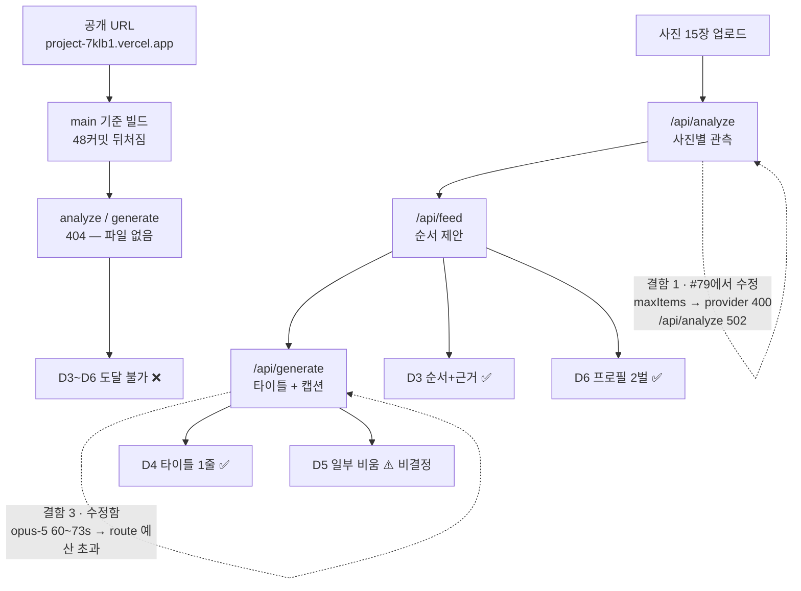

# D1~D6 실측 검증 보고서

- **검증 대상 코드(당시 스냅샷)**: `origin/develop` = `531b134`
- **검증 브랜치**: `verify/d1-d6`
- **검증 일시**: 2026-09-18
- **공개 URL**: https://project-7klb1.vercel.app/
- **검증 방법**: chrome-devtools 로 실제 브라우저 조작 + HTTP 실측 + 모델 호출 실측

> 모든 판정은 **실제 조작 결과**다. 추정으로 적은 PASS 는 없다.
> 통과하지 못한 항목은 원인과 담당자를 명시했다.
> 이 문서는 `531b134` 검증 당시의 스냅샷이다. 이후 병합된 #79와 Production 상태를 현재 상태로 소급해 해석하지 않는다.

---

## 0. 한 줄 결론

**배포된 제품으로는 D1·D2 만 통과한다. D3~D6 는 공개 URL 에서 아예 도달 불가다** — 프로덕션이 `develop` 보다 48커밋 뒤처진 코드를 서빙하기 때문이다.
코드 자체로는 **서버 결함 3건을 고친 뒤 D3·D4·D6 가 통과**하고, **D5 는 비결정적으로 절반쯤 실패**한다.



---

## 1. 판정표

| # | 기준 | 공개 URL | 코드(`develop` + 본 PR 수정) | 근거 |
|---|---|---|---|---|
| **D1** | 로그인 없이 열린다 | ✅ **PASS** | ✅ PASS | `GET /` → 200, 익명 컨텍스트에서 첫 화면 렌더 |
| **D2** | 샘플 원클릭 → 결과 30초 내 | ✅ **PASS** | ✅ PASS | 프로덕션 **0.4초**, 로컬 **0.15초** |
| **D3** | 3~20장 → 1~N 순서 + 자리별 근거 | ❌ **FAIL** | ✅ PASS | 15장 → 15슬롯, position 1..15 유일, 슬롯마다 근거 펼침 |
| **D4** | 타이틀 정확히 1줄 | ❌ **FAIL** | ✅ PASS | 화면에 타이틀 입력 1개 ("차분한 색채 시리즈") |
| **D5** | 일부 채우고 일부 비움 + 이유 + `[그래도 채우기]` | ❌ **FAIL** | ⚠️ **불안정** | 샘플 경로는 PASS. 실업로드 경로는 **10회 중 약 절반이 0개 비움** |
| **D6** | 프로필 2벌 → 눈에 띄게 다른 결과 | ❌ **FAIL** | ✅ PASS | 같은 15장, **15자리 중 14자리 순서 상이** |

공개 URL 의 D3~D6 가 전부 FAIL 인 이유는 하나다 → **2절**.

---

## 2. 배포 신선도 — 확정

**프로덕션은 `main` 기준으로 빌드되며, `main` 에는 라우트 파일 자체가 없다.**

| 확인 | 결과 |
|---|---|
| 최신 **Production** 배포 ref | `e9020fc` (2026-09-17T08:40:51Z) |
| `git merge-base origin/main origin/develop` | **`e9020fc`** — 두 브랜치 공통 조상 |
| `git rev-list --count origin/main..origin/develop` | **48** |
| `git ls-tree origin/main src/app/api/` | `feed/route.ts` **만** 존재 |
| 공개 URL `GET /api/analyze` · `/api/generate` | **404** |
| 로컬(`develop`) 동일 경로 | **405** |

**405 vs 404 가 결정적이다.** 라우트 파일이 있으면 메서드 불허(405), 없으면 404 다.

`develop` 커밋은 **Preview 로는 정상 배포**된다(최신 `531b134`). 그러나 Preview URL 은 **Vercel 인증에서 302 로그인 리다이렉트**라 D1 을 만족하지 못한다.

```
$ curl -s -o /dev/null -w "%{http_code}\n" https://gyeol-ragbbxsjt-jangwons-projects-c001fb62.vercel.app/
302
```

### 정정 — 이슈 #72 의 "유효한 JSON 이 아니다" 는 관측 오류였다

`corrected: bool`, `[string] (5)` 같은 출력은 **서버 응답이 아니라 셸 출력 필터가 JSON 을 스키마 요약으로 압축한 것**이다. 파일로 받으면 정상이다.

```
$ curl -s "https://project-7klb1.vercel.app/api/feed?mock=1" -o feed.txt
$ python3 -c "import json;json.load(open('feed.txt'));print('VALID JSON')"
VALID JSON
```

→ **JSON 파싱 버그는 없다.** 이 건은 #72 에 정정 코멘트를 남겼다.

**담당**: `@jangwonyoon` (배포) — 이슈 #72

---

## 3. 발견하고 고친 서버 결함 3건

배포만 갱신해도 D3~D6 는 통과하지 못했다. 실경로가 아래 3건으로 막혀 있었다.

### 결함 1 — 구조화 출력 스키마가 실모델 분석을 **전량** 실패시킴 (가장 치명적)

```
output_config.format.schema: For 'array' type, property 'maxItems' is not supported
→ POST /api/analyze 502 (ModelError MODEL_HTTP 400)
```

`lib/photo_analysis.js` 의 `palette_hex: { type:'array', items:{type:'string'}, maxItems: 3 }` 한 줄.

**영향과 원인 분리**: 이 스키마 결함은 모델의 `ModelError` 로 다시 던져져 `POST /api/analyze` 가 **502** 를 반환했다. heuristic 으로 폴백하거나 `preserveOrder` 로 이어지지 않았으며, #79가 이 분석 실패 원인을 수정했다. `analysis_source='heuristic'` 와 `preserveOrder` 는 **키가 없거나 mock인 분석 경로**에서 발생하며, 그 파이프라인 우회 문제는 #69/#75의 범위다.

**왜 테스트가 못 잡았나**: 테스트는 `ANTHROPIC_API_KEY` 를 지우고 돌아 mock 경로만 탄다. 실 API 스키마를 검증하는 테스트가 없었다.

**수정**: `maxItems` 제거. `≤3` 제약은 이미 두 곳에 있어 잃는 것이 없다 — 프롬프트(`prompts/input/photo_analysis.md`: "최대 3개")와 응답 검증(`lib/contracts.js:44`: `palette_hex.length<=3`).

**회귀 테스트 추가** (`W5`): 모델에 실제로 전달되는 스키마를 잡아 거부 키워드를 검사한다. API 가 거부하는 키워드는 실측으로 확인했다.

| 키워드 | API 응답 |
|---|---|
| `maxItems` | REJECTED |
| `uniqueItems` | REJECTED |
| `minItems` | 0 또는 1 외의 값 REJECTED |

재도입 시 실패하는 것까지 확인했다.
```
not ok 21 - W5: the observation schema sent to the model uses no rejected array keywords
    schema carries keywords the model API rejects: schema.properties.color.properties.palette_hex.maxItems
```

**수정 후 실측**:
```
OK source= vision_model model= claude-opus-5
palette= ["#997b2d","#ba7c35","#727a25"]
facts= ["연한 청회색 원 하나가 화면 왼쪽 중간보다 위쪽에 있다", ...]
```

### 결함 2 — 타임아웃 체인이 15슬롯 생성에 못 미침

`/api/generate` 가 **504** 로 떨어졌다. 세 층이 전부 짧았다.

| 위치 | 기존 | 변경 |
|---|---|---|
| `lib/output-generation.js` 모델 호출 | 20s | **45s** |
| `lib/interaction.js` `REQUEST_TIMEOUT_MS` | 25s | **55s** |
| `src/app/api/generate/route.ts` `maxDuration` | 30 | **60** |

모델 < 클라이언트 < 함수 순서를 유지해 실패가 구체적 오류로 드러나게 했다.

여기서 60초는 이 라우트가 설정한 `maxDuration` 실행 예산이다. Vercel Hobby Fluid Compute의 플랫폼 상한은 300초이므로 60초를 요금제 한도로 표현하지 않는다([Vercel Functions limits](https://vercel.com/docs/functions/limitations#max-duration)).

> ⚠️ `REQUEST_TIMEOUT_MS` 는 analyze·feed 와 공유된다. 최악의 경우 대기가 55초로 늘어난다.
> 더 정확한 대안은 generate 에만 긴 타임아웃을 주는 것이나, 호출부가 `src/lib/api.ts`(화면 범위)라 건드리지 않았다.

### 결함 3 — 출력 모델이 라우트의 60초 실행 예산을 초과

타임아웃을 늘려도 `claude-opus-5` 는 예산 안에 못 들어왔다. 동일 페이로드 실측:

| 모델 | 소요 시간 | 판정 |
|---|---|---|
| `claude-opus-5` | 60.5 / 65.2 / 73.0초 | ❌ route `maxDuration=60` 예산 초과 |
| `claude-sonnet-5` | 58.9 / 59.6초 | ❌ route 실행 예산 경계선 |
| `claude-haiku-4-5` | 17.9 / 19.0 / 19.3 / 19.5 / 20.0 / 23.4초 | ✅ |

**수정**: `config/models.json` 에 `output_model` 추가 → 출력 생성만 `claude-haiku-4-5`. **비전 분석은 `claude-opus-5` 유지**(관측 품질이 D3 근거의 질을 좌우).

수정 후 화면 실측: **17.6초**에 타이틀 + 15캡션 생성 완료.

---

## 4. 항목별 실측 증거

### D1 — 로그인 없이 열린다 ✅

```
$ curl -s -o /dev/null -w "%{http_code}\n" https://project-7klb1.vercel.app/
200
```
쿠키 없는 격리 브라우저 컨텍스트에서 첫 화면 렌더 확인.
📎 `evidence/D1-public-url-anon.jpg`

> 단, **열리는 화면이 구버전**이다. 화면에 "내 사진 업로드와 편집 기능은 준비 중입니다" 가 떠 있다.

### D2 — 샘플 원클릭 → 30초 내 ✅

페이지 내 `performance.now()` 로 클릭부터 결과 렌더까지 측정 (MCP 왕복 오버헤드 제외).

| 환경 | 소요 | 결과 |
|---|---|---|
| 공개 URL | **0.4초** | 15슬롯 렌더 |
| 로컬 `develop` | **0.15초** | 3슬롯 샘플 렌더 |

📎 `evidence/D2-prod-sample-result.jpg`, `evidence/D2-D5-local-sample-result.jpg`

### D3 — 15장 → 15슬롯 + 자리별 근거 ✅ (코드) / ❌ (공개 URL)

15장 업로드 → 15슬롯. position 중복·누락 없음:
```json
{"uniqueSorted":[1,2,3,4,5,6,7,8,9,10,11,12,13,14,15], "summaryCount":15}
```

각 슬롯 근거를 펼치면 **실측값 + 서사 규칙**이 나온다:
```
측정값 — 밝기 0.694 · 채도 0.566 · 한 색이 넓게 깔림 · 주요 색 #c14362
서사 규칙 R1 — 첫 자리는 지향 방향 점수가 가장 높은 사진
```
→ 근거가 규칙(`kind:"rule"`)만인 슬롯이 0개이므로 **S1 도 만족**한다.

📎 `evidence/D3-local-15photos-15slots.jpg`, `evidence/D3-rationale-expanded.jpg`

> 공개 URL 은 업로드 UI 자체가 없어 FAIL.
> 실업로드 경로 총 소요는 **102~112초**(15장 순차 분석). D2 대상인 샘플 경로와는 별개다.

### D4 — 타이틀 정확히 1줄 ✅ (코드)

```json
{"titleCount":1, "titleInput":{"tag":"INPUT","type":"text","value":"차분한 색채 시리즈"}}
```
화면에 타이틀 입력은 **1개**. (`h1` 은 히어로 문구로 타이틀이 아니다.)
📎 `evidence/D4-title-single-15photo.jpg`

### D5 — 일부 채우고 일부 비움 ⚠️ **불안정**

**기능 자체는 구현돼 있다.** 샘플 경로에서 3슬롯 중 1슬롯이 비고, 그 자리에 이유와 버튼이 붙는다:
```
02  비움(권장)
    잎맥과 빛이 충분히 보여서, 이 장에는 말을 덧붙이지 않아 봤어요.
    [그래도 채우기]
```
📎 `evidence/D2-D5-local-sample-result.jpg`

**그러나 실업로드 15장 경로에서는 비움이 안정적으로 나오지 않는다.** 동일 페이로드 반복 실측:

| 모델 | 비움 슬롯 수 (회차별) |
|---|---|
| `claude-opus-5` | 6 / 10 / 9 |
| `claude-sonnet-5` | 12 / 14 |
| `claude-haiku-4-5` (현재 설정) | **0 / 0 / 0 / 0 / 12 / 0 / 12 / 12 / 0 / 12** |

**0 또는 12 로 갈리는 이봉 분포**이고, 페이로드 차이가 아니라 **회차 간 비결정성**이다 (두 페이로드를 교차 검증해 확인).

비움 신호는 입력에 충분히 들어 있다 — `adjacent_overlap` 이 15슬롯 중 14개에서 0.83~0.95 다. 프롬프트(`prompts/output/omit_reason.md`)가 비움을 **"제안할 수 있다"(may)** 로 서술해 모델 재량에 맡기는 것이 원인으로 보인다.

**왜 문제인가**: 예선이 온라인 투표다. 심사자가 한 번 돌렸을 때 **절반 확률로 "비움" 을 못 본다.** 비움은 이 제품의 서명 기능이다.

**고치지 않은 이유**: 프롬프트 문구를 강제형으로 바꾸면 근거 없는 비움을 유발해 **S4(없는 사실 말하지 않기)** 와 충돌할 수 있다. 제품 보이스에 대한 설계 판단이라 단독 수정하지 않았다.
**담당**: `@onejaejae` (서버/프롬프트) — 별도 이슈

### D6 — 프로필 2벌 → 다른 결과 2벌 ✅

같은 15장, `원하는 느낌` 만 교체.

| 프로필 | 1번 자리 판단 |
|---|---|
| A "차분하고 미니멀한 흑백 감성…" | 지향 문구를 **조용한 쪽**으로 읽음 |
| B "쨍하고 화려한 원색 파티…" | 지향 문구를 **빼곡한 쪽**으로 읽음 |

측정 대표색 기준 순서:
```
A: c14362 2e9b7b c23991 3095a0 c14e34 3991c2 929f30 4d3e9a 92c339 279569 a03094 3f9c4d 7b2f9e 4d34c1 997b2d
B: 279569 a03094 3f9c4d 7b2f9e 92c339 4d34c1 2e9b7b c14362 3095a0 929f30 4d3e9a c14e34 3991c2 c23991 997b2d
```
**15자리 중 14자리 상이** (동일 사진 집합, 마지막 자리만 우연 일치).
→ **S3(프로필이 결과를 실제로 바꾼다) 도 만족**한다.

📎 `evidence/D6-profileA-calm-order.jpg`, `evidence/D6-profileB-vivid-order.jpg`

---

## 5. 남은 차단 요인과 담당

| # | 무엇 | 담당 | 상태 |
|---|---|---|---|
| **B1** | 프로덕션이 `main`(48커밋 뒤) 서빙 → D3~D6 도달 불가 | `@jangwonyoon` | 이슈 **#72** (정정 코멘트 추가) |
| **B2** | 프로덕션 환경변수 `ANTHROPIC_API_KEY` + `ANTHROPIC_WORKSPACE_ID` | `@jangwonyoon` | #72 코멘트에 포함 |
| **B3** | D5 비움이 비결정적 (약 50% 확률로 0개) | `@onejaejae` | 신규 이슈 |
| **B4** | 서버 결함 3건 | `@onejaejae` | **본 PR 에서 수정 완료** |

### B2 보충 — 키 2개가 모두 필요하다

이 계정 키는 workspace 스코프가 아니라 `anthropic-workspace-id` 헤더가 필수다.
```
$ curl -s https://api.anthropic.com/v1/models -H "x-api-key: $KEY" -H "anthropic-version: 2023-06-01"
{"error":{"message":"This API key is not scoped to a workspace, so this request must include
 the anthropic-workspace-id header ..."}}
```
둘 다 넣으면 200. 키가 없으면 `/api/generate` 는 503 `GENERATION_UNAVAILABLE` 이고 **D4·D5 가 화면에 아예 안 뜬다.**

### 배포 후 확인 (한 줄)

```
curl -s -o /dev/null -w "%{http_code}\n" https://project-7klb1.vercel.app/api/analyze
```
**`405` 가 나와야 최신**이다. `404` 면 아직 구버전이다.

---

## 6. 검증 재현 방법

```bash
git checkout verify/d1-d6
npm test                      # 190 pass (W5 회귀 테스트 포함)

set -a; . .env; set +a         # ANTHROPIC_API_KEY + ANTHROPIC_WORKSPACE_ID
npm run dev -- -p 3100
# http://localhost:3100 에서 사진 15장 업로드 → 원하는 느낌 입력 → 시작 → 제목과 문장 제안받기
```

테스트 데이터는 색상 hue 가 각기 다른 합성 JPEG 15장을 사용했다 (`sharp` 로 생성, 저장소에 커밋하지 않음).

> **합성 이미지의 한계**: 15장이 서로 유사한 그라데이션이라 `adjacent_overlap` 이 높게(0.83~0.95) 나온다.
> 실제 사진 세트에서는 D5 비움 빈도가 달라질 수 있다. D5 판정은 이 점을 감안해 읽어야 한다.
