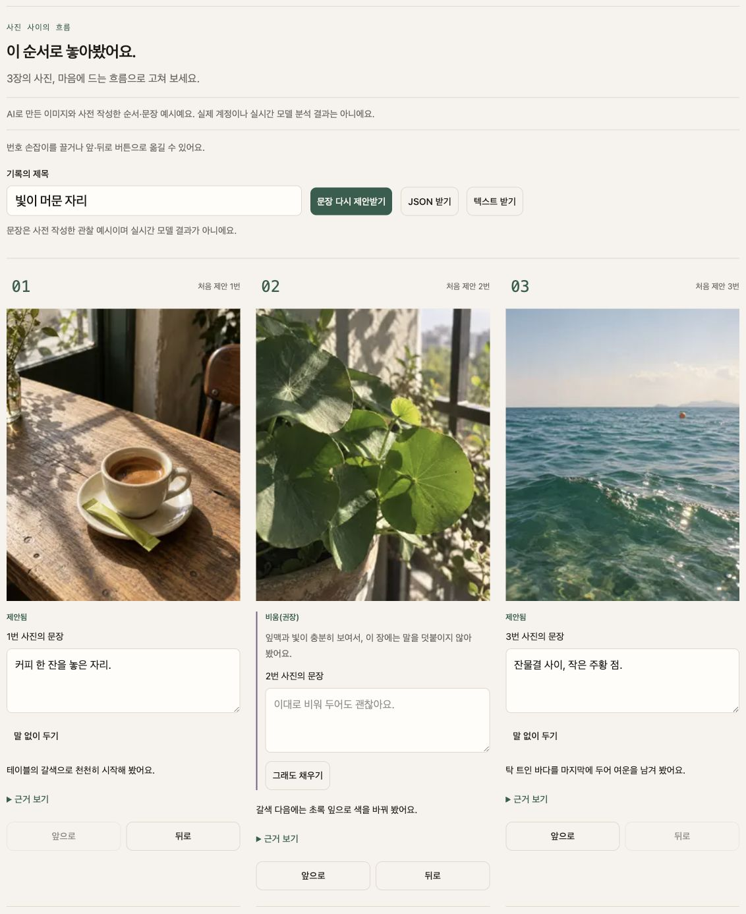

# 결 GYEOL · 제출 검토 초안

담당 **diego.yoon** · 협업 **enzo.cho**. 2026-09-17, develop `05b2af5` 기준. **아직 제출하지 않았다.** 공개 릴리스와 실제 모델 품질 인수 전의 검토 자산이다.

## 현재 증거로 사용할 소개

> 결 GYEOL은 샘플 사진의 순서와 문장을 직접 고르고, 말 없이 둘 자리도 남기는 편집 공간입니다.

세 장의 합성 샘플에서 순서를 바꾸고 문장을 고치거나 비운 뒤, JSON과 텍스트로 받을 수 있습니다. 샘플의 사진·관찰·문장은 사전 준비한 예시입니다.

위 문구는 실사진 AI 분석의 정확성, 현재 스타일에 따른 개인화,30초 보장,공개 서비스를 주장하지 않는다. 현재 스타일 입력은 결과 순서·문장에 반영하지 않고 화면에 `target_only`로 알린다. “사진 여러 장 넣으면 올릴 순서를 정해줍니다”라는 최종 소개는 D3 실경로 인수 후 교체할 후보이며 현재 제출 문구로 사용하지 않는다.

## 결과 화면

- 실제 인증된 Vercel Preview, PR #62 head `c3f5df581bb7dc1d7f4aafc05a017f609a4e7b2b`의 Chrome 캡처. 샘플을 닫고 다시 열어 초기 제안으로 복원했다.
- 1440px 데스크톱 viewport에서 제품 결과 영역1132×1387px를 캡처했다. 합성 사진3장, 사전 작성 타이틀/문장/비움 이유이며 실모델 결과가 아니다. 이미지 내용을 후처리하거나 새 UI를 합성하지 않았다.
- [검토용 Preview](https://gyeol-git-feat-37-companion-motion-jangwons-projects-c001fb62.vercel.app). **인증이 필요한 검토 링크이며 투표자용 공개 URL이 아니다.**

## D1~D6 현재 판정

아니오는 기능 부재 단정이 아니라 해당 제출 게이트를 입증하지 못했다는 뜻이다. 로컬/샘플 PASS를 제품 실경로 PASS로 확대하지 않는다.

| 항목 | 예/아니오 | 확보한 증거와 남은 조건 |
|---|---|---|
| D1 로그인 없는 공개 배포 | 아니오 | 인증 Preview 성공. 최신 develop의 main 릴리스 및 다른 기기 익명 접근 미확인 |
| D2 원클릭30초 | 예 · 같은 장비 샘플 한정 | #19 로컬0.320초에 DOM/이미지/포커스 확인. 다른 실제 기기·공개 배포 측정은 #19/#27 미완료이며30초 보장 문구에 사용하지 않음 |
| D3 내 사진3~20장 순서·근거 | 아니오 | mock 실제 업로드3/15/20 및 경계/근거 UI PASS. 배포 파일 업로드·실모델의 사진 근거 품질 미확인 |
| D4 타이틀1개 | 아니오 | 샘플/계약/제공자 대역 PASS. 실제 모델의 한 줄 타이틀 품질 미확인 |
| D5 비움·편집·내보내기 | 예 · 샘플/mock 경로 한정 | 실제 전체 비움 JSON/텍스트 다운로드, 문장/근거/순서 보존 확인. 팀 밖2명 반응과 실모델 비움 품질은 별도 미확인 |
| D6 같은 사진×지향2벌 차이 | 아니오 | 현재 프로필 보정은 지원한다고 주장하지 않는다. 서로 다른 지향 2벌의 실제 모델 결과·스크린샷·팀2인 전수대조가 남았다 |

근거: [#19 샘플](../specs/19-sample-result/verification.md), [#14 입력](../specs/14-photo-input/verification.md), [#15 실제15장 결과](../specs/15-result-screen/verification.md), [#17 다운로드](../specs/17-caption-export/verification.md), [#37 Preview](https://github.com/Daterl/gyeol/pull/62#issuecomment-5713977745), [#27 통합 검증 이슈](https://github.com/Daterl/gyeol/issues/27).

## 실제 제출 전 남은 산출물

1. 승인된 비용 범위·모델 환경에서 같은 사진×지향2벌 결과 JSON/스크린샷을 수집하고 정렬된 photo_id 배열·캡션·사진에 없는 사실을 전수 대조한다. 현재 프로필 개인화 그림을 대역으로 만들지 않는다.
2. 팀 밖2명에게 비움 화면을 보여주고 “성의 없어 보이나요?” 응답을 기록한다. 아직 응답자는 없다.
3. main 릴리스 승인 후 다른 실제 기기에서 로그인 없는 접근·원클릭30초·터치·업로드를 확인한다. Preview 보호를 낮추어 대체하지 않는다.
4. D1~D6 표를 실제 증거로 갱신하고 통과하지 않은 주장 없이 소개를 확정한다. 제출처·접수 완료는 실제 제출 후에만 기록한다.

#20 전체 판정 PENDING. 지금 완성한 것은 소개 초안1개·실제 결과 캡처1개·검토 링크·현시점 판정표다. 제품 코드 변경 없음.

## 사실성 전수 대조 (#129)

[factuality-audit.md](factuality-audit.md) — 실사진 15장 1벌의 실제 모델 생성 결과(타이틀 2 + 캡션 22 + 비움 이유 8, 총 32문장)를 사진의 `describable_facts` 와 한 줄씩 대조한 표다. **사진에 없는 장소·인물·시간이 들어간 문장은 0개**, 관측 사실에 근거 없는 타이틀 2개, 있는 사실을 어긋나게 옮긴 문장 3개다. 원본 사진 15장(서로 다른 파일 14개, cq_01·cq_13 은 sha256 동일)을 전부 열어 인용한 관측 사실을 확인했고, 14장은 사진과 맞고 1장(cq_10)은 관측 단계에서 색 이름이 어긋나 있다. cq_01..cq_15 ↔ 파일 ↔ sha256 대응표가 문서에 있다. 다시 만들려면 `node scripts/factuality-audit.mjs`. **판정과 육안 확인 주체는 모두 에이전트이고 사람 인수는 PENDING이다.**
